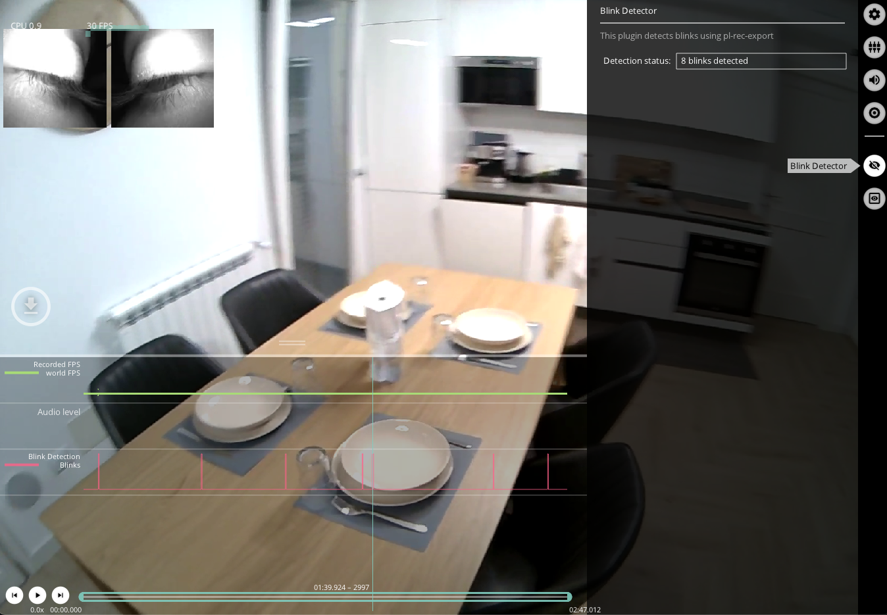

# Fixation & Blink Detectors

<!-- TODO: Add tunable parameters in the fixation as table -->

Neon Player runs the same [fixation](./../../data-collection/data-streams/#fixations) and [blink detectors](./../../data-collection/data-streams/#blinks) that are employed in Pupil Cloud.

The exported data also follows the same structure as reported in the [Data Format](./../../data-collection/data-format/).

## Fixation Detector

The fixation detector calculates fixations for the whole recording. The menu gives feedback about the progress of the detection, how many fixations were found, and shows detailed information about the current fixation. Press `f` or click the `f` hot key button on the left hand side of the window to seek forward to the next fixation.

Toggle `Show fixations` to show a visualization of fixations. The blue number is the number of the fixation (0 being the first fixation). You can export fixation reports for your current trim section by pressing `e` on your keyboard or the `e` hot key button on the left hand side of the window.

You can also modify the appearance of the fixation.

## Blink Detector

Read more information about our blink detector [here](./../../data-collection/data-streams/#blinks).

You can see a graph on the bottom as a timeline of blinks, this will allow you to visualise.

:::tip
Want to compute blink rate or use this detector in realtime? Have a look at [Detect Eye Blinks With Neon](./../../../alpha-lab/blink-detection/#detecting-eye-blinks-using-pupil-labs-blink-detection-pipeline)
:::
