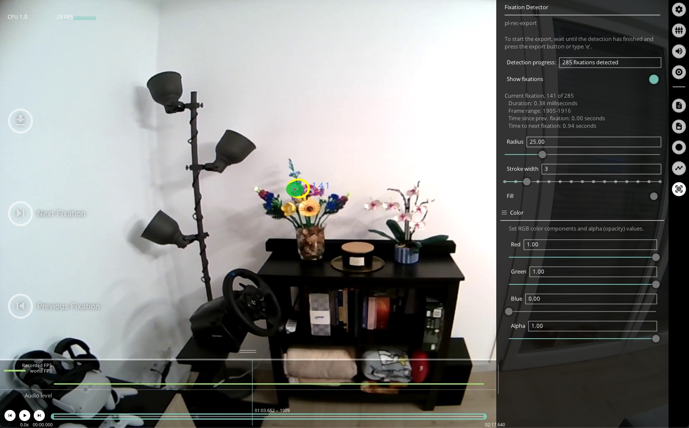

# Fixation Detector

<!-- TODO: Add tunable parameters in the fixation as table -->

Neon Player runs the same [Fixation Detector](./../../data-collection/data-streams/#fixations-saccades) employed in Pupil Cloud.
It calculates fixations for the whole recording. The menu gives feedback about the progress of the detection, how many 
fixations were found, and shows detailed information about the current fixation. 

The `Show fixations` toggle enables or disables visualization of fixations. You can modify the appearance of the fixations 
in the menu. The blue number next to the fixation circle corresponds to the fixation ID. 

Press `f` or click the arrow buttons on the left-hand side of the window to seek forward or backward through fixations.

## Export Format
Results exported to `fixations.csv` with the following fields:
| Field | Description | 
| -------- | -------- | 
| **fixation id** | Identifier of the fixation. The counter starts at the beginning of the recording.     |
| **start&nbsp;timestamp&nbsp;[ns]** | UTC timestamp in nanoseconds of the start of the fixation.     |
| **end timestamp [ns]** | UTC timestamp in nanoseconds of the end of the fixation.     |
| **duration [ms]** | Duration of the fixation in milliseconds.     |
| **fixation x [px]** | Float value representing the x-coordinate of the fixation in world camera pixel coordinates. This position is the average of all gaze samples within the fixation.     |
| **fixation y [px]** | Same as "fixation x [px]" but for the y-coordinate.     |
| **fixation y [px]** | Same as "fixation x [px]" but for the y-coordinate.     |
