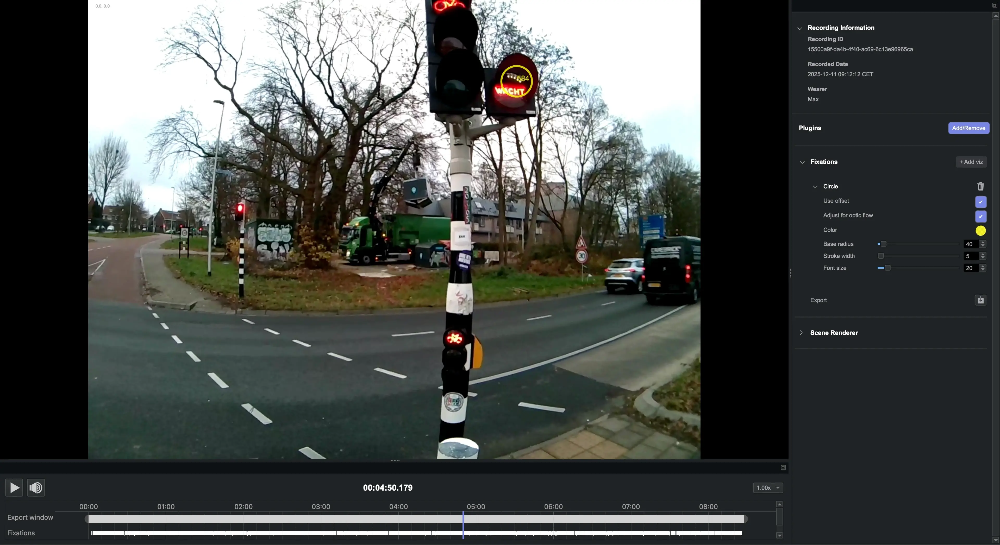

# Fixations

<!-- TODO: Check saccades.csv once NP Beta will export them -->

[Fixations](./../../data-collection/data-streams/#fixations-saccades) are provided for the whole recording. 

With this plugin enabled, Neon Player also exports [saccades](./../../data-collection/data-streams/#fixations-saccades).

The default `Circle` menu enables to customize the appearance of the fixations. The number next to the fixation circle corresponds to the fixation ID.

Press `S` to go to the next fixation, or `A` to go to the previous fixation.

## Export Format

### Fixations

Fixation results exported to `fixations.csv` with the following fields:
| Field | Description |
| -------- | -------- |
| **fixation id** | Identifier of the fixation. The counter starts at the beginning of the recording. |
| **start&nbsp;timestamp&nbsp;[ns]** | UTC timestamp in nanoseconds of the start of the fixation. |
| **end timestamp [ns]** | UTC timestamp in nanoseconds of the end of the fixation. |
| **duration [ms]** | Duration of the fixation in milliseconds. |
| **fixation x [px]** | Float value representing the x-coordinate of the fixation in world camera pixel coordinates. This position is the average of all gaze samples within the fixation. |
| **fixation y [px]** | Same as "fixation x [px]" but for the y-coordinate. |
| **azimuth [deg]** | The [azimuth](https://en.wikipedia.org/wiki/Horizontal_coordinate_system) of the gaze ray corresponding to the fixation location in relation to the scene camera in degrees. |
| **elevation [pdegx]** | The [elevation](https://en.wikipedia.org/wiki/Horizontal_coordinate_system) of the gaze ray corresponding to the fixation location in relation to the scene camera in degrees. |

### Saccades

Saccade results exported to `saccades.csv` with the following fields:
| Field | Description |
| -------- | -------- |
| **saccade id** | Identifier of the saccade. The counter starts at the beginning of the recording. |
| **start&nbsp;timestamp&nbsp;[ns]** | UTC timestamp in nanoseconds of the start of the saccade. |
| **end timestamp [ns]** | UTC timestamp in nanoseconds of the end of the saccade. |
| **duration [ms]** | Duration of the saccade in milliseconds. |
| **amplitude [px]** | Float value representing the amplitude of the saccade in world camera pixel coordinates. |
| **amplitude [deg]** | Float value representing the amplitude of the saccade in degrees of visual angle. |
| **mean velocity [px/s]** | Float value representing the mean velocity of the saccade in world camera pixel coordinates per second. |
| **peak velocity [px/s]** | Float value representing the peak velocity of the saccade in world camera pixel coordinates per second. |
