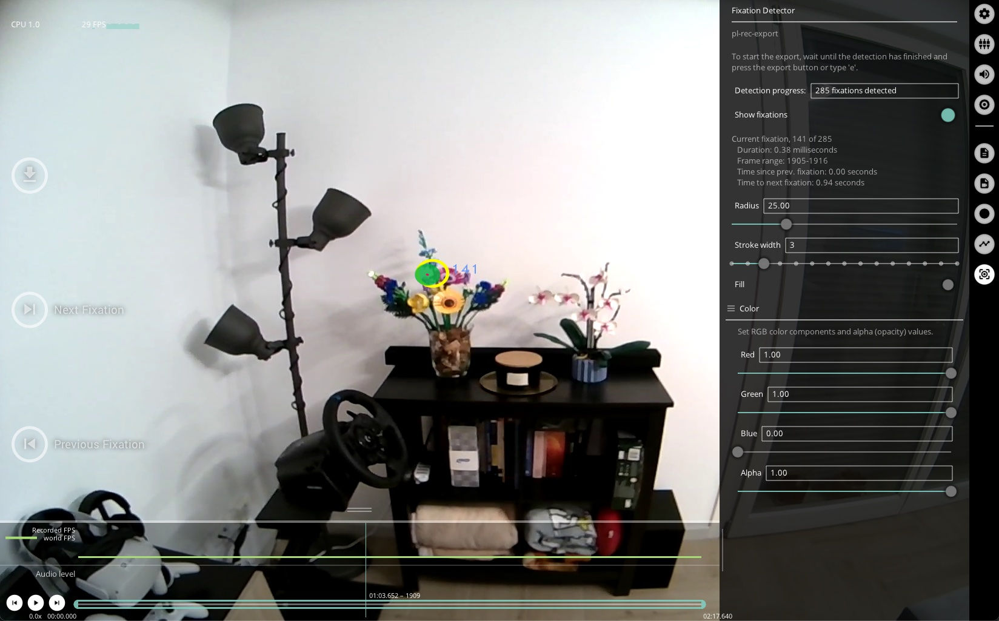

# Fixations & Saccades

<!-- TODO: Add tunable parameters in the fixation as table -->

[Fixations](./../../data-collection/data-streams/#fixations-saccades) are provided for the whole recording. 
The menu gives feedback about the total number of fixations, and shows detailed information about the current fixation.

With this plugin enabled, Neon Player also exports [saccades](./../../data-collection/data-streams/#fixations-saccades).

The `Show fixations` toggle enables or disables visualization of fixations. You can modify the appearance of the fixations
in the menu. The blue number next to the fixation circle corresponds to the fixation ID.

Press `f` or click the arrow buttons on the left-hand side of the window to seek forward or backward through fixations.

## Export Format

### Fixations

Fixation results exported to `fixations.csv` with the following fields:
| Field | Description |
| -------- | -------- |
| **fixation id** | Identifier of the fixation. The counter starts at the beginning of the recording. |
| **start&nbsp;timestamp&nbsp;[ns]** | UTC timestamp in nanoseconds of the start of the fixation. |
| **end timestamp [ns]** | UTC timestamp in nanoseconds of the end of the fixation. |
| **duration [ms]** | Duration of the fixation in milliseconds. |
| **fixation x [px]** | Float value representing the x-coordinate of the fixation in world camera pixel coordinates. This position is the average of all gaze samples within the fixation. |
| **fixation y [px]** | Same as "fixation x [px]" but for the y-coordinate. |

### Saccades

Saccade results exported to `saccades.csv` with the following fields:
| Field | Description |
| -------- | -------- |
| **saccade id** | Identifier of the saccade. The counter starts at the beginning of the recording. |
| **start&nbsp;timestamp&nbsp;[ns]** | UTC timestamp in nanoseconds of the start of the saccade. |
| **end timestamp [ns]** | UTC timestamp in nanoseconds of the end of the saccade. |
| **duration [ms]** | Duration of the saccade in milliseconds. |
| **amplitude [px]** | Float value representing the amplitude of the saccade in world camera pixel coordinates. |
| **amplitude [deg]** | Float value representing the amplitude of the saccade in degrees of visual angle. |
| **mean velocity [px/s]** | Float value representing the mean velocity of the saccade in world camera pixel coordinates per second. |
| **peak velocity [px/s]** | Float value representing the peak velocity of the saccade in world camera pixel coordinates per second. |
