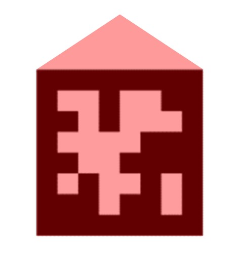

# Head Pose Tracker

<!-- TODO: Need to provide links to marker downloads. -->

This plugin uses [AprilTag markers](https://april.eecs.umich.edu/software/apriltag.html) to build a 3d model of the environment and track the headset's pose within it. Note, only markers of the default `tag36h11` family are currently 
supported by the head pose tracker plugin.

::: info
The markers used must be **unique and of the same size**. You may **not** use multiple instances of the same marker ID within your environment.
:::

<Youtube src="9x9h98tywFI"/>

Head pose tracking works best in a well lit environment with an even distribution of light, so that the tracking markers are clearly visible. Try to avoid situations where the world-camera faces into bright light, such as sunlight entering through a window in an otherwise dim room.

By default, the location of the first visible marker will be used as the origin of the 3d model's coordinate system. In the plugin's menu, you can change the marker that is being used as the origin. The unit of the coordinate system is defined as the physical length of the tracking markers.

## Export Format
Results exported to the following files:
- `head_pose_tracker_model.csv`: A list of all markers used to generate the 3d model and the 3d locations of the marker vertices.
- `head_pose_tracker_poses.csv`: The world camera's pose within the 3d model coordinate system for each recorded world frame with the following fields:
  
| Field           | Description                                                                            |
|:----------------|:---------------------------------------------------------------------------------------|
| `timestamp`     | World timestamp                                                                        |
| `rotation_x`    | Rodrigues' rotation vector x-component 1                                     |
| `rotation_y`    | Rodrigues' rotation vector y-component 1                                     |
| `rotation_z`    | Rodrigues' rotation vector z-component 1                                     |
| `translation_x` | Translation vector x-component 2                                            |
| `translation_y` | Translation vector y-component 2                                            |
| `translation_z` | Translation vector z-component 2                                            |
| `pitch`         | Orientation about the x-axis (head tilt from front to back) in degrees 3    |
| `yaw`           | Orientation about the y-axis (head rotation from side to side) in degrees 3 |            
| `roll`          | Orientation about the z-axis (head tilt from side to side) in degrees 3     |     

1. The Rodrigues' rotation vector describes the rotation axis, and its length encodes the angle to rotate in radians
2. Units are scaled to the length of the tracking markers
3. The Euler convention is dependent on the origin tracking marker's orientation (see below).

Positioning of the origin marker is crucial to ensure that pitch, yaw and roll correspond to expected head movements 
using the right-hand convention, where:
- Upward head tilt corresponds to a positive pitch angle
- Rightward head rotation corresponds to a positive yaw angle
- Rightward head tilt corresponds to a positive roll angle

The correct position of the origin marker is vertical relative to the earth (e.g. on a computer monitor) pointing 
upwards: 

:::tip
Euler angles are an intuitive representation of rotation. However, they can be subject to the effects of [gimbal lock](https://en.wikipedia.org/wiki/Gimbal_lock). Luckily, most head movements associated with eye tracking *should* not lead to this situation with correct positioning of the origin marker.
:::
