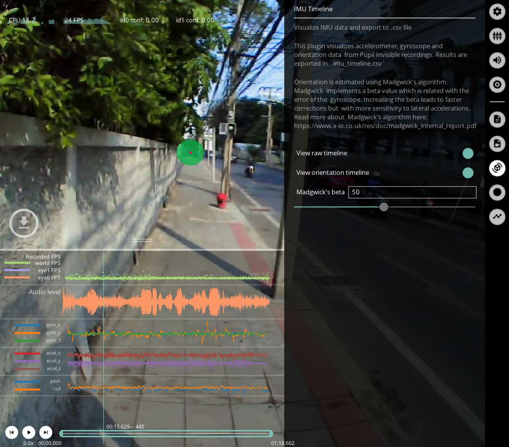

# IMU Timeline
<!-- TODO: Needs revisit -->
This plugin visualizes accelerometer and gyroscope data from Neon recordings along with Euler angles (pitch, yaw and roll).

Why fuse the data? Numerical integration of angular rate is subject to position errors that grow with time. Accurate estimates of orientation therefore require drift correction. Madgwick's algorithm removes orientation drift in the pitch and roll axes using accelerometer feedback to monitor position relative to gravity.

In the Plugin's menu, toggle `View raw timeline` to view the accelerometer and gyroscope readings and `View orientation timeline` for pitch and roll. You can also change `Madgwick's beta`. This value is associated with gyroscope mean error.
Increasing the beta will lead to faster drift corrections but with more sensitivity to lateral accelerations. Read more about [Madgwick's algorithm here](https://x-io.co.uk/downloads/madgwick_internal_report.pdf).

Results are exported in `imu_timeline.csv` with the following columns:
| Key                 | Description                                                            |
|:--------------------|:-----------------------------------------------------------------------|
| `imu_timestamp`     | Timestamp of the IMU reading                                           |
| `world_index `      | Associated_frame: closest world video frame                            |
| `gyro_x`            | Angular velocity about the x-axis in deg/s                             |
| `gyro_y`            | Angular velocity about the y-axis in deg/s                             |
| `gyro_z`            | Angular velocity about the z-axis in deg/s                             |
| `accel_x`           | Linear acceleration along the x-axis in G (9.80665 m/s2)    |
| `accel_y`           | Linear acceleration along the y-axis in G (9.80665 m/s2)    |
| `accel_z`           | Linear acceleration along the z-axis in G (9.80665 m/s2)    |
| `pitch`             | Orientation about the x-axis (head tilt from front to back) in degrees |
| `roll`              | Orientation about the z-axis (head tilt from side to side) in degrees  |

<!-- :::tip
<v-icon large color="info">info_outline</v-icon>
Read more about [Pupil Invisible's coordinate systems here](/developer/invisible/#coordinate-systems).
::: -->

This Plugin does not estimate orientation about the yaw axis (head rotation from left to right). This is 
because the IMU has no magnetometer to monitor heading. The Plugin therefore implements a version of Madgwick's algorithm that only estimates Pitch and Roll.