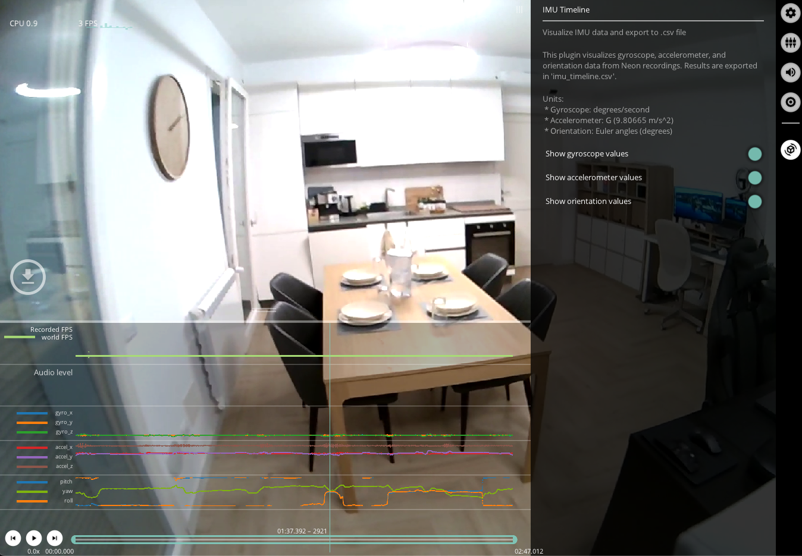

# IMU Timeline
This plugin visualizes accelerometer and gyroscope data from Neon recordings along with Euler angles (pitch, yaw and roll).

You can toggle the sensor readings plots on or off in the menu.

Read more about Neon's IMU and how it works in the dedicated [IMU section of the docs](../../data-collection/data-streams/#movement-imu-data)

## Export Format
Results exported to `imu.csv` with the following fields:
| Field | Description | 
| -------- | -------- | 
| **timestamp [ns]** | UTC timestamp in nanoseconds of the sample.    |
| **gyro x [deg/s]** **gyro y [deg/s]** **gyro z [deg/s]** | Rotation speed around x, y or z-axis respectively in degrees/s.    |
| **acceleration&nbsp;x&nbsp;[G]** **acceleration&nbsp;y&nbsp;[G]** **acceleration z [G]** | Translational acceleration along the x, y or z-axis respectively in G. Note `1 G = 9.80665 m/s^2`.|
| **roll [deg]** | Drift-free estimate of the roll (head tilt from side to side) in degrees. The output range is -180 to +180 degrees. Added in version 2 of this enrichment.    |
| **pitch [deg]** | Drift-free estimate of the pitch (head tilt from front to back) in degrees. The output range is -90 to +90 degrees. Added in version 2 of this enrichment. |
| **yaw [deg]** | Drift-free estimate of the yaw (horizontal head rotation) in degrees. The output range is -180 to +180 degrees. Added in version 2 of this enrichment. |
| **quaternion w** **quaternion x** **quaternion y** **quaternion z** | Quaternion describing the rotation of the Neon module. |