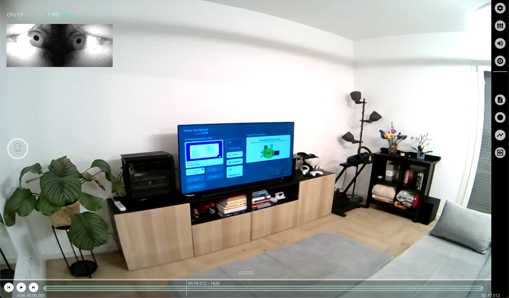

<VPHomeHero />

Use Neon Player to play back and export Neon recordings offline on your computer! You can download it [here](https://github.com/pupil-labs/neon-player/releases/tag/v4.0).

Recordings you want to play can be pulled [directly off of the Companion device](/data-collection/transfer-recordings-via-usb/) or download them from Pupil Cloud (in the "Raw Android Data" format).

We are still working on the documentation of Neon Player and will publish more soon. In the meantime, please reach out to us on [Discord](https://pupil-labs.com/chat/) if you run into any trouble!