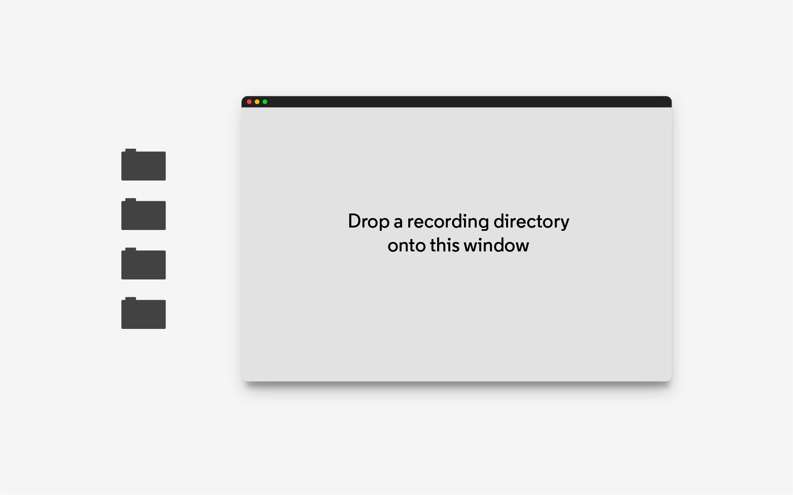

# Neon Player

Neon Player is a cross-platform desktop application for playing back and exporting Neon recordings. It runs in an
offline context; no interaction with Pupil Cloud is required.

<download-links
  src="https://api.github.com/repos/pupil-labs/neon-player/releases/latest"
  text="Download Neon Player"
  icon="./neon-player.svg"
/>

::: info
Starting with version `v2.9.0-prod` of the Neon Companion app, blinks, and fixations & saccades, can be computed at
recording time. These data can be loaded in Neon Player `v5.0.0` or later. The current version you can download below is `v6.0.0`

To load blinks or fixations & saccades in recordings made prior to `v2.9.0-prod` of the Neon
Companion app, use [Neon Player `v4.x`](https://github.com/pupil-labs/neon-player/releases) instead.
:::

## Loading a Recording

To load a recording, you first need to download or export it to your computer:

1. Direct transfer from Neon Companion Device – For detailed instructions, refer to [this guide](/data-collection/transfer-recordings-via-usb/).
2. Download from [Pupil Cloud](/pupil-cloud/) – Right-click on a recording in Pupil Cloud, select **Download**, and ensure you choose the **"Native Recording Data"** format.

Once you have the recording, open Neon Player and drag-and-drop the folder into the application window, or click "Choose a recording folder", navigate to the desired folder and click "Open".

Don't have a recording yet? [Download a sample recording](https://drive.google.com/file/d/1bicOLzmJLzDegNq7qByctsFjmTJgCWPZ/view?usp=sharing "Download sample recording to use in Neon Player").

::: info
Neon Player will **never** remove or overwrite any of your raw data gathered at the time of recording. Instead, it will create a new hidden folder, `neon_player`, which contains the Neon Player compatible files.
:::

::: info

Recordings extracted from the phone do not contain [eye state](../data-collection/data-streams/#_3d-eye-states) or [pupillometry](../data-collection/data-streams/#pupil-diameters), and the sampling rate matches that at the time of recording.

Recordings downloaded from [Pupil Cloud](./../pupil-cloud/) will be at 200Hz.
:::

## Neon Player Window

- **Export window**: Control the playback of the video with the play/pause button (or spacebar on your keyboard). Drag the playhead (vertical line) to the desired point in time.

   - **Trimming**: Drag the rounded rectangles at either end of the `Export window` timeline to set beginning and ending trim markers. The trim section markers specify the section of the video/data to export.
   - **Frame Stepping**: With the arrow keys on your keyboard, you can jump through the recording in steps of 5 seconds. Alternatively, if you hold Shift while pressing the arrow keys, you advance one frame at a time.
   - **Playback Speed**: To change the playback speed, use the dropdown menu on the right side of the timeline to change playback from `-2x` to `2x`. 

- **Timeline Events**: Plugins can add temporal events to this expandable panel. Below the `Export window`, the following types of events are visible, depending on which plugins are activated:
   - **Blinks**: White bard indicate eye blinks. Their width indicates the duration of the blink.
   - **Fixations**: You can jump from one fixation to the next using the `a` and `s` keys.
   - **Marker Visibility**: This track's colour indicates how many markers were recognised in the scene video at a given time. 

- **Sidebar**: This area contains clickable buttons for each plugin. System plugins are loaded in the top and user added plugins are added below the horizontal separator.

### Keyboard Shortcuts

| Keyboard Shortcut | Description                                                                |
| :---------------- | :------------------------------------------------------------------------- |
| `<space>`         | Play and pause video                                                       |
| `<arrow left>`    | Jump 5 seconds backward 1                                                    |
| `<arrow right>`   | Jump 5 seconds forward 1                                                      |
| `a`               | Jump to previous fixation                                           |
| `s`               | Jump to next fixation                                           |
|

1 Hold `<shift>` to move one frame at a time

## Plugins

Neon Player uses a plugin framework to add functionality. Visualizations, fixations, blinks, and data exports are
all implemented using this structure.

## Exports

You can export data for every plugin individually, or you can use the `Export All` plugin to export all data together. Under the `Export All` plugin, you can press the  symbol, which prompts you to select a location to create a new folder with the title of the current timestamp. All loaded plugins with export capabilities will initiate the export process and save their data to this folder. During the export, you can continue to work with Neon Player.

## Workflow

Neon Player is similar to a video player. You can playback recordings and can load plugins to build visualizations.

Here is an example workflow:

- Start **Neon Player** and load a recording.
- Add required plugins - From the **Plugins** secction, which can be found in the Sidebar, click  to add any plugin of your choice. A number of plugins are activated by default, but if you are for example interested in pupil size, you would activate the `Eyestate` plugin now. 
- Playback - press the play button or `space` bar on your keyboard to view the video playback with visualization overlay, or drag the playhead in the seek bar to scrub through the dataset.
- Set trim marks - drag the rounded rectangle at the beginning and end of the `Export window` to set the trim marks. This will set the start and end frame for the exporter and for other plugins.
- Export Video & Raw Data - From the `Export All` view, click the   symbol, and select a location to create the export folder.
- View the exported data in .csv format in the newly created directory. 
