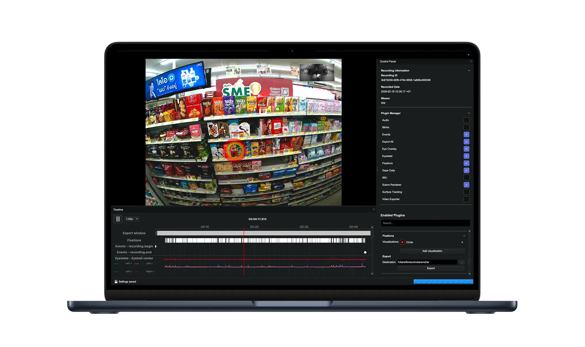

# Neon Player

[Neon Player](https://github.com/pupil-labs/neon-player) is a cross-platform desktop application for playing back, analyzing, and exporting Neon recordings. 
It runs entirely offline: all data stays on the local machine, and no interaction with Pupil Cloud is required.

The application is designed to provide an intuitive way to work with Neon recordings locally.

Neon Player is extensible through a plugin architecture, allowing users to add or remove data streams on demand, build 
custom visualizations, and even run custom data processing pipelines and export functionalities.
