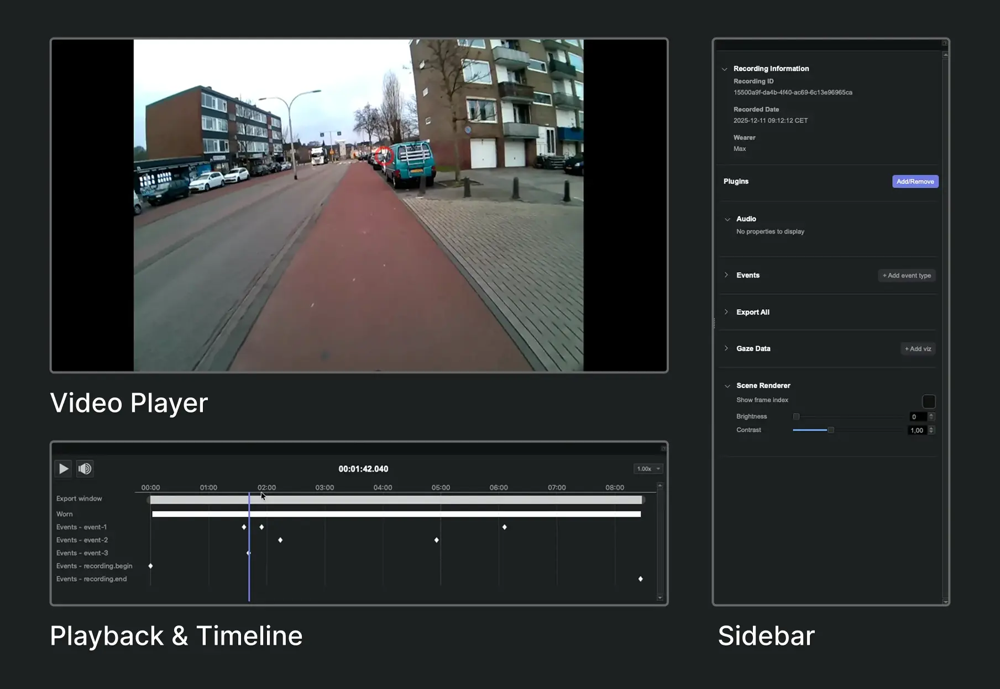

# Neon Player Interface

Neon Player's interface consists of three main sections, that are resizable and can be un-docked to separate windows:

- **Video Player**: The main area of the interface displays the world video with any overlay from activated plugins (gaze, fixations, eye overlay, surfaces and more). You can control the playback of the video using the controls in [Playback & Timeline](../playback-timeline/).

- **Playback & Timeline**: By default, this is located below the video player and contains the export window, events, and other tracks added by plugins. The playhead is synchronized with the video player, allowing you to scrub through the recording and see corresponding events and data visualizations.

- **Sidebar**: Located by default on the right side of the interface, it displays the recording's metadata, and the activated plugins and streams with their options. You can also add or remove plugins from the sidebar and configure [Plugin](../plugins/index.md) settings.
