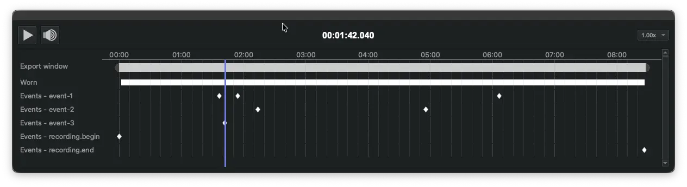
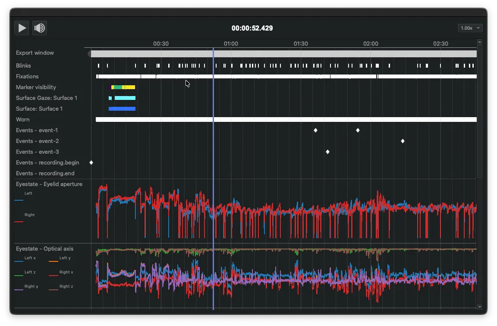

# Playback & Timeline

- **Export window**: Control video playback using the **Play/Pause** button or the `Spacebar` on your keyboard. To navigate to a specific point in time, drag the vertical playhead along the timeline.
- **Trimming**: Drag the rounded handles at either end of the timeline to set your beginning and ending trim markers. These markers define the specific section of video and data that will be included in your export.
- **Frame Stepping**: Use the Arrow Keys to jump through the recording in 5-second increments. To advance or retreat one frame at a time for precise inspection, hold Shift while pressing the arrow keys.
- **Playback Speed**: To change the playback speed, use the dropdown menu on the right side of the timeline. Speeds can be toggled between `-2x` (reverse) to `2x` (fast-forward).

## Data Tracks

You can add data tracks to the timeline from plugins that support this feature. These tracks appear directly beneath the Export window and are organized in alphabetical order.

For instance, the Eyestate plugin enables you to add tracks for pupil diameter, eyelid aperture, or optical axis data. This allows you to visualize how specific metrics change over time and in relation to other events in the recording.

Depending on how the specific plugin is implemented, data may be displayed as a line plot, a series of dots, or broken lines.
