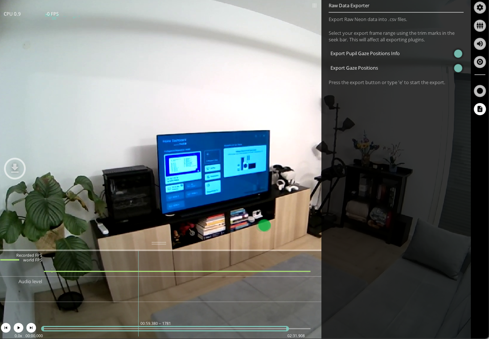

# Raw Data Exporter
The `Raw Data Exporter` exports gaze data and is active by default.

## Export Format
Results exported to `gaze.csv` with the following fields:

| Field | Description | 
| -------- | -------- |
| **timestamp&nbsp;[ns]** | UTC timestamp in nanoseconds of the sample. Equal to the timestamp of the eye video frame this sample was generated with.     |
| **gaze x [px]** | Float value representing the x-coordinate of the mapped gaze point in world camera pixel coordinates.
| **gaze y [px]** | Same as "gaze x [px]" but for the y-coordinate.     |