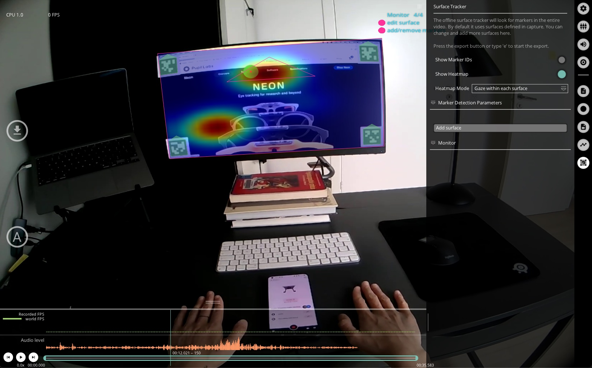

# Surface Tracker

TODO: There are no references to where to get markers and how to place them. This is only explained in the Capture docs.

You can use this plugin to detect markers in the recording, define surfaces, edit surfaces, and create and export visualizations of gaze data within the defined surfaces.

Here is an example workflow for using the `Surface Tracker` plugin to generate heatmap visualizations and export surface data reports:

  + Load the `Surface Tracker` plugin - if you already have surfaces defined, the load may take a few seconds because the plugin will look through the entire video and cache the detected surfaces.
  + Add surface - if you do not have any defined surfaces, you can click on the `Add surface` button when the markers you want to user are visible or just click the circular `A` button in the left hand side of the screen.
  + Surface name and size - In the `Surface Tracker` menu GUI, define the surface name and real world size.
  *Note* - defining size is important as it will affect how heatmaps are rendered.
  + Set trim marks - optional, but if you want to export data for a specific range, then you should set the trim marks.
  + Recalculate gaze distributions - click the `(Re)calculate gaze distributions` button after specifying surface sizes.
  You should now see heatmaps in the Player window (if gaze positions were within your defined surfaces).
  + Export gaze and surface data - click `e` and all surface metrics reports will be exported and saved for your trim section within your `export` folder.

All files generated by the `Surface Tracker` will be located in the subfolder `surfaces`.
The different reported metrics are:

  + `surface_visibility.csv` - Overview of how many world camera frames each surface was contained in.
  + `surface_gaze_distribution.csv` - Overview of how many gaze samples have been collected on each individual surface and outside of surfaces.
  + `surface_events.csv` - List of image-enter and image-exit events for all surfaces.

Further the following metrics are reported for every individual surface.
Each surface has a name, which can be manually set as described above.
This name is augmented by an automatically generated numerical identifier.

  + `heatmap_<surface_name>.png` - Heatmap of gaze positions on the surface aggregated over the entire export.
  + `gaze_positions_on_surface_<surface_name>.csv` - A list of gaze datums on the surface.
  The values include the gaze point in two different coordinates systems.
  `x_norm` and `y_norm` are coordinates between 0 and 1, where `(0,0)` is the bottom left corner of the surface and `(1,1)` is the top right corner.
  `x_scaled` and `y_scaled` contain the same coordinates but scaled with the size defined for the surface.
  + `surf_positions_<surface_name>` - List of surface positions in 3D.
  The position is given as the 3D pose of the surface in relation to the current position of the scene camera.
  `img_to_surf_trans` is a matrix transforming coordinates from the camera coordinate system to the surface coordinate system.
  `surf_to_img_trans` is the inverse of `img_to_surf_trans`.

Additionally, the `Surface Tracker` exports the detected markers to the `marker_detections.csv` file. The `world_index` column represents the scene video frame index, `marker_uid` is the label used for identifying a single marker, and `corner_<0|1|2|3>_<x|y>` is the corner coordinate in pixel space.
