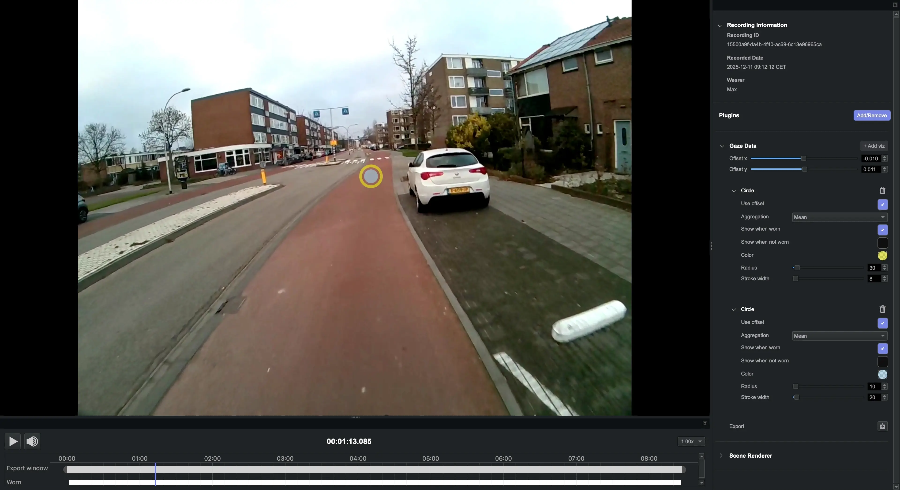
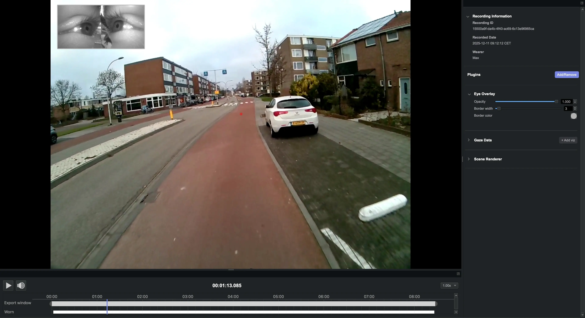

# Visualization Plugins

We refer to plugins prefixed with Viz as Visualization plugins. These plugins are straightforward and primarily additive (i.e., non-exclusive or unique).

## Viz Circle

Visualize the gaze positions with a circle for each gaze position. This plugin is **not [unique](/neon-player/plugin-api/#plugin-class-attributes)**, therefore you can add multiple instances of the plugin to build your visualization.

You can set the following parameters within the Gaze Data plugin:

| Parameter                    | Description                                                                                                                                                                     |
| :--------------------------- | :------------------------------------------------------------------------------------------------------------------------------------------------------------------------------ |
| **Use offset**               | If enabled, gaze points are rendered using the gaze offset. If disabled, raw gaze positions are used.                                                                           |
| **Aggregation**              | Controls how gaze points are displayed over the scene camera frame: `Raw` draws all points; `Mean`, `Median`, `First`, and `Last` draw only one point per frame.                |
| **Show when worn**           | If enabled, gaze points are shown when Neon is detected as worn.                                                                                                                |
| **Show when not worn**       | If enabled, gaze points are shown when Neon is detected as not worn.                                                                                                            |
| **Color**                    | Select the gaze point color and opacity.                                                                                                                                        |
| **Radius**                   | The radius of the circle around the gaze point.                                                                                                                                 |
| **Stroke width**             | The thickness or width of the stoke in pixels.                                                                                                                                  |

You can set the following parameters within the Fixations plugin:

| Parameter                    | Description                                                                                                                                                                     |
| :--------------------------- | :------------------------------------------------------------------------------------------------------------------------------------------------------------------------------ |
| **Use offset**               | If enabled, fixation points are rendered using the gaze offset. If disabled, raw fixations positions are used.                                                                  |
| **Ajust for optic flow**     | If enabled, fixation points are rendered with optic flow adjustment, reducing the impact of scene motion on fixations.                                                          |
| **Color**                    | Select the fixation circle color and opacity.                                                                                                                                   |
| **Base radius**              | Scaling factor for fixation circle size based on fixation duration.                                                                                                             |
| **Stroke width**             | The thickness or width of the stoke in pixels.                                                                                                                                  |
| **Font size**                | Sets the font size of the fixation ID labels.                                                                                                                                   |

The above example shows how you could use **2** instances of the `Viz Circle` Plugin. The first instance renders the gaze position as a filled blue circle. The second instance renders the same gaze position as yellow stroke circle.

## Viz Crosshair

Visualize the gaze positions with a cross for each gaze position. This plugin is **not unique**, therefore you can add multiple instances of the plugin to build your visualization.

You can set the following parameters within the Gaze Data plugin:

| Parameter                    | Description                                                                                                                                                                     |
| :--------------------------- | :------------------------------------------------------------------------------------------------------------------------------------------------------------------------------ |
| **Use offset**               | If enabled, gaze points are rendered using the gaze offset. If disabled, raw gaze positions are used.                                                                           |
| **Aggregation**              | Controls how gaze points are displayed over the scene camera frame: `Raw` draws all points; `Mean`, `Median`, `First`, and `Last` draw only one point per frame.                |
| **Show when worn**           | If enabled, gaze points are shown when Neon is detected as worn.                                                                                                                |
| **Show when not worn**       | If enabled, gaze points are shown when Neon is detected as not worn.                                                                                                            |
| **Color**                    | Select the color and opacity of the gaze point.                                                                                                                                 |
| **Size**                     | The size of the crosshair around the gaze point.                                                                                                                                |
| **Gap size**                 | The distance in pixels to offset the interior cross endpoints from the gaze position. A value of 0 will make the crosshairs intersect the gaze position.                                                                                                                                                                                                        |
| **Stroke width**             | The thickness or width of the stoke in pixels.                                                                                                                                  |
| **Draw dot**                 | If enabled, it draws the gaze point at the center of the crosshair.                                                                                                             |

The above example shows how you could use **2** instances of the `Viz Cross` Plugin. The first instance renders the gaze position as a blue cross and the second instance renders the gaze position as a green cross, in the outer area.

## Viz Eye Overlay

Visualize the eye cameras video feed. This plugin is **unique**, therefore you can only load one instance of this plugin.

This plugin can be used to overlay the eye video on top of the world video.

You can set the following parameters:

| Parameter             | Description                                                                                              |
| :-------------------- | :------------------------------------------------------------------------------------------------------- |
| **Opacity**           | The opacity of the overlay eye video image. `1.0` is opaque and `0.0` is transparent.                    |
| **Border width**      | The thickness or width of the border around the eye video image.                                         |
| **Border color**      | Select the border color and opacity for the eye video image.                                             |

The above example shows the `Eye Overlay` with binocular eye videos.
