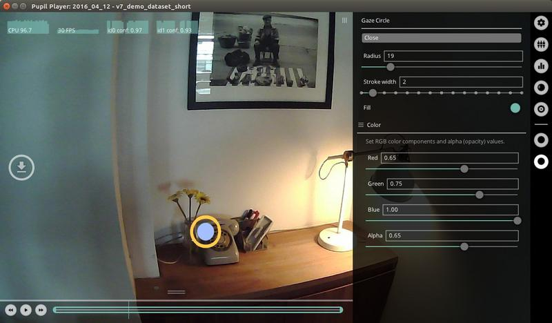
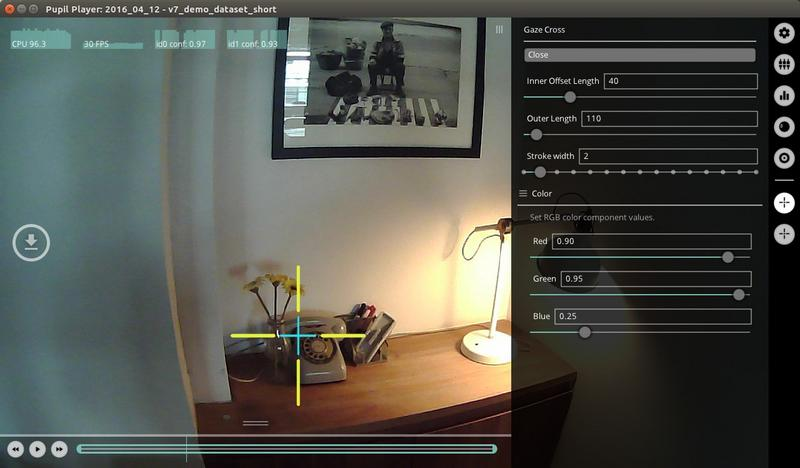
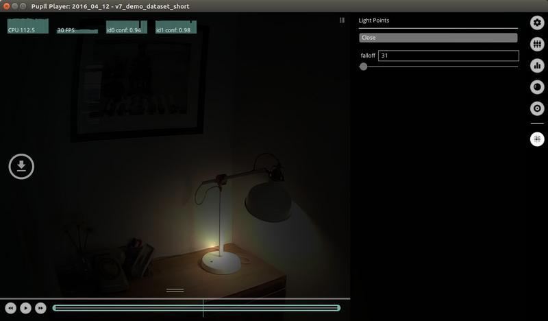
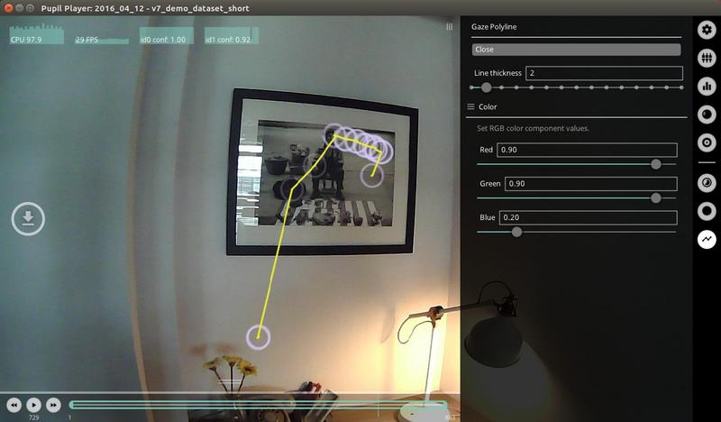
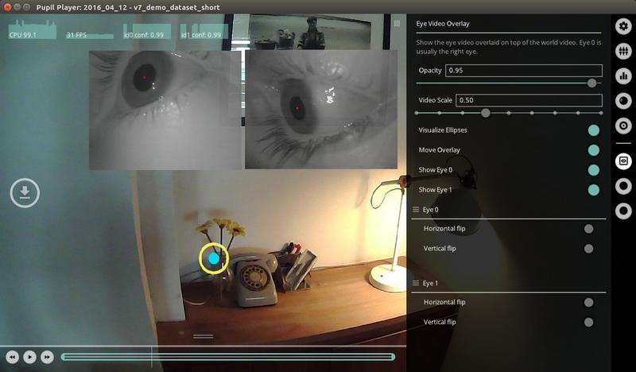

# Visualization Plugins
  <!-- TODO: NEW VISUALS -->
We will call plugins with the `Vis` prefix **visualization** plugins. These plugins are simple plugins, are mostly additive (or *not unique*), and directly operate on the gaze positions to produce visualizations. Other plugins like `Surface Tracker` also produces visualizations, but will be discussed elsewhere due to the extent of its features.

## Vis Circle
Visualize the gaze positions with a circle for each gaze position. This plugin is **not unique**, therefore you can add multiple instances of the plugin to build your visualization.

You can set the following parameters:

| Parameter | Description |
|:----------|:------------|
| Radius | The radius of the circle around the gaze point. |
| Stroke&nbsp;width | The thickness or width of the stoke in pixels. |
| Fill | Toggle on for a circle with solid fill. Toggle off for a circle with only stroke. |
| Color | Define the `Red`, `Green`, and `Blue` values for color. `Alpha` defines the opacity of the stroke and fill. |
 
Here we show an example of how you could use **2** instances of the `Vis Circle` Plugin. The first instance renders the gaze position as a filled yellow circle. The second instance renders the same gaze position as an orange stroke circle.

## Vis Cross
Visualize the gaze positions with a cross for each gaze position. This plugin is **not unique**, therefore you can add multiple instances of the plugin to build your visualization. You can set the following parameters:

| Parameter | Description |
|:----------|:------------|
| Inner&nbsp;offset&nbsp;length | The distance in pixels to offset the interior cross endpoints from the gaze position. A value of `0` will make the crosshairs intersect the gaze position. |
| Outer&nbsp;length | The length of the cross lines in pixels from the gaze position. Note - equal values of `inner offset length` and `outer length` will result in a cross with no length, and therefore not rendered. |
| Stroke&nbsp;width | The thickness or width of the stoke in pixels. |
| Color | Define the `Red`, `Green`, and `Blue` values for color. |

Here we show an example of how you could use **2** instances of the `Vis Cross` Plugin. The first instance renders the gaze position as a red cross with that extends to the boundaries of the screen. The second instance renders the gaze position as a green cross, with a heavier stroke weight.

<!-- ## Vis Fixation
TODO -->

## Vis Light Points
Visualize the gaze positions as a point of light for each gaze position. The `falloff` of the light from the gaze position is specified by the user.

This plugin is **not unique**, therefore you can add multiple instances of the plugin to build your visualization. You can set the following parameters:

| Parameter | Description |
|:----------|:------------|
| Falloff | The distance (in pixels) at which the light begins to fall off (fade to black). A very low number will result in a very dark visualization with tiny white light points. A very large number will result in a visualization of the world view with little or no emphasis on the gaze positions. |

Here is an example demonstrating `Vis Light Points` with a falloff of 73.

## Vis Polyline
Visualize the gaze positions with a polyline for each gaze position.

This plugin is **not unique**, therefore you can add multiple instances of the plugin to build your visualization. You can set the following parameters:

| Parameter | Description |
|:----------|:------------|
| Line&nbsp;thickness | The thickness or width of the polyline stroke in pixels. |
| Color | Define the `Red`, `Green`, and `Blue` values for color. |

An example showing `Vis Polyline` used with `Vis Circle`. The polyline enables one to visualize the sequence of the gaze positions over a single world frame.

<!-- ## Vis Watermark
TODO -->

<!-- ## Vis Eye Video Overlay
Here is an example of the `Eye Video Overlay` with binocular eye videos.

This plugin can be used to overlay the eye video on top of the world video. Note that the eye video is not recorded by default in Pupil Capture so if you want to use this plugin, make sure to check `record eye video` in Pupil Capture.

This plugin is **unique**, therefore you can only load one instance of this plugin. You can set the following parameters:

  + `opacity` - the opacity of the overlay eye video image. `1.0` is opaque and `0.0` is transparent.
  + `video scale` - use the slider to increase or decrease the size of the eye videos.
  + `move overlay` - toggle `on` and then click and drag eye video to move around in the player window. Toggle `off` when done moving the video frames.
  + `show` - show or hide eye video overlays.
  + `horiz. and vert. flip` - flip eye videos vertically or horizontally -->