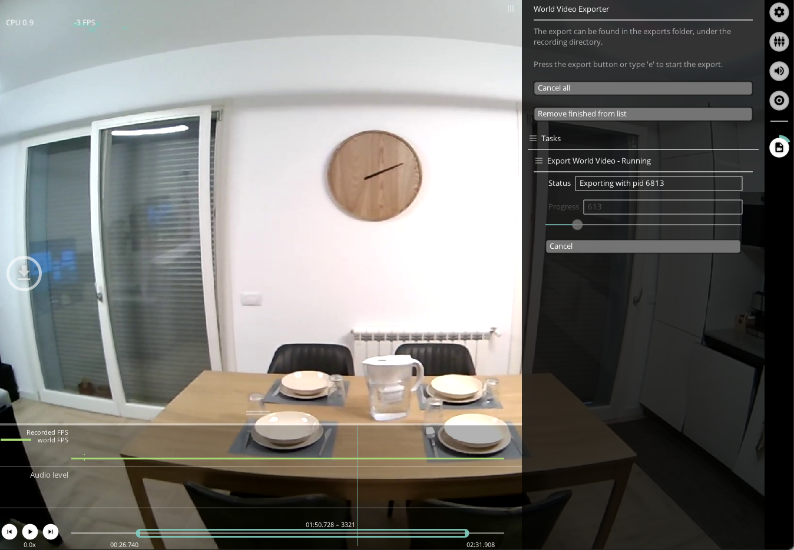

# World Video Exporter

The `Video Exporter` Plugin is loaded by default.

The export saves the world video as shown in Neon Player, including all currently active visualizations, and is triggered by clicking the "Export" button. You can also export or copy the current frame to the clipboard.

 # TODO: replace with newer image

## Export Format

The World Video Exporter saves the world video file (world.mp4), together with a csv files containing timestamps corresponding to each frame.
TODO: Currently, world timestamps are not there
