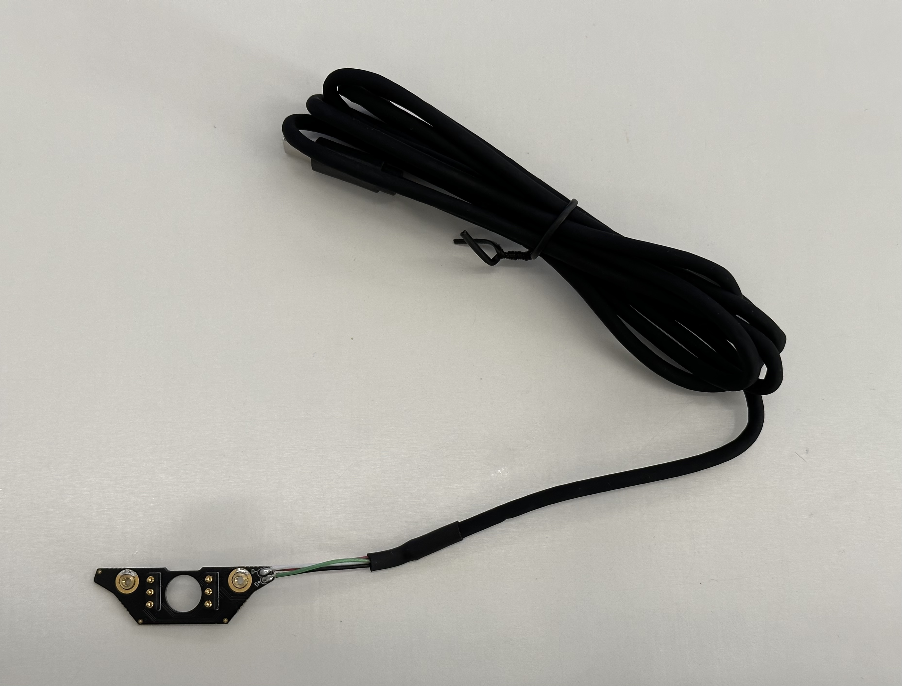
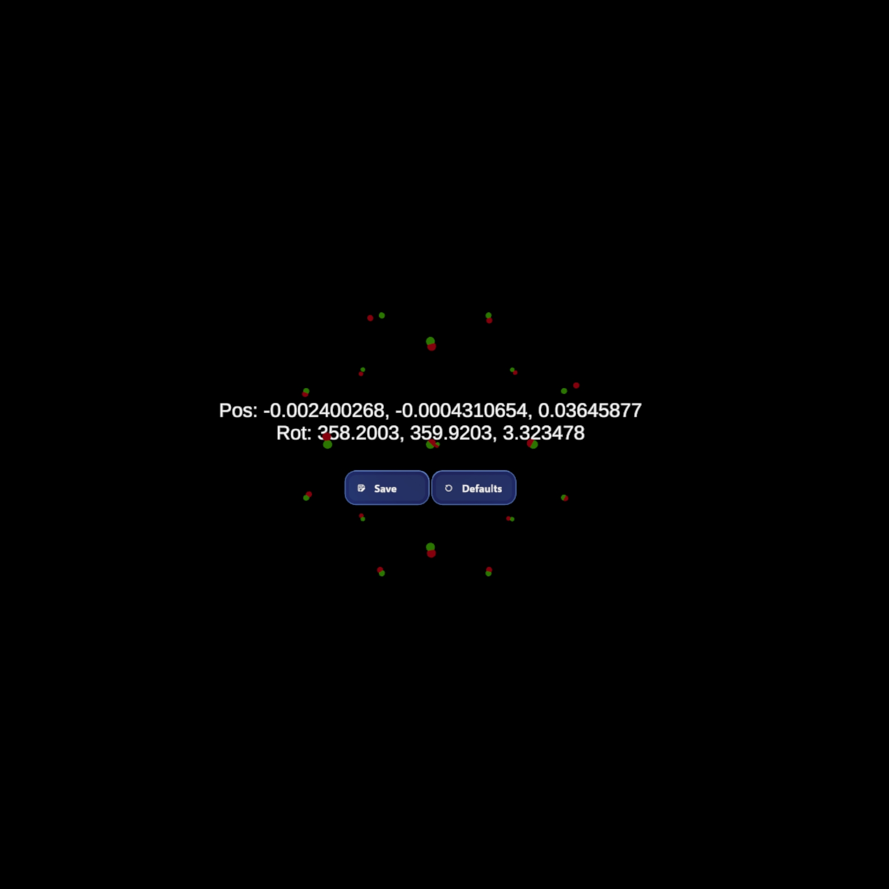

# Build Your Own Mount for Neon

If you want to integrate Neon into a headset that we do not support yet, you can build your own mount! Thanks to the small form factor of the Neon module, this is possible for a wide range of headsets. The only requirement is that the headset provides a sufficient amount of space to place the Neon module such that it sits correctly above the wearers nose. Especially for headsets that are compatible with regular glasses, this is typically the case.

The process consists of two steps:

1. Building the mount
2. Calibrating the mount inside of the headset.

## Building the Mount

Similar to how you might [design a regular frame](/hardware/make-your-own-frame/) for Neon, you need to build the mount around the "Bare Metal" frame, which includes the "nest" PCB and USB cable.



To help you get started, we provide CAD models of the Neon module and Bare Metal frame [here](https://github.com/pupil-labs/neon-geometry). A model of the "Just act natural" frame is also included as a template to kickstart your design process!

For Neon to work correctly, your mount needs to fulfill the following criteria:

1. The Neon Module does not move in relation to the headset
2. The Neon Module sits correctly above the wearers nose, similar to how it would sit when using the "Just act natural" frame.

## Calibrating the Mount

After building your mount, you need to calibrate it inside of the headset. This calibration process determines the location of the module inside the headset and how it relates to the virtual world presented by the headset.

The calibration process is contained in one of the scenes of the [MRTK3 template project](/neon-xr/MRTK3-template-project/). You can find it in the `Scenes` folder and it is called `PL_Calibration`. You can start it by following the steps in the [Usage section](../MRTK3-template-project/index.md#usage) of the MRTK3 Template Project documentation.

In this scene, the wearer is presented with a set of gaze targets distributed over their field of view. The wearer must gaze at each target in turn and perform a pinch-gesture to confirm that they are looking at a target. After each pinch-gesture, the target that was gazed upon should disapear. Once all targets have been gazed upon, the calibration process is complete and can be saved to the configuration file.

Below is an image showing a successful mount calibration.



When you click `Save`, the mount calibration values are witten to the configuration file, which is called `config.json` and is located on the XR device's filesystem at the following path:

```
\Android\data\org.MixedRealityToolkit.MRTK3Sample\files\config.json
```

It has a `sensorCalibration.offset` field that contains the results:

| Field      | Description                                                            |
| ---------- | ---------------------------------------------------------------------- |
| `position` | The position of the Neon Module relative to the origin of the headset. |
| `rotation` | The rotation of the Neon Module relative to the origin of the headset. |

::: tip
It should suffice to execute the calibration procedure just once for a new mount design. When using the same mount design on multiple headsets, you can copy the configuration file from one headset to another. Simply place the file at the corresponding [`persistent Data Path` of your application](https://docs.unity3d.com/6000.0/Documentation/ScriptReference/Application-persistentDataPath.html), similar to the default MRTK3 path for `config.json` shown above. This will also work if you only use the [Neon XR Core Package](../neon-xr-core-package/).
:::
