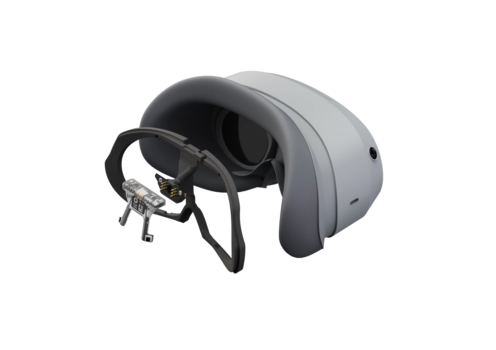
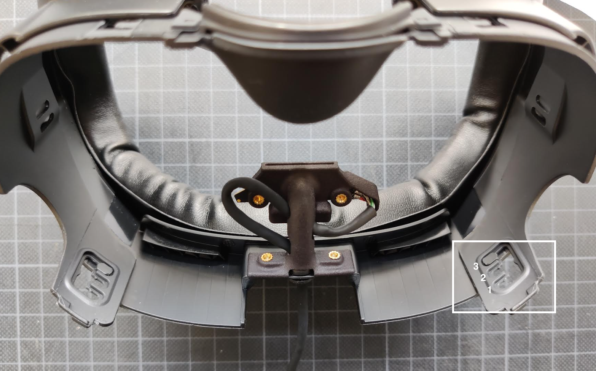

# Neon XR

Neon XR allows you to equip XR devices with research-grade eye tracking powered by Neon. This enables both gaze-based interaction for XR applications and visual behaviour analysis in XR environments.

Thanks to the small form factor of the [Neon module](/hardware/module-technical-overview/), it can easily be integrated into a variety of XR devices. Hardware mounts for the [Pico 4 and Quest 3](https://pupil-labs.com/products/vr-ar) headsets are available for purchase and additional mounts for other headsets are in development. You can also [build a mount yourself](/neon-xr/build-your-own-mount/) for any headset!

Neon XR includes software integration with Unity. The [Neon XR Core Unity Package](/neon-xr/neon-xr-core-package/) allows you to receive gaze data from a Neon Module in your Unity project in real-time. We also provide a [template project](/neon-xr/MRTK3-template-project/) for the [Mixed Reality Toolkit 3.0](https://learn.microsoft.com/en-us/windows/mixed-reality/mrtk-unity/mrtk3-overview/) that makes it easy to get started with the development of your XR application.

## System Overview

The **Neon Module** is attached to it's **mount**, which is in turn attached to the **XR device**. Similar to regular Neon frames, the mount is tethered to the **Neon Companion Device** with a USB-C cable.

The Neon Companion Device provides power to the module and runs the **Neon Companion app**, which does all the real-time computation.

Depending on the XR device used, the **Unity application** is running on the XR device itself or on a separate computer the XR device is tethered to.
It communicates with the Neon Companion app over the network, receives gaze data in real-time, and projects it into the virtual world thanks to the **Neon XR Core** Unity Package.

 

## Getting Started

The easiest starting point for building XR applications with Neon is to use our [MRTK3 template project](/neon-xr/MRTK3-template-project/). It uses MRTK3 as the foundation, and contains several demo scenes you can work off of.

If you don't want to use MRTK3, you can also integrate the [`Neon XR Core` Unity Package](/neon-xr/neon-xr-core-package/) into your project directly, which contains only the ability to receive gaze data in real-time in Unity and to map it into the virtual world.

If the available Pico 4 or Quest 3 mounts do not fit your needs, [build your own mount](/neon-xr/build-your-own-mount/)!

## Installing the Quest 3 mount

Printed instructions for the Quest 3 mount are included with the package. While following those instructions, it is useful to know that the mount should be set to level 3, to ensure that Neon is positioned above the headset's lenses correctly.

