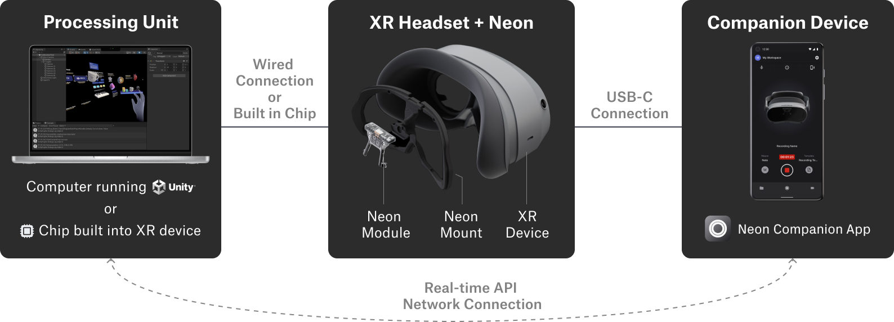

# Neon XR

<!-- 
#### Remaining Todos
- [ ] Add system overview
- [ ] Add instructions regarding pre-generated calibrations and how to use them
- [ ] Complete guide on how to build you own mount including calibration instructions. 
-->

Neon XR allows you to equip XR devices with research-grade eye tracking powered by Neon. This equally enables gaze-based interaction for XR applications and visual behaviour analysis in XR environments.

Thanks to the small form factor of the [Neon module](/hardware/module-technical-overview/), it can easily be integrated into a variety of XR devices. A hardware mount for the [Pico 4](https://pupil-labs.com/products/vr-ar) headset is available for purchase and additional mounts for other headsets are in development. You can also [build a mount yourself](/neon-xr/build-your-own-mount/) for any headset!

Neon XR includes software integration with Unity. This allows you to receive eye tracking data from a Neon module in your Unity project in real-time. We also provide a [template project](/neon-xr/gaze-based-interaction-with-MRTK/) for the [Mixed Reality Toolkit 3.0](https://learn.microsoft.com/en-us/windows/mixed-reality/mrtk-unity/mrtk3-overview/) that makes it easy to add gaze-based interaction to your XR application.

## System Overview
TODO

## Adding Neon XR to Your Project
The [**Neon XR Unity package**](https://github.com/pupil-labs/neon-xr) enables you to receive eye tracking data from a Neon module in your Unity project in real-time. 

To integrate it in your project, follow these steps:

1. Add the `Neon XR` package in the Package Manager.
    1. Select `Window -> Package Manager`
    2. Select `+ -> Add Package from git URL…`
    3. Insert `https://github.com/pupil-labs/neon-xr.git`.
1. If your project does not use Addressables, create default Addressables settings.
    1. Select `Window -> Asset Management -> Addressables -> Groups`.
    2. Click on `Create Addressables Settings`.
    3. If legacy bundles are detected click on `Ignore`.
1. Select `Pupil Labs -> Addressables -> Import Groups`. After this step the `NeonXR Group` should appear in the `Addressables Groups` window (you can open this window again following step 2.1).
1. In the `Addressable Groups` window, select `Build -> New Build -> Default Build Script`.
1. Copy the `NeonXR` prefab from the imported package into the scene.
1. Locate the `Neon Gaze Data Provider` component on GameObject `NeonXR/PupilLabs`.
1. Add your own listener for the `gazeDataReady` event (see for example, `GazeDataVisualizer.OnGazeDataReady`).