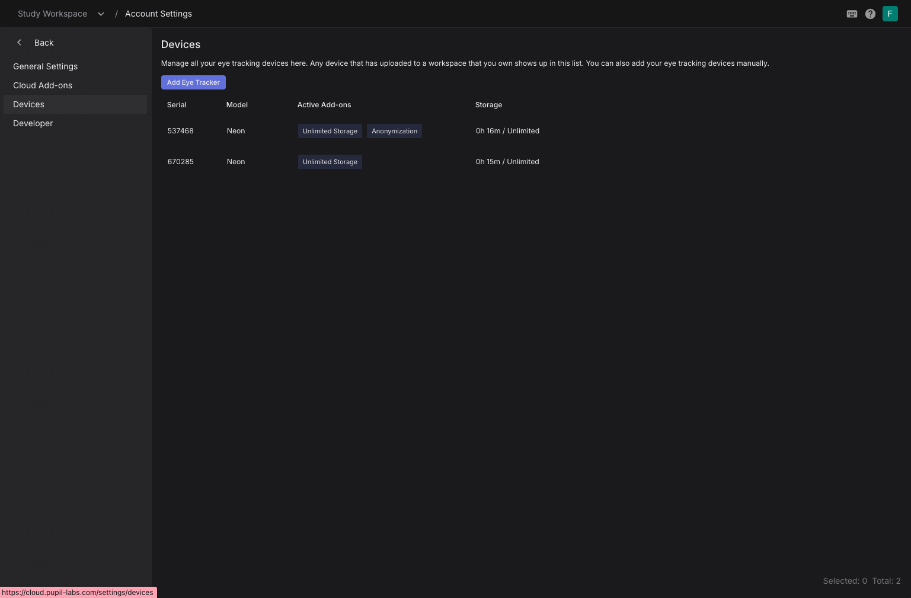
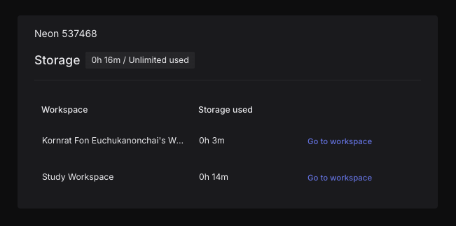

# What Are Add-ons?

Pupil Cloud add-ons allow you to selectively upgrade services for your eye tracking device. Add-ons can be purchased through the Pupil Labs [website](https://pupil-labs.com/products/cloud/pricing). Each add-on is bound to a device.

## Register an Add-on

Add-ons are registered with a single user account. Typically registering an add-on can be done by clicking on a link that we send in an email when you purchase the add-on.

To manually register an add-on:

1. Click on the top right account avatar in the navigation bar, and then “Account Settings”
2. In the Cloud Add-ons tab, click on “Register Add-on”
3. Enter your activation key and your activation date
4. Confirm your add-on activation

<video width="100%" controls>
  <source src="./register_addon.mp4" type="video/mp4">
</video>

## Link a Device

When purchasing any number of add-ons, you receive an activation key that can be linked with one device for each add-on purchased. Linking a device with an add-on unlocks the functionality of the add-on for the device.

To link a device with a registered add-on, click `Link device` in the table. The drop-down menu for the hardware serial will contain the serials of all the devices that have uploaded recordings to one of your workspaces before. You can also obtain the serial of a new device via the Companion app and enter it here.

<video width="100%" controls>
  <source src="./link_device.mp4" type="video/mp4">
</video>

## Devices View

The Devices view shows devices that have uploaded to workspaces you own. Here you can check how much storage each device is using and compare this to their quota.

You can also check the workspaces each device has uploaded to by double clicking on a device in the table.

::: info
**Enabling recording anonymization on upload:** 
Anonymizing recording on upload requires an Anonymization Add-on. If you have registered an Anonymization Add-on and linked a device to it you can you create a new workspace and enable `Face Blurring`. Any recording uploaded to this workspace will be anonymized.
:::

## Sharing Add-on Benefits

### Workspace Management

You can create multiple workspaces within the user account registered with an add-on. This allows you to share the benefits of your add-on with other users without them needing to purchase their own add-ons.

### Inviting Users

You can invite other users to [join your workspaces](https://docs.pupil-labs.com/neon/pupil-cloud/workspaces/). As part of your workspaces, invited users can, for example, view, edit, enrich, and download recordings based on the role assigned to them.

### Device Access

Other users can also log into the [Companion App](https://docs.pupil-labs.com/neon/data-collection/ecosystem-overview/#neon-companion-app) on the device linked to your add-on using their own accounts. They can then upload recordings to your workspaces, thereby benefiting from the add-on features.
