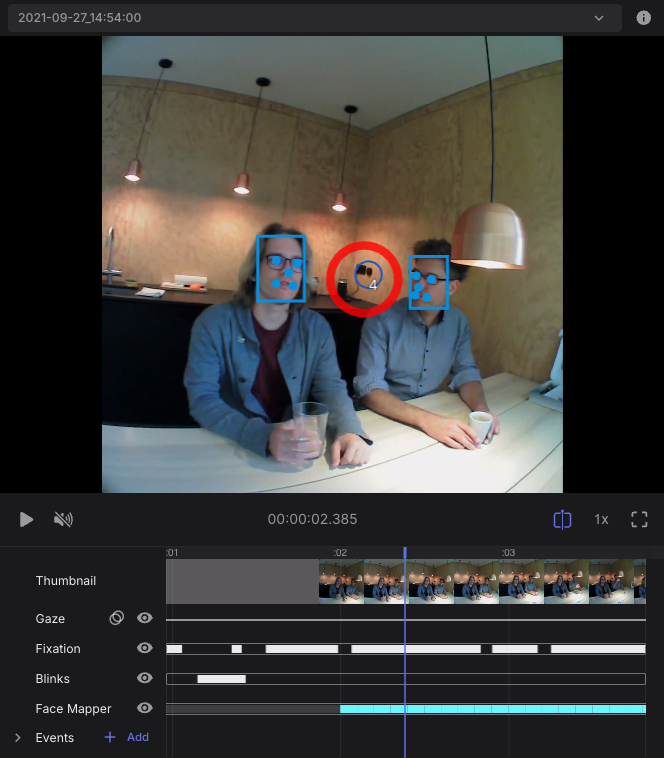

# Face Mapper

The Face Mapper enrichment robustly detects faces in the scene video. Detections consist of the bounding box of the face. This provides you with insight into _when_ and _where_ faces are visible to a subject.

This enrichment automatically maps gaze data onto faces so that you can determine when a subject has been looking at them.

Additionally, this enrichment also calculates the location of the most important facial landmarks in the image for each face: left eye, right eye, nose, left mouth corner, and right mouth corner.

The face detection algorithm used under the hood for this enrichment is [RetinaFace](https://github.com/deepinsight/insightface/tree/master/detection/retinaface).

## Export Format

### face_positions.csv
This file contains all the individual face detections.

| Field | Description | 
| -------- | -------- | 
| **section id** | Unique identifier of the corresponding section.     |
| **recording id** | Unique identifier of the recording this sample belongs to.     |
| **timestamp [ns]** | UTC timestamp in nanoseconds of the corresponding world camera frame timestamp. If multiple faces have been detected in the same scene video frame, each face is reported in a separate row with the same timestamp.     |
| **p1 x [px]** | x-coordinate of the starting point of the bounding box rectangle.     |
| **p1 y [px]** | y-coordinate of the starting point of the bounding box rectangle.     |
| **p2 x [px]** | x-coordinate of the ending point of the bounding box rectangle.     |
| **p2 y [px]** | y-coordinate of the ending point of the bounding box rectangle.     |
| **eye left x [px]** | X coordinate of the left eye in image coordinates in pixels.	|	
| **eye left y [px]** | Y coordinate of the left eye in image coordinates in pixels.	|
|	**eye right x [px]** | X coordinate of the right eye in image coordinates in pixels.	|
| **eye right y [px]** | Y coordinate of the right eye in image coordinates in pixels.	|
| **nose x [px]** | X coordinate of the nose in image coordinates in pixels. |
|	**nose y [px]** | Y coordinate of the nose in image coordinates in pixels. | 
|	**mouth left x [px]** | X coordinate of the left mouth corner in image coordinates in pixels. |
|	**mouth left y [px]** | Y coordinate of the left mouth corner in image coordinates in pixels. |
|	**mouth right x [px]** | X coordinate of the right mouth corner in image coordinates in pixels. |
|	**mouth right y [px]** | Y coordinate of the right mouth corner in image coordinates in pixels. |

### gaze_on_face.csv
This file indicates which gaze samples are on faces (within the bounding box of detected faces).

| Field | Description | 
| -------- | -------- | 
| **section id** | Unique identifier of the corresponding section.     |
| **recording id** | Unique identifier of the recording this sample belongs to.     |
| **timestamp [ns]** | UTC timestamp in nanoseconds of the sample. Equal to the timestamp of the corresponding gaze sample.     |
| **gaze on face** | Boolean indicating whether the gaze point is on a face.     |

### fixations_on_face.csv
This file indicates which fixations are on faces (within the bounding box of detected faces).

| Field                                 | Description | 
| --------                              | -------- |
| **section id**                        | Unique identifier of the corresponding section.     |
| **recording id**                      | Unique identifier of the recording this sample belongs to.     |
| **fixation id**                       | Identifier of the fixation. The counter starts at the beginning of the recording.     |
| **start&nbsp;timestamp&nbsp;[ns]**    | UTC timestamp in nanoseconds of the start of the fixation.     |
| **end timestamp [ns]**                | UTC timestamp in nanoseconds of the end of the fixation.     |
| **duration [ms]**                     | Duration of the fixation in milliseconds.     |
| **fixation on face**                  | Boolean indicating whether the fixation is on a face.     |
| **fixation x [px]**                   | Float value representing the x-coordinate of the fixation in world camera pixel coordinates. This position is the average of all gaze samples within the fixation.     |
| **fixation y [px]**                   | Same as "fixation x [px]" but for the 
