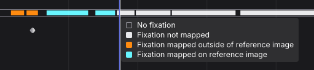

# Manual Mapper

<video width="100%" controls>
  <source src="./manualmapper_header.mp4" type="video/mp4">
</video>

The Manual Mapper offers a simple interface for manually mapping fixations to a reference image, aiding gaze data visualization and analysis. Click on the reference image to map a fixation and the recording auto-advances to the next one. Fixations outside the image can be marked by clicking beyond the image boundary.

## Setup

- **Upload a Reference Image:** Upload the image you want to map fixations on.
- **Map Fixations:** Begin mapping the recorded fixations onto the reference image by clicking the corresponding location on the image. If a fixation does not fall on the reference image, use the keyboard shortcut <kbd>S</kbd>.
  - The field `Fixation` shows the ID of the current fixation.
  - The field `Recording Mapping Progress` indicates how many fixations have been mapped within the specified enrichment section.

In the example below, we manually map the fixations detected between the `manual.start` and `manual.end` events. This section includes 101 fixations in total, and we currently map the fixation with ID 15.

You will see all fixations and their durations visualized in the timeline below.

::: tip TIP Move between fixations
Use <kbd>Shift+A</kbd> to move to the **previous unmapped** fixation, and <kbd>Shift+S</kbd> to move to the **next unmapped** fixation. 
Use <kbd>A</kbd> and <kbd>S</kbd> to move across all fixations.
:::

## Export Format

### fixations.csv

This file contains fixation events detected in the gaze data stream and mapped to the reference image.

| Field                              | Description                                                                                                                                                                       |
| ---------------------------------- | --------------------------------------------------------------------------------------------------------------------------------------------------------------------------------- |
| **section id**                     | Unique identifier of the corresponding section.                                                                                                                                   |
| **recording id**                   | Unique identifier of the recording this sample belongs to.                                                                                                                        |
| **fixation id**                    | Identifier of fixation within the section. The id corresponds to the fixation id of the raw unmapped data.                                                                        |
| **start&nbsp;timestamp&nbsp;[ns]** | UTC timestamp in nanoseconds of the start of the fixation.                                                                                                                        |
| **end&nbsp;timestamp&nbsp;[ns]**   | UTC timestamp in nanoseconds of the end of the fixation.                                                                                                                          |
| **duration&nbsp;[ms]**             | Duration of the fixation in milliseconds.                                                                                                                                         |
| **fixation&nbsp;status**           | `True` if the fixation was mapped inside the reference image, `False` if it was marked as outside of the reference image, and `Not mapped` if the fixation was not mapped at all. |

### sections.csv

The enrichment is calculated based on sections defined by a start and end event. The `sections.csv` file contains the start and end timestamps of all sections that were used for the enrichment calculation, along with the corresponding section and recording IDs.

### AOI Metrics

If AOIs are defined for the enrichment, the download would also contain the AOI metrics in `.csv` format, as reported in the [AOI Metrics](../../areas-of-interest/index.md#exporting-aoi-metrics).
