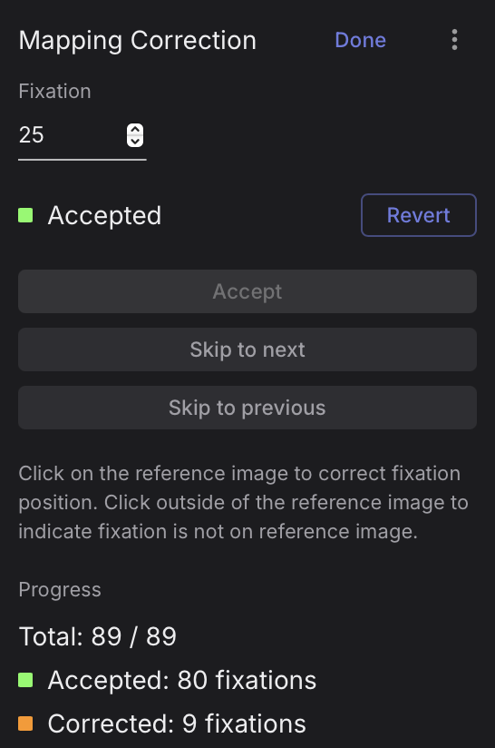
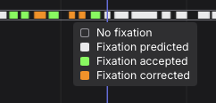

# Mapping Correction

<video width="100%" controls>
  <source src="./mappingcorrection_header.mp4" type="video/mp4">
</video>

You can use the Mapping Correction interface to adjust mis-mapped or unmapped fixations.

In the majority of cases, [**Reference Image Mapper**](/enrichments/reference-image-mapper/) and [**Manual Mapper**](/enrichments/manual-mapper/) will successfully and accurately map gaze from your recording to your Reference Image. For some fixations, though, the mapping may not be successful, or fixations it can be somewhat misplaced. This can happen if the view of the Reference Image is partially obscured in the recording or the wearer briefly moves to a viewpoint that was not adequately scanned, for instance.

## Setup

- **Enrich:** First, run your Reference Image Mapper or Manual Mapper Enrichment, if not already done.
- **Correct:** After the Enrichment has completed, open it and validate the mapping results. If you notice mis-mapped or unmapped fixations, and click `Edit` next to Mapping Correction to start the interface.
    - Initially, all fixations are in their default Predicted state; i.e., the result of the Enrichment’s automatic mapping process.
    - You can `Skip to next` or `previous` fixation with the corresponding buttons. Similarly, you can click on the Recording Timeline to navigate fixations.
    - You can click on the Reference Image to correct mis-mapped fixations and then `Accept` them. You can also use the `D` keyboard shortcut.
    - If a fixation does not fall on the Reference Image, then click outside of the Image.
    - You can `Revert` any `Accept`-ed accepted fixations with the corresponding button or the `R` keyboard shortcut.
    - Click `Done` once you are finished.

You will see the total number of accepted & corrected fixations, in the Mapping Correction panel. It shows the fixation currently being mapped (fixation ID 25 in this case), and you can enter a number to jump to a specific fixation. In the example below, the predictions for 80 fixations were accepted, and the other 9 were corrected.

You will see all fixations and their durations visualized in the timeline below.

::: tip
**Move between fixations** 
Use the <kbd>A</kbd> and <kbd>S</kbd> keyboard shortcuts to move back and forth through fixations. The <kbd>Shift+A</kbd> and <kbd>Shift+S</kbd> shortcuts take you back and forth through predicted fixations; that is, those which have not been manually corrected.
:::

## Export

Once you are done with Mapping Correction, then the output of the Enrichment is automatically updated and can be downloaded. Please refer to each Enrichment’s respective Export Format Documentation:

- [Reference Image Mapper Export Format](/enrichments/reference-image-mapper/#export-format)
- [Marker Mapper Export Format](/enrichments/marker-mapper/#export-format)
