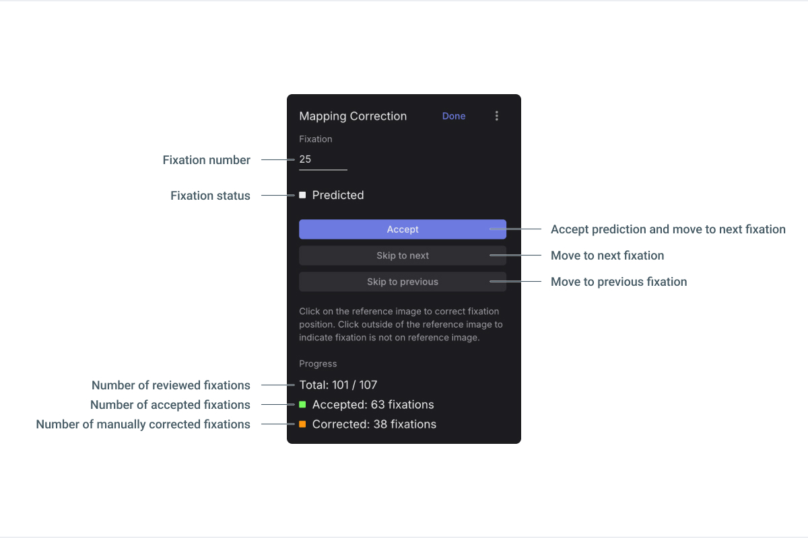

# Mapping Correction

<Youtube src="WcCwCVo1_lg"/>

Using the Mapping Correction, you can correct errors in the results of the [**Reference Image Mapper**](/pupil-cloud/enrichments/reference-image-mapper/) and [**Marker Mapper**](/pupil-cloud/enrichments/marker-mapper/), which may have happened due to e.g. motion blur or occlusions.
It allows you to add missing fixations and adjust the locations of mapped fixations.

## Setup

- **Enrich:** First, run your Reference Image Mapper or Manual Mapper Enrichment, if not already done.
- **Correct:** After the Enrichment has completed, open it and validate the mapping results. If you need to make corrections, click `Edit` next to Mapping Correction to start the interface.
  - Initially, all fixations are in their default mapped state; i.e., the result of the Enrichment’s automatic mapping process.
  - You can `Skip to next` or `previous` fixation with the corresponding buttons. Similarly, you can click on the Recording Timeline to navigate fixations.
  - You can click on the Reference Image to fill in missing fixations or adjust mapped fixations, and then `Accept` them. You can also use the `D` keyboard shortcut.
  - If a fixation does not fall on the Reference Image, then click outside of the image.
  - You can `Revert` any accepted fixations with the corresponding button or the `R` keyboard shortcut.
  - Click `Done` once you are finished.

You will see the total number of accepted & corrected fixations in the Mapping Correction panel. It shows the fixation 
currently being mapped, and you can enter a number to jump to a specific fixation.

You will also see all fixations and their durations visualized in the timeline below.

::: tip
**Move between fixations** 
Use the <kbd>A</kbd> and <kbd>S</kbd> keyboard shortcuts to move back and forth through fixations. The <kbd>Shift+A</kbd> and <kbd>Shift+S</kbd> shortcuts take you back and forth through predicted fixations; that is, those which have not been manually corrected.
:::

## Export

Once you are done with Mapping Correction, then the output of the Enrichment is automatically updated and can be downloaded. Please refer to each Enrichment’s respective Export Format Documentation:

- [Reference Image Mapper Export Format](/pupil-cloud/enrichments/reference-image-mapper/#export-format)
- [Marker Mapper Export Format](/pupil-cloud/enrichments/marker-mapper/#export-format)
