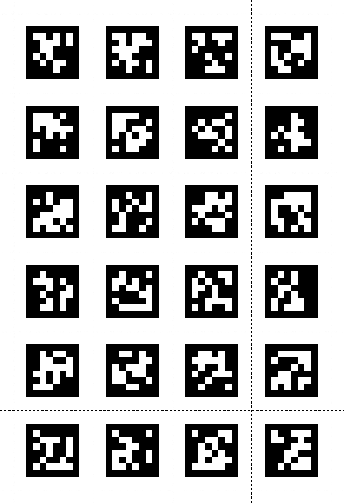

# Marker Mapper

The Marker Mapper enrichment enables tracking of where an individual is looking on a particular area or "surface" by positioning markers in the surrounding environment. This allows for the generation of a heatmap of gaze data directly within the Pupil Cloud enrichment, or for downloading the remapped gaze data in CSV format for further analysis.

## Setup

For robust detection, you should place enough markers on your surface such that at least 3 of them are visible whenever the surface is visible. You may also place markers inside the surface or outside the surface in close proximity to it.

You can use these images as a template for printing markers:

  
  

If you need more markers or higher resolution please see [here](https://github.com/pupil-labs/pupil-helpers/blob/master/markers_stickersheet/tag36h11_full.pdf?raw=True "PDF file with high-resolution markers.").

::: warning
Note that the markers require a white border around them to be robustly detected. In our experience, this border should be at least equal to the width of the smallest white square or rectangle shown in the marker. Therefore, please make sure to include a sufficient border when displaying or printing them.
:::

::: tip
If presenting the markers on a digital display (tablet, monitor or through PsychoPy), you may need to tweak the display brightness, and Neon's exposure settings, to improve marker detection. Typically, dimming the screen helps avoid overexposure and improves marker visibility.
:::

## Selecting Markers in the Cloud

<video width="100%" controls>
  <source src="./mm_define.mp4" type="video/mp4">
</video>

By default, all visible markers are used for surface definition when creating a surface. You can add or remove markers by clicking on them. Markers that are part of the definition are shown in green, while others are shown in red.

Note that when adding a new marker to the surface definition, another marker that is already part of the definition has to be visible within the same video frame.

A surface definition always needs to contain at least 2 markers. Thus, at least 2 markers have to be visible in the video frame when initially creating the surface, and you cannot remove further markers from the surface definition when the marker count is down to 2.

## Surface Coordinates

The Marker Mapper maps gaze points to a 2D surface and returns them in surface coordinates. The top left corner of the surface is defined as `(0, 0)`, and the bottom right corner is defined as `(1, 1)`. The orientation of the surface can be set in the enrichment settings.

The mapper may return values outside of the surface, which yields values smaller than 0 or larger than 1, indicating that the corresponding gaze was not on the surface at that time.

::: tip
**Orientation:** The red border marks the top edge of the surface. You can rotate the surface by clicking on "Rotate Surface" under the ellipsis next to 'Surface Defined'.
:::

## Select image to be used in Marker Mapper visualizations

<video width="100%" controls>
  <source src="./mm_imageupload.mp4" type="video/mp4">
</video>

You can select the image to be used in Marker Mapper visualizations. You can either pick a frame from a scene video, or you can upload a dedicated image that contains the surface. Images should contain the selected markers, and will be cropped according to the surface definition. The selected image will be used in the side-by-side view and as the background for AOI and heat map visualizations.

## Validate the Mapping

After the enrichment is successfully run, the recording timeline contains visualizations that indicate when surface was localized, and when gaze was on the surface.

<video width="100%" controls>
  <source src="./mm_enrichment_viz.mp4" type="video/mp4">
</video>

::: tip
If you find that any fixations or unmapped or mis-mapped, then make use of [the Mapping Correction tool](/pupil-cloud/enrichments/mapping-correction/)!
:::

## Export Format

### gaze.csv

This file contains all the mapped gaze data from all sections. The coordinate system is explained [here](/pupil-cloud/enrichments/marker-mapper/#surface-coordinates).

| Field                                       | Description                                                                                                                                      |
| ------------------------------------------- | ------------------------------------------------------------------------------------------------------------------------------------------------ |
| **section id**                              | Unique identifier of the corresponding section.                                                                                                  |
| **recording id**                            | Unique identifier of the recording this sample belongs to.                                                                                       |
| **timestamp [ns]**                          | UTC timestamp in nanoseconds of the sample. Equal to the timestamp of the original gaze sample before mapping.                                   |
| **gaze detected on surface**                | Boolean indicating whether the gaze point was inside or outside of the surface.                                                                  |
| **gaze position on surface x [normalized]** | Float value representing the x-coordinate of the mapped gaze point in surface coordinates. If the surface was not localized this value is empty. |
| **gaze position on surface y [normalized]** | Same as gaze position on surface x [normalized] but for y-coordinate.                                                                            |
| **fixation id**                             | If this gaze sample belongs to a fixation event, this is the corresponding id of the fixation. Otherwise, this field is empty.                   |
| **blink id**                                | If this gaze samples belongs to a blink event, this is the corresponding id of the blink. Otherwise this field is empty.                         |

### fixations.csv

This file contains fixation events detected in the gaze data stream and mapped to the surface.

| Field                              | Description                                                                                                                                                    |
| ---------------------------------- | -------------------------------------------------------------------------------------------------------------------------------------------------------------- |
| **section id**                     | Unique identifier of the corresponding section.                                                                                                                |
| **recording id**                   | Unique identifier of the recording this sample belongs to.                                                                                                     |
| **fixation id**                    | Identifier of fixation within the section. The id corresponds to the fixation id of the raw unmapped data.                                                     |
| **start&nbsp;timestamp&nbsp;[ns]** | UTC timestamp in nanoseconds of the start of the fixation.                                                                                                     |
| **end&nbsp;timestamp&nbsp;[ns]**   | UTC timestamp in nanoseconds of the end of the fixation.                                                                                                       |
| **duration [ms]**                  | Duration of the fixation in milliseconds.                                                                                                                      |
| **fixation detected on surface**   | Boolean indicating whether the fixation was inside or outside of the surface.                                                                                  |
| **fixation x [normalized]**        | Float value representing the x-coordinate of the fixation in surface coordinates. This position is the average of all mapped gaze samples within the fixation. |
| **fixation y [normalized]**        | Same as "fixation x [normalized]" but for the y-coordinate.                                                                                                    |

### surface_positions.csv

This file contains the surface locations in the scene images for all sections.

| Field                   | Description                                                                                                                                                                          |
| ----------------------- | ------------------------------------------------------------------------------------------------------------------------------------------------------------------------------------ |
| **section id**          | Unique identifier of the corresponding section.                                                                                                                                      |
| **timestamp&nbsp;[ns]** | UTC timestamp in nanoseconds of the sample. Equal to the timestamp of the scene camera frame the marker detection was executed on.                                                   |
| **detected markers**    | A list of the markers detected in the corresponding scene camera frame. Markers are represented by their ID and the list is separated by `;`. Added in version 2 of this enrichment. |
| **tl x/y [px]**         | x or y coordinate respectively of the **t**op **l**eft corner. Empty in case the surface could not be localized. Added in version 2 of this enrichment.                              |
| **tr x/y [px]**         | x or y coordinate respectively of the **t**op **r**ight corner. Empty in case the surface could not be localized. Added in version 2 of this enrichment.                             |
| **br x/y [px]**         | x or y coordinate respectively of the **b**ottom **r**ight corner. Empty in case the surface could not be localized. Added in version 2 of this enrichment.                          |
| **bl x/y [px]**         | x or y coordinate respectively of the **b**ottom **l**eft corner. Empty in case the surface could not be localized. Added in version 2 of this enrichment.                           |
