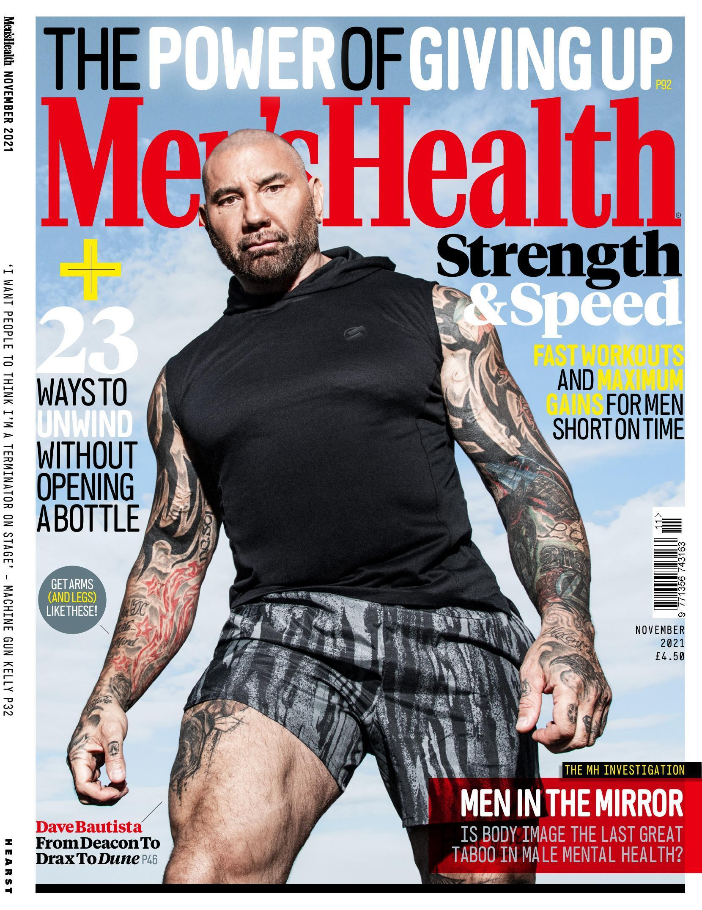
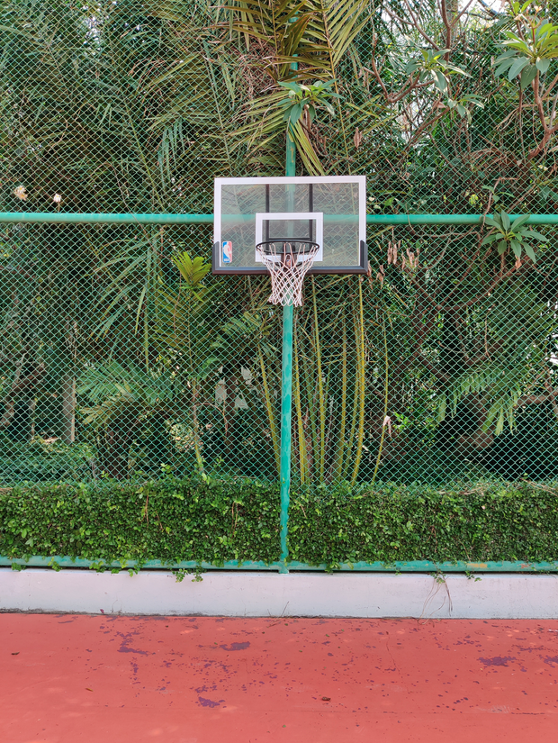
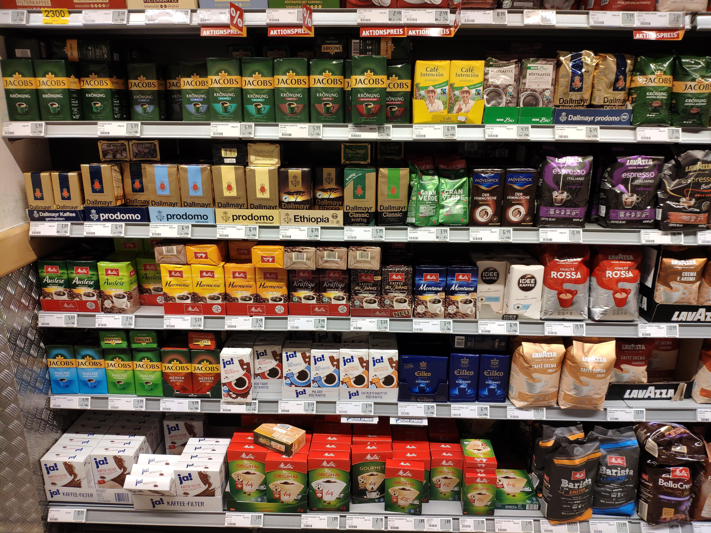
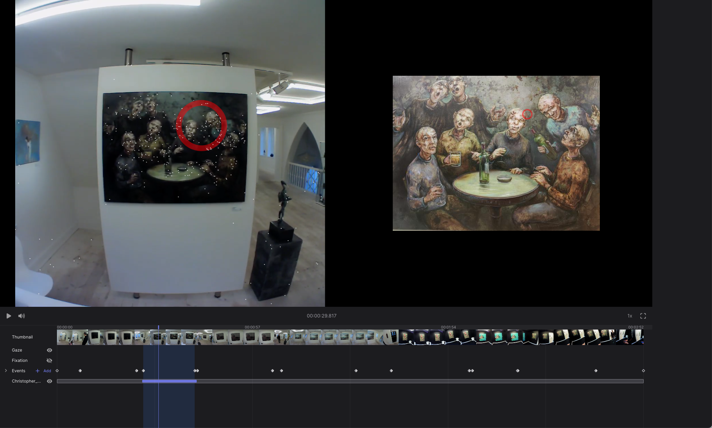
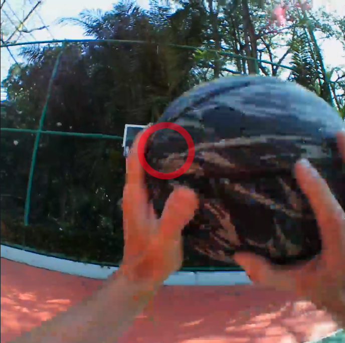

# Reference Image Mapper

Reference Image Mapper is a powerful tool to automatically map gaze onto features/objects in the environment.

<Youtube src="IF8f1Z3ZkEo" muted="1"/>

A heatmap of gaze data mapped onto the reference image can be generated, and mapped gaze and fixation data can further be downloaded as [CSV files](/pupil-cloud/enrichments/reference-image-mapper/#export-format). 

## Setup

<Youtube src="ygqzQEzUIS4"/>

As described in the setup video, you will need two things in addition to your eye tracking recording(s) to produce a Reference Image Mapper enrichment:
1. A reference image
2. A scanning video of the object/feature(s) taken with Invisible/Neon’s scene camera

:::tip
**Reference Image** 
Only the scanning recording needs to be taken with Invisible/Neon. The reference image can be taken with any camera. It can be also be a scanned image.
 
 
<b>Duration</b> 
The **3 min** duration limit only applies to the scanning recording, the rest of your videos can be as long as you like.  But to avoid long processing times and get the best results, we recommend spliting the recordings into relevant parts where you expect the image to be mapped.  
:::

In this guide, we will show you how the Reference Image Mapper can be used in a few different situations. This should help you get set up using the enrichment in your own testing environment!

Below, gaze is mapped in four very different environments: to a **magazine cover**, a **basketball backboard**, a **supermarket shelf**, and even a **whole building**!

<PhotoGrid :images="[
  `./heatmap-0.jpg`,
  `./heatmap-1.jpg`,
  `./heatmap-2.jpg`,
  `./heatmap-3.jpg`,
]"/>

Let's take a look at what the Reference Image and Scanning Recording look like to produce these heatmaps.
### 1. Magazine reading

  

  <h4>Reference image</h4>
    
  

  First, we need a high-resolution .jpeg of the page.
  

  

    <h4>Scanning video</h4>
    <Youtube src="SplYZK-ZzE8"/>
    Then, we need a scanning recording, about <i>15 s</i> long, taken on a blank background and in good lighting (natural light works well). Note that the magazine page is clear with good contrast
  

### 2. Basketball

  

  <h4>Reference image</h4>
  
  

  Here we can take a photo of the basketball hoop and court background.
  

  

    <h4>Scanning video</h4>
    <Youtube src="4MB5o4W_XJo"/>
    The scanning recording, in this case, is about 45 s long – note that the angles and distances cover what a player might see when dribbling towards the basket or taking a shot
  

### 3. Supermarket shelf

  

  <h4>Reference image</h4>
  
  
  
  This photo captures the assortment of packagíng in the coffee aisle of a supermarket.
  

  

    <h4>Scanning video</h4>
    <Youtube src="d3Yk3nKDIOQ"/>
    Notice that the scanning recording is fairly slow to reduce motion blur for this feature-rich shelf.
  

### 4. An entire building

  

  <h4>Reference image</h4>
  
  
    
  This is a photo of the <i>entire</i> building
  

  

    <h4>Scanning video</h4>
    <Youtube src="0U4H-uOIHlw"/>
    We take a longer scanning recording, about 2 min. The angles and distances cover what a person might see whilst walking past or standing in front of the building.
  

## Scanning best practices
Try to follow these best practices when recording a scanning video:
- Make the recording while holding Neon in your hand rather than wearing it on your head.
- Record the object of interest from all possible angles and from all distances a subject may view them. More diversity is better. Collecting sufficiently diverse viewpoints for a large object, like a building, may require you to move accordingly large distances.
- Move the glasses slowly while recording to avoid motion blur.
- Make sure to have good contrast and that your scene lighting during scanning is similar to that during mapping.

What works and what doesn’t?
- The scene must be **feature-rich** like in the examples above. There has to be enough salient visual content to produce a successful mapping.
- The scene needs to have relatively **static** features in the environment. If there is a lot of movement or the objects change in appearance or shape, the mapping *can* fail.

::: tip
**Ready to go?** 
Why not try replicating the above examples? Or even try it with your own use cases! If you haven’t already, we recommend you check out the [Cloud Getting Started Guide](/pupil-cloud/tutorials/), which covers the basics of working with enrichments.
:::

## Validate the gaze mapping

To check if gaze has been mapped successfully, use the side-by-side view:
1. Select a recording.
2. Select the Reference Image Mapper Enrichment.
3. Select the Scene / Reference Image View.
<!-- 4. If you want to visualize and evaluate the 3D model generated (white dots), just turn on the Point Cloud toggle! Not in the new cloud UI (to be deleted if no toggle is added)-->

Now when you play back the recording you can see where gaze is mapped to on your reference image for validation.

## Occlusions

Sometimes an object will occlude the feature/object of interest. The reference image mapper may not recognize this, so a false positive mapping could occur. 

If you need to remove the falsely mapped data points, there are a few workarounds.

1. Use Events and Sections to trim out false positive sections.
2. Manually remove the affected data points in the reference image mapper export, by finding the timestamp and deleting the row in the .csv export.

## Repetitions
In cases such as supermarket shopping, where features of the environment like freezers and aisles are repetitive and overlapping, it can be useful to divide recordings into shorter sections using [Events](/general/events/) for enrichment. This way you can ensure gaze is only mapped to portions of the recording during which you know the user is looking at a particular part of the store.

::: tip
**Want to know more?** 
Under the hood, the Reference Image Mapper uses a method called Structure from Motion (SfM) to build a model of the environment. You can see this model as a ‘point cloud’ on the left side video.
:::

## Export Format

### gaze.csv
This file contains all the mapped gaze data from all sections.

| Field | Description | 
| -------- | -------- | 
| **section id** | Unique identifier of the corresponding section.     |
| **recording id** | Unique identifier of the recording this sample belongs to.     |
| **timestamp [ns]** | UTC timestamp in nanoseconds of the sample. Equal to the timestamp of the original gaze sample before mapping.     |
| **gaze detected in reference image** | Boolean indicating whether or not the gaze point was detected inside or outside of the reference image.     |
| **gaze position in reference image x [px]** | Float value representing the x-coordinate of the mapped gaze point in pixel coordinates. If the reference image was not detected in the scene at the given time this value is empty.     |
| **gaze position in reference image y [px]** | Same as "gaze position in reference image x [px]" but for the y-coordinate.     |
| **fixation id** | If this gaze sample belongs to a fixation event, this is the corresponding id of the fixation. Otherwise, this field is empty.     |
| **blink id** | If this gaze samples belongs to a blink event, this is the corresponding id of the blink. Otherwise this field is empty.     |

### fixations.csv
This file contains fixation events detected in the gaze data stream and mapped to the reference image.

| Field | Description | 
| -------- | -------- | 
| **section id** | Unique identifier of the corresponding section.     |
| **recording id** | Unique identifier of the recording this sample belongs to.     |
| **fixation id** | Identifier of fixation within the section. The id corresponds to the fixation id of the raw unmapped data.    |
| **start timestamp [ns]** | UTC timestamp in nanoseconds of the start of the fixation.     |
| **end timestamp [ns]** | UTC timestamp in nanoseconds of the end of the fixation.     |
| **duration [ms]** | Duration of the fixation in milliseconds.     |
| **fixation detected in reference image** | Boolean indicating whether or not the fixation was inside or outside of the reference image.    |
| **fixation x [px]** | Float value representing the x-coordinate of the fixation in reference image coordinates. This position is the average of all mapped gaze samples within the fixation.     |
| **fixation y [px]** | Same as "fixation x [px]" but for the y-coordinate.     |

### Reference Image
The reference image that was used for defining the enrichment. The file is named `reference_image.jpeg|png`.