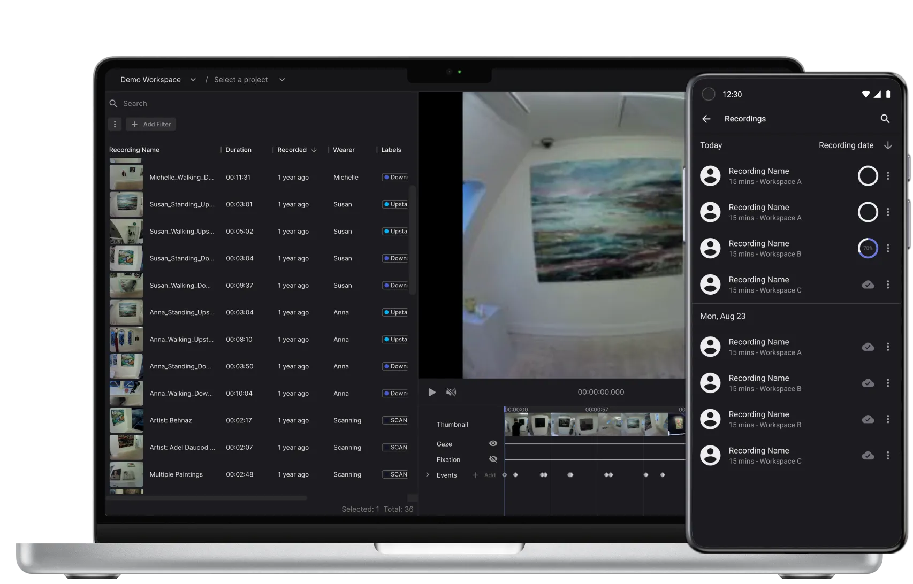

# Pupil Cloud

[Pupil Cloud](https://cloud.pupil-labs.com) is a web-based eye tracking platform for data logistics, analysis, and visualization. It is the recommended tool for processing your Neon recordings. It makes it easy to store all your data securely in one place and it offers a variety of options for analysis.

If Cloud upload is enabled in the Neon Companion app, then all recordings will be uploaded automatically to Pupil Cloud.

We have a strict privacy policy that ensures your recording data is accessible only by you and those you explicitly grant access to. Pupil Labs will never access your recording data unless you explicitly instruct us to.
