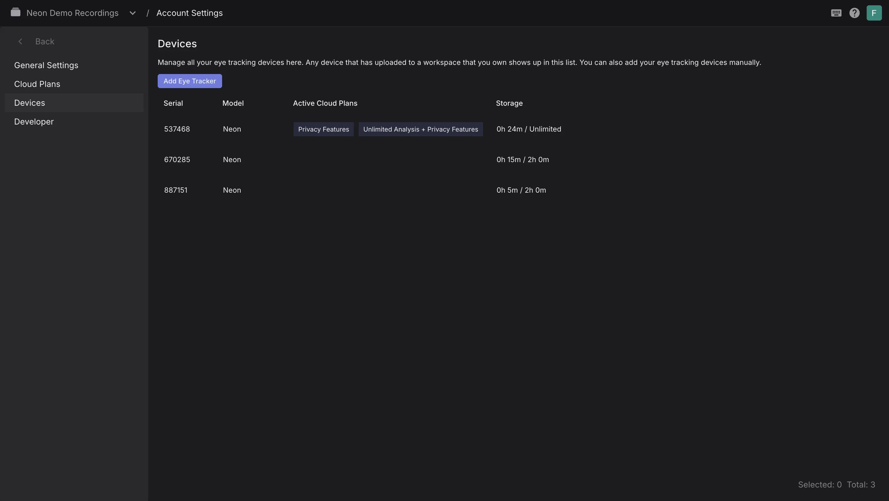
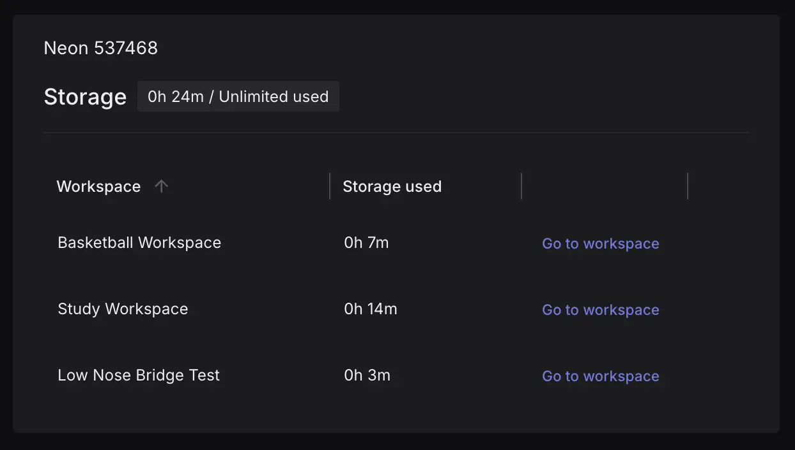

# What Are Cloud Plans?

Pupil Cloud offers different plans to fit your needs:

- **Free Plan:** Lets you explore Pupil Cloud and run small-scale studies with two hours of active analysis
- **Unlimited Analysis Plan:** Built for comprehensive research, this plan unlocks unlimited active analysis and supports multiple devices for labs, universities, and enterprise projects.

You can purchase or configure your plan through the [Pupil Labs website](https://pupil-labs.com/products/cloud/pricing).

Plans are registered to a single user account and can be configured to support one or
multiple eye tracking devices. You can also enhance your plan with optional features, like Anonymization.

Active analysis refers to the duration of recordings that can be processed through Pupil Cloud’s analysis and visualization
pipelines.

## Activate Your Plan and Features

Your plan and any additional features need to be registered with your user account. This can be
done by clicking the link sent in your purchase confirmation email.

You can also manually register a plan or feature in Pupil Cloud:

1. Click on the top right account avatar in the navigation bar, and then “Account Settings”
2. In the Cloud Plans tab, click on “Register Cloud Plan”
3. Enter your Activation Key and your Cloud Plan start date
4. Click "Confirm" and then "Activate"

<video width="100%" controls>
  <source src="./Register.mp4" type="video/mp4">
</video>

## Link Your Devices to a Plan

Linking a device or devices to your plan unlocks the benefits of the plan for those devices. You can
link devices to your plan in the same Cloud Plans tab of your Account Settings.

Click 'Link device' in the table. The drop-down menu will contain the serial numbers of all devices
that have previously uploaded recordings to your workspaces. You can also obtain the
serial of a new device via the Companion app and enter it here.

<video width="100%" controls>
  <source src="./Link.mp4" type="video/mp4">
</video>

## Devices Tab

The Devices tab shows all devices that have uploaded to workspaces you own. Here you can check which plan each device
is linked to (Free or Unlimited) and monitor storage.

You can also check the workspaces each device has uploaded to by double clicking on a device in the table.

::: info
If you have purchased the Anonymization feature, you can you create a new workspace and enable `Face Blurring`. Any recordings uploaded to this workspace will be anonymized.
:::

## Sharing Your Plan's Benefits

An Unlimited Analysis Plan is tied to both **your Pupil Cloud account** and **the device(s) you linked to it**. This means, any recording created on a linked device and uploaded to a [workspace](https://docs.pupil-labs.com/neon/pupil-cloud/workspaces/) owned by that account will automatically receive the benefits of your plan, regardless of who uploads it.

If you want to collaborate with other accounts, it can help to view the account that registers the plan as a _master account_. This _master account_ is responsible for registering the plan, linking devices, and if you want other accounts to benefit, creating [workspaces](https://docs.pupil-labs.com/neon/pupil-cloud/workspaces/) and inviting collaborators to them.

Invited users can view, edit, enrich, and download recordings according to their assigned roles. When they upload recordings from a linked device into one of these workspaces, they also benefit from the plan. This setup allows your team to share the features of your Unlimited Analysis Plan (and privacy features, where applicable) without requiring additional plans.

::: tip
Registered the plan on the wrong account? Need to transfer a workspace from from your team member to your master account? No problem! Just reach out to our [support team](mailto:info@pupil-labs.com) and we'll be happy to help
:::

### Device Access

Upon inviting other users to your workspace, they can keep using their credentials to log into the [Companion App](https://docs.pupil-labs.com/neon/data-collection/ecosystem-overview/#neon-companion-app), they simply need to select the appropiate workspace before making the recording.
