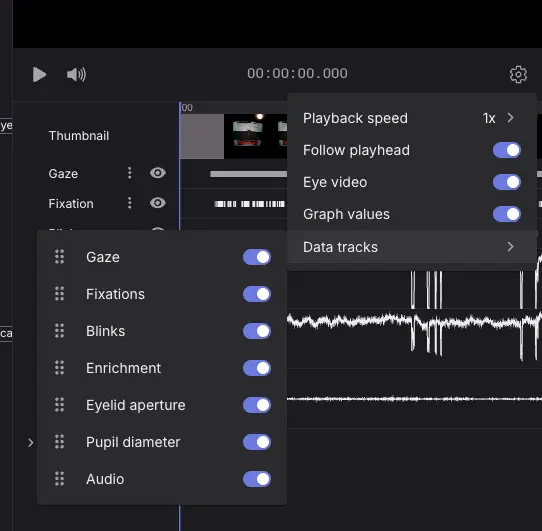

# Video Player

Pupil Cloud provides a fully featured video player with a timeline for visualizing eye tracking data.

## Changing Speed and Follow Playhead Mode

<Youtube src="AWLpFRwYVmo"/>

The playback speed can be adjusted in Settings.

::: tip
You can modify the speed also by pressing <kbd>Shift</kbd> + <kbd>.</kbd> to increase speed and <kbd>Shift</kbd> + <kbd>,</kbd> to decrease speed.
:::

‘Follow Playhead’ mode is toggled on by default to keep the playhead in the center of the timeline as the video plays. Turn this on/off in Settings.

## Gaze, Fixation, and Eye Overlay Customization

<Youtube src="-igWmBCiGGA"/>

You can customize gaze visualization (circle or crosshair) with adjustable size, color, width, and transparency. You can also adjust colors for fixation and scanpath visualization, enable or disable fixation history and fixation numbers for flexible analysis.

Eye video can be enabled or disabled, positioned, and scaled. Customized settings are applied for the user across the application.

# Timeline

## Customizing the Timeline and Data Tracks

<Youtube src="Sv2a8Wn2lrM"/>

There are data tracks for each recording: gaze, fixation, blinks, eyelid aperture, pupil diameter, audio, and events. Hover on each track to see: graph values, blink and fixation ID and duration, and event name and times.

You can customize how data tracks are displayed across the app in Settings → Data Tracks.

::: tip
Press <kbd>S</kbd> to seek to the next fixation, Press <kbd>A</kbd> to return to the previous fixation.
See all keyboard shortcuts using Cmd+D / Ctrl+D
:::
