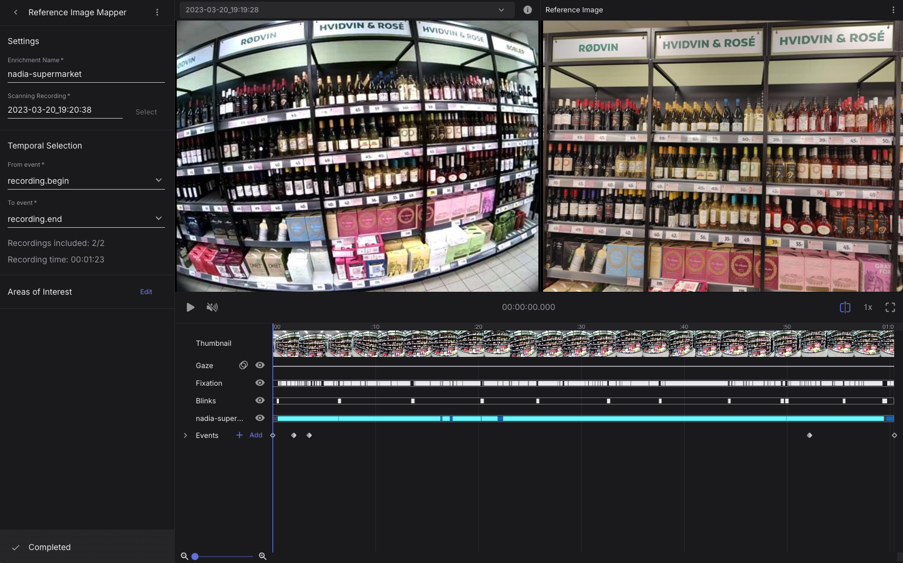
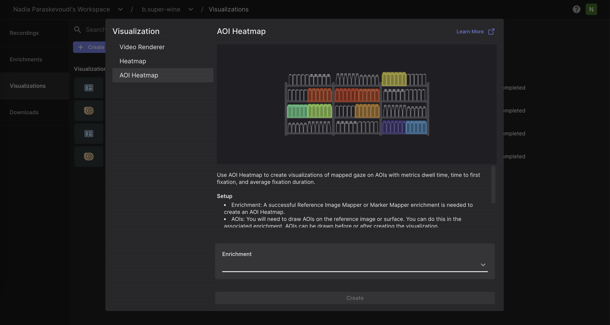

# Areas of Interest (AOIs)

The AOI Editor allows you to draw areas of interest (AOIs) on top of the reference image or surface. You can draw anything from simple polygons to multiple disconnected shapes. This tool is available for use after an [Auto Image Mapper](/pupil-cloud/enrichments/auto-image-mapper/), a [Reference Image Mapper](/pupil-cloud/enrichments/reference-image-mapper/), a [Marker Mapper](/pupil-cloud/enrichments/marker-mapper/), or a [Manual Mapper](/pupil-cloud/enrichments/manual-mapper/) enrichment is completed.

## Setup

### AOI Editing and Drawing

Upon completion of the enrichment, access the main view of the enrichment by navigating to the **`Enrichments`** tab and selecting **`Edit`** next to **`Areas of Interest`**.

From there, you will enter the AOI editing view and you are ready to start drawing AOIs on your reference image or surface.

<video width="100%" controls>
  <source src="./aoi_drawing_and_editing_lowres.mp4" type="video/mp4">
</video>

**AOI Labels**

AOIs can be associated with one or more labels. Labels provide a flexible way to classify AOIs and enable aggregation of gaze metrics across multiple AOI instances and across one or more enrichments within a project.

Right click the label to quickly access the label menu. Multi select AOIs with `shift` or `ctrl` (`cmd` for MacOS) and assign labels to multiple AOIs at once.

Labels exist in the Project scope. To manage Labels, right click an AOI and select ‘Manage Labels’ in the menu.

::: tip
Would you like to automatically segment your areas of interest? Check out our [Alpha-Lab tutorial](https://docs.pupil-labs.com/alpha-lab/gaze-metrics-in-aois/).
:::

### AOI Heatmap and Metrics

To visualize your AOI heatmap:

- Navigate to the **`Visualizations`** tab.
- Click on **`Create Visualization`**.
- Select **`AOI heatmap`** and the enrichment to which it should be applied.

Within the AOI Heatmap view, users can specify the recordings to be included, the metric to be displayed, and which AOIs should be incorporated into the visualization. In the recording drop-down selector, you can view the fixation count for each recording. This provides a clearer understanding of exactly what data is contributing to the visualization.

<!-- <Youtube src="Rrb6OKmTCOs"/> -->
<video width="100%" controls>
  <source src="./aoi_metrics_reduced.mp4" type="video/mp4">
</video>

## Export Format

In the AOI Heatmap view and the Downloads view, you can download:

- The final visualization displaying the metric of your interest in `.png` format.

- `aoi_fixations.csv`: This file contains fixation events mapped on each area of interest.

| Field                                | Description                                                                                      |
| ------------------------------------ | ------------------------------------------------------------------------------------------------ |
| **label id**                         | Unique identifier of the corresponding AOI label.                                                |
| **aoi label**                        | Label of the corresponding AOI.                                                                  |
| **section id**                       | Unique identifier of the corresponding section.                                                  |
| **recording id**                     | Unique identifier of the recording this sample belongs to.                                       |
| **fixation id**                      | Identifier of fixation within the section. The counter starts at the beginning of the recording. |
| **fixation&nbsp;duration&nbsp;[ms]** | Duration of the fixation in milliseconds.                                                        |

- `aoi_metrics.csv`: This file contains standard fixation metrics on AOIs.

| Field                                               | Description                                                                                                              |
| --------------------------------------------------- | ------------------------------------------------------------------------------------------------------------------------ |
| **label id**                                        | Unique identifier of the corresponding AOI label.                                                                        |
| **recording id**                                    | Unique identifier of the recording this sample belongs to.                                                               |
| **recording name**                                  | Unique identifier of the corresponding AOI label.                                                                        |
| **aoi label**                                       | Label of the corresponding AOI.                                                                                          |
| **average&nbsp;fixation&nbsp;duration&nbsp;[ms]**   | Average fixation duration for the corresponding area of interest in milliseconds.                                        |
| **total fixations**                                 | Total number of fixations for the corresponding area of interest in milliseconds.                                        |
| **time&nbsp;to&nbsp;first&nbsp;fixation&nbsp;[ms]** | Average time in milliseconds until the corresponding area of interest gets fixated on for the first time in a recording. |
| **total&nbsp;fixation&nbsp;duration&nbsp;[ms]**     | Total fixation duration for the corresponding area of interest in milliseconds.                                          |

Through the **`Downloads`** tab, you can download the AOI-related files as part of the enrichment folder. Note, that the following CSV files will be empty if no AOIs are defined for a specific enrichment.

### aoi_fixations.csv

This file contains fixation events mapped on each area of interest.

| Field                                | Description                                                                                      |
| ------------------------------------ | ------------------------------------------------------------------------------------------------ |
| **label id**                         | Unique identifier of the corresponding AOI label.                                                |
| **aoi label**                        | Label of the corresponding AOI.                                                                  |
| **section id**                       | Unique identifier of the corresponding section.                                                  |
| **recording id**                     | Unique identifier of the recording this sample belongs to.                                       |
| **fixation id**                      | Identifier of fixation within the section. The counter starts at the beginning of the recording. |
| **fixation&nbsp;duration&nbsp;[ms]** | Duration of the fixation in milliseconds.                                                        |

### aoi_metrics.csv

This file contains standard fixation metrics on AOIs.

| Field                                               | Description                                                                                                              |
| --------------------------------------------------- | ------------------------------------------------------------------------------------------------------------------------ |
| **label id**                                        | Unique identifier of the corresponding AOI label.                                                                        |
| **recording id**                                    | Unique identifier of the recording this sample belongs to.                                                               |
| **recording name**                                  | Name of the recording this sample belongs to.                                                                            |
| **aoi label**                                       | Label of the corresponding AOI.                                                                                          |
| **average&nbsp;fixation&nbsp;duration&nbsp;[ms]**   | Average fixation duration for the corresponding area of interest in milliseconds.                                        |
| **total fixations**                                 | Total number of fixations for the corresponding area of interest in milliseconds.                                        |
| **time&nbsp;to&nbsp;first&nbsp;fixation&nbsp;[ms]** | Average time in milliseconds until the corresponding area of interest gets fixated on for the first time in a recording. |
| **total&nbsp;fixation&nbsp;duration&nbsp;[ms]**     | Total fixation duration for the corresponding area of interest in milliseconds.                                          |
