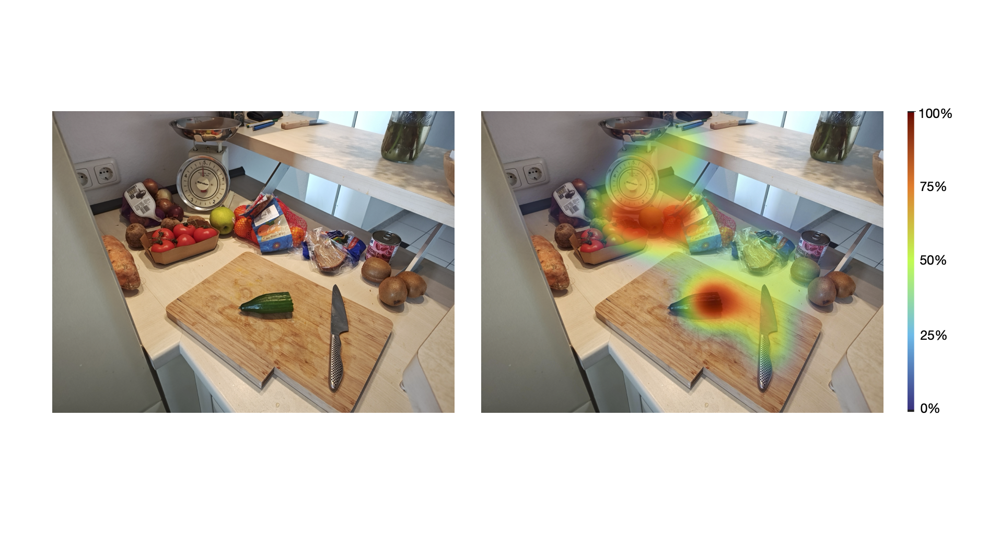

# Heatmap

The output of the [Auto Image Mapper](/pupil-cloud/enrichments/auto-image-mapper/), [Reference Image Mapper](/pupil-cloud/enrichments/reference-image-mapper/), [Marker Mapper](/pupil-cloud/enrichments/marker-mapper/), and [Manual Mapper](/pupil-cloud/enrichments/manual-mapper/) enrichments can be visualized as a traditional heatmap. This shows you which parts of your reference image or surface were fixated more often by an observer.

For example, below and to the left is a view of a kitchen that was used as a reference image. On the right, you can see the output of the Heatmap Visualization for a recording that was made while the observer was preparing ingredients.



The Heatmap is a Gaussian blurred 2D histogram of fixation data from all selected recordings mapped to the reference image. No normalization for recording time is performed, so longer recordings will carry more weight and contribute more to the Heatmap.

The colors in the heatmap range from 0 to 100%, as indicated by the color bar to the right. A value of 0% means a point was never fixated and 100% means it had the longest fixation duration.

The output of the Heatmap Visualization is two image files: one image with just the Heatmap and another where it is overlayed on the reference image.

:::: details Implementation Details

1. Compute the 2D histogram over the fixation data of all selected recordings. The histogram has the same aspect ratio as the reference image, with the wider side set to 300 bins:
    
    ```
    fixation_histogram2d = hist2d(fixation_x, fixation_y, bins=[nbins_x, nbins_y])
    ```
    
2. Apply a 2D Gaussian blur to the 2D histogram and normalize the resulting values to the maximum:
    
    ```
    fixation_heatmap = GaussianBlur(fixation_histogram2d, 0.01 * scale)
    fixation_heatmap /= max(fixation_heatmap)
    ```
    
3. Resize the Heatmap using Lanczos smoothing interpolation:
    
    ```
    final_heatmap = resize(fixation_heatmap,
                           (ref_img_width, ref_img_height),
                           interpolation=LANCZOS)
    ```

::::

## Export Format

Within the Heatmap view, you can download:
- The final visualization in `.png` format
- The heatmap overlay in `.png` format

- `aoi_fixations.csv`: This file contains fixation events mapped on each area of interest.

| Field                                | Description                                                                                      |
| ------------------------------------ | ------------------------------------------------------------------------------------------------ |
| **label id**                         | Unique identifier of the corresponding AOI label.                                                |
| **aoi label**                        | Label of the corresponding AOI.                                                                  |
| **section id**                       | Unique identifier of the corresponding section.                                                  |
| **recording id**                     | Unique identifier of the recording this sample belongs to.                                       |
| **fixation id**                      | Identifier of fixation within the section. The counter starts at the beginning of the recording. |
| **fixation&nbsp;duration&nbsp;[ms]** | Duration of the fixation in milliseconds.                                                        |


- `aoi_metrics.csv`: This file contains standard fixation metrics on AOIs.

| Field                                               | Description                                                                                                              |
| --------------------------------------------------- | ------------------------------------------------------------------------------------------------------------------------ |
| **label id**                                        | Unique identifier of the corresponding AOI label.                                                                        |
| **recording id**                                    | Unique identifier of the recording this sample belongs to.                                                               |
| **recording name**                                  | Name of the recording this sample belongs to.                                                                            |
| **aoi label**                                       | Label of the corresponding AOI.                                                                                          |
| **average&nbsp;fixation&nbsp;duration&nbsp;[ms]**   | Average fixation duration for the corresponding area of interest in milliseconds.                                        |
| **total fixations**                                 | Total number of fixations for the corresponding area of interest in milliseconds.                                        |
| **time&nbsp;to&nbsp;first&nbsp;fixation&nbsp;[ms]** | Average time in milliseconds until the corresponding area of interest gets fixated on for the first time in a recording. |
| **total&nbsp;fixation&nbsp;duration&nbsp;[ms]**     | Total fixation duration for the corresponding area of interest in milliseconds.                                          |
