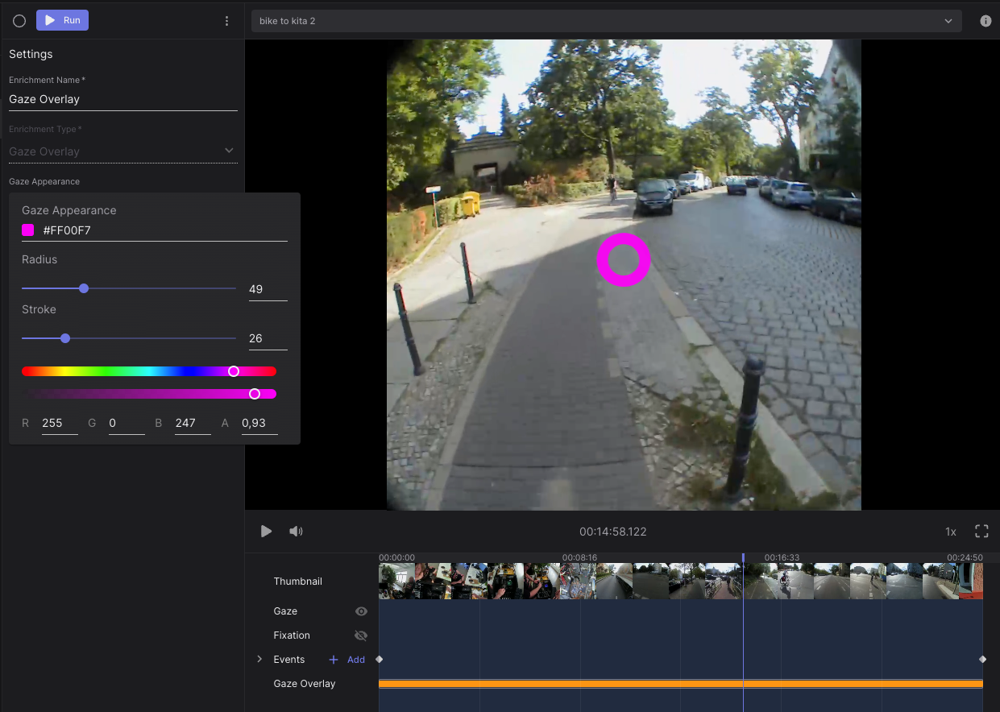

# Video Renderer

The Gaze Overlay enrichment allows you to download world videos with a gaze overlay and/or fixation scanpath renderings. You can easily filter out the sections of your recordings you are interested in and customise the visualization. Currently, you can select whether to show or not the gaze, and change its size, stroke, color and transparency. 

Furthermore, you can choose to show the fixation scanpath, or to undistort the video (correcting the lens distortion).

