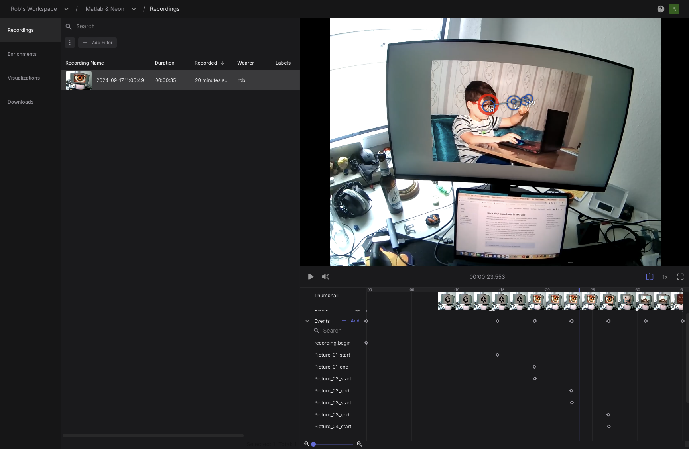
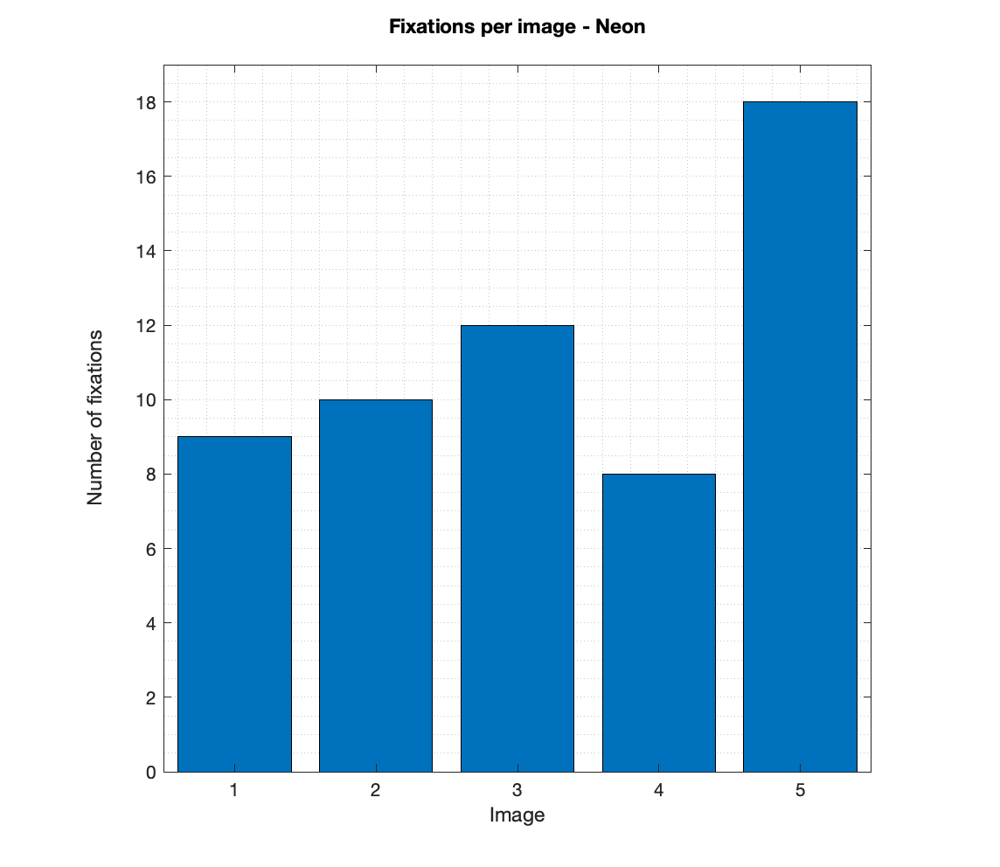

# Track Your Experiment in MATLAB

MATLAB is often used by researchers to build eye tracking experiments, such as tracking how long participants look at stimuli presented on a computer screen.

When working with head-mounted eye trackers like Neon, it can be useful to synchronize stimuli presentation with the eye tracking recording. This enables you to, a) keep track of when a stimulus is shown, and b) segment the eye tracking data accordingly.

In this guide, we will build a simple MATLAB experiment. The experiment will show you how to automatically and conveniently track stimulus presentation as part of your eye tracking recording using [events](/data-collection/events/) and [Neon's real-time API](/real-time-api/tutorials/). Finally, you will see how those events enable the segmentation of eye tracking data per stimulus during the analysis.

We will use our [pl-neon-matlab](https://github.com/pupil-labs/pl-neon-matlab) integration in this guide. See that link for installation instructions.

::: tip
A similar guide for tracking an experiment in Python can be found [here](/real-time-api/track-your-experiment-progress-using-events/).
:::

## Requirements

First, make sure that the Neon-MATLAB integration is installed and working.

You can use any library that you want to present your stimulus or even [run the integration alone](#can-i-run-the-integration-alone?). However, if you plan on running the current demo to its full extent, you will need to install [Psychtoolbox](http://www.psychtoolbox.org/download.html) and ensure it runs before continuing.

[Psychtoolbox](http://www.psychtoolbox.org/) is a free set of MATLAB and GNU Octave functions for vision and neuroscience research, which makes it easy to show accurately controlled visual stimuli on-screen. You can learn more about it [here](http://www.psychtoolbox.org/).

All images used in the demo are from [Unsplash](https://unsplash.com/), but we do not include the photos in the demo files. Therefore, you will need internet access so MATLAB can read them from the web.

Finally, you will need to download the demo code, which can be found [here](https://github.com/pupil-labs/pl-neon-matlab/blob/main/matlab/examples/demo_pupil_labs.m).

## How To Use Events To Keep Track of Your Experiment

Before we dig into how to run the demo and the integration, you will need to understand what events are and how to use them to keep track of your experiment.

Events are essentially timestamps within a recording that have been marked with a name. In this demo, we need to track when a specific image is shown during a recording to associate the fixation data with that image. Thus, we will create an event at the start and end of each image presentation to mark this section.

Events can be created post-hoc in the project editor or at recording time using either the [real-time API](/real-time-api/tutorials/) or the [Monitor app](/data-collection/monitor-app/). In this example, we are interested in fully automating the event creation within MATLAB. Still, depending on your use case, you could use either of those methods.

## Running the Demo

Hands-on!
Confirm that your Neon device is plugged into the Companion Device.
Check that the Companion Device and the MATLAB computer are connected to the same network.
Then you can execute the demo code as shown below:

```matlab
demo_pupil_labs;
```

### Walkthrough of the Demo

Beyond all the steps needed to display an image in Psychtoolbox (which you can find in the demo code), here we will focus on the calls to the Neon real-time API.

First, we initiate a connection to the Neon Companion Device.

```matlab
device = Device();
```

A proper connection will return without errors.

Then, the demo script will load the images, and several steps will follow to prepare a Psychtoolbox call to the screen. After that, the recording is initialised.

```matlab
device.recording_start();
```

It's good practice to start the recording before drawing anything on the screen, as the device might start the recording with a small delay.

In the demo, a logo is shown, and a keystroke is required to start displaying the images when the participant is ready. When an image is shown `(Screen('Flip'))`, a starting event call is made to annotate the beginning of the image presentation.

```matlab
device.send_event(['Picture_',num2str(n, '%02.0f'),'_start']);
```

After 4 seconds, another event call is performed to mark the end of the section.

```matlab
device.send_event(['Picture_',num2str(n, '%02.0f'),'_end']);
```

Finally, the recording is stopped and saved after iterating through all the images.

```matlab
device.recording_stop_and_save();
```

Additionally, a cancel command was included in our catch routine, so the recording is discarded if any error occurs.

```matlab
device.recording_cancel();
```

That is all we have to do during data collection. Once all recordings have been uploaded to Pupil Cloud, we create a
project to export them using the "Downloads" view. Within the project editor, we can already see the events in every recording.



## Analysing the Data

Having the .csv files means we can read them within MATLAB and start doing some magic!

Let's plot the number of fixations per image using our demo data.

```matlab
% Import events and fixations from the csv files as tables
events = readtable("events.csv");
fixations = readtable("fixations.csv");

% Take only those events with Picture in the name as this is what we used
% in demo_pupil_labs to target our events.
events = events(contains(events.name, "Picture"), :);
start_events = events(contains(events.name, "start"), :);
end_events = events(contains(events.name, "end"), :);

% New array matching events and fixations
for nImage = 1:height(start_events)
    imIndex(1,nImage) = nImage;
    fixperIm(1, nImage) = sum(fixations.startTimestamp_ns_ >= start_events.timestamp_ns_(nImage) &...
        fixations.endTimestamp_ns_ <= end_events.timestamp_ns_(nImage));
end

% Plot the data
bar(imIndex,fixperIm);
axis square; grid minor;
ylim([0 max(fixperIm)+1]);
xlabel('Image'); ylabel(['Number of fixations', newline]);
title(['Fixations per image - Neon', newline]);
```



## Can I Run the Integration Alone?

Yes, nothing about the Neon-MATLAB integration depends on Psychtoolbox. Simply follow [the installation instructions](https://github.com/pupil-labs/pl-neon-matlab) and then, initiate a connection to the Neon Companion Device.

```matlab
device = Device();
```

The Neon-MATLAB integration mirrors [the Python implementation](https://docs.pupil-labs.com/neon/real-time-api/tutorials/), so many of the functions have the same name and signature. Check [the MATLAB examples](https://github.com/pupil-labs/pl-neon-matlab/tree/main/matlab/examples) to see other ways you can use it.

## Performance

:::tip
The speed of the `receive_gaze_datum` function call has been measured to be 0.0055 seconds on average (0.0038 seconds median), matching the speed of the Python implementation on modern systems.
:::
