# Map and visualize gaze onto multiple reference images taken from the same environment

<TagLinks />

    <iframe width="560" height="315" src="https://www.youtube.com/embed/BZoO7zxHaiw?si=I3zF-EV4O-ancTY0" title="YouTube video player" frameborder="0" allow="accelerometer; autoplay; clipboard-write; encrypted-media; gyroscope; picture-in-picture" allowfullscreen></iframe>

 

::: tip
Level-up your Reference Image Mapper workflow to extract insights from participants freely exploring their environment!
:::

## Exploring gaze patterns on multiple regions of an environment
Understanding where subjects focus their gaze in relation to their environment is a common area of study for researchers in fields as diverse as art, architecture, and fall safety. Recently, powerful scene recognition tools such as the Reference Image Mapper enrichment in Pupil Cloud have made it possible to map gaze onto 3D environments, and generate heatmap visualizations. This offers a high-level overview of visual exploration patterns and also paves the way for further analysis, such as region of interest analysis.

In this guide, we will show you how to use the [Reference Image Mapper](/enrichments/reference-image-mapper/) to map a participant's gaze onto multiple areas of a living environment as they freely navigate around it.

::: tip
Before continuing, ensure you are familiar with the [Reference Image Mapper](/enrichments/reference-image-mapper) enrichment. Check out [this explainer video](https://www.youtube.com/watch?v=ygqzQEzUIS4&t=56s) for reference.
:::

## The tools at hand
The [Reference Image Mapper](/enrichments/reference-image-mapper/) enrichment available in Pupil Cloud can be used to map gaze onto a single reference image of an environment. However, mapping gaze onto *multiple* regions of an environment is often of interest, since it can enable a deeper understanding of patterns of visual exploration.  Therefore, we have put together this guide to show you how to leverage Reference Image Mapper for this purpose.

Because the [Reference Image Mapper](/enrichments/reference-image-mapper/) is only able to map gaze onto a *single* reference image, we need a few things to generate *multiple* reference image mappings in a larger environment:

- Multiple reference images of the environment
- Single or multiple scanning recordings. The choice of whether to use single or multiple scanning recordings depends on the dimensions of the space to be explored. Further details on this in ‘Steps’
- An eye tracking recording taken as the participant(s) move freely within the environment, combined with custom user-inputted [events](/neon/basic-concepts/events) to segment the recording into [sections](/enrichments/#enrichment-sections) based on the specific areas the person was looking at

## Steps
1. **Capture Reference Images:** Take pictures of the areas or objects within the environment you wish to investigate. Here are some example pictures of different areas and pieces of furniture in the living room:

    

        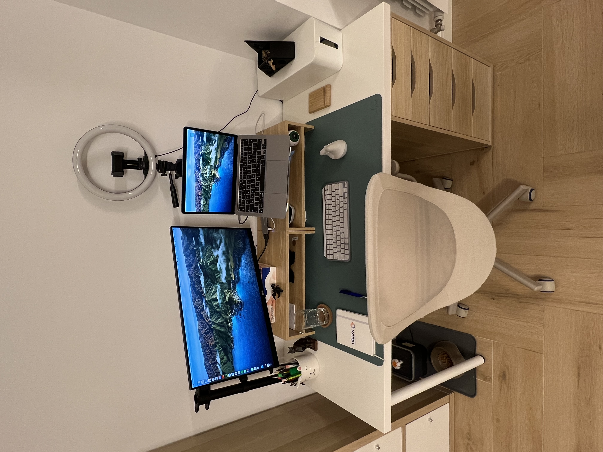
    

    

        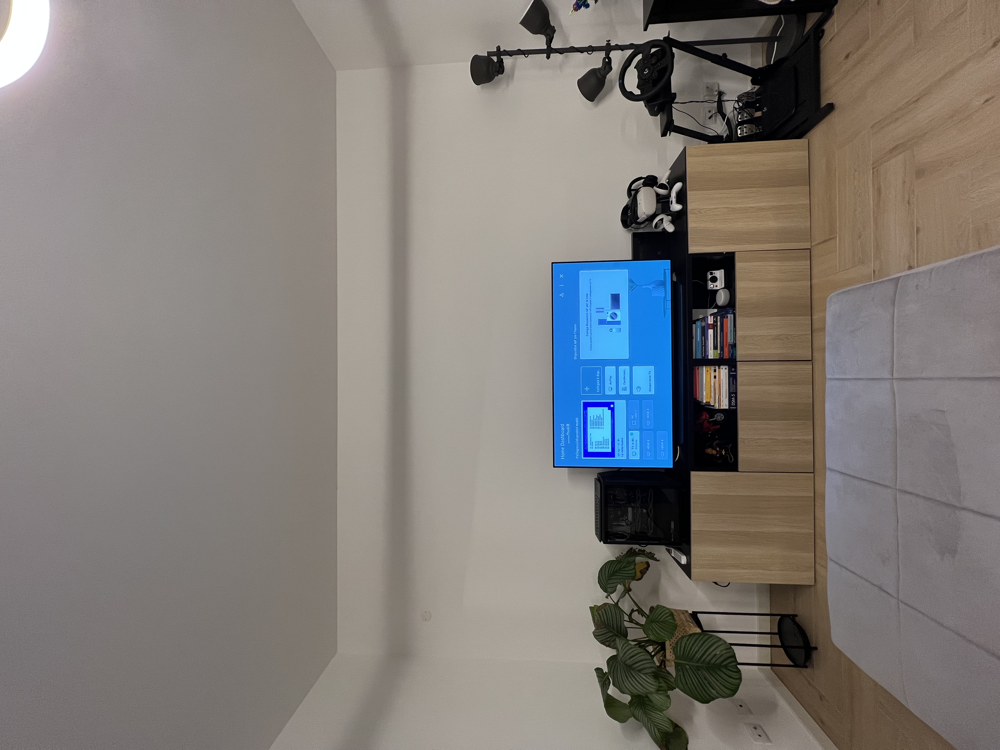
    

    

        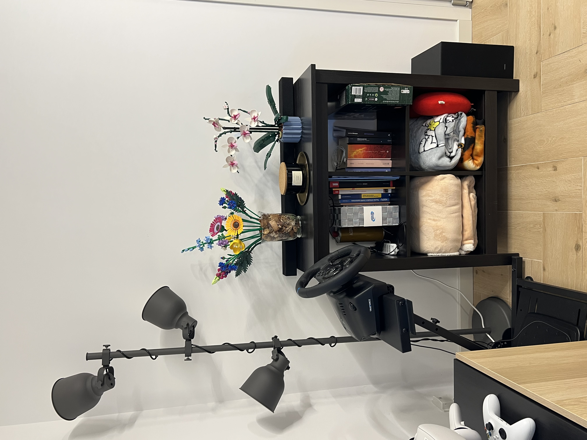
    

    

        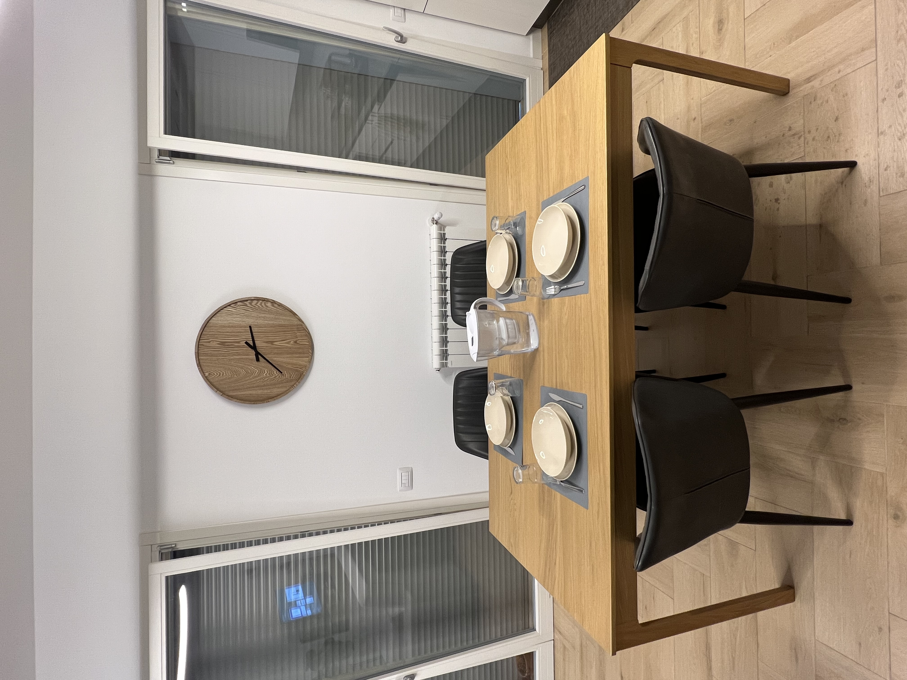
    

    

        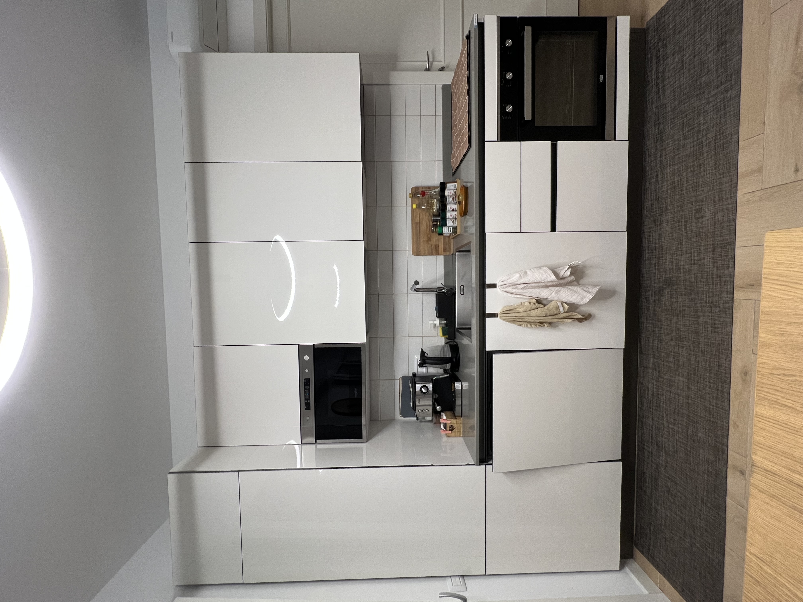
    

    

        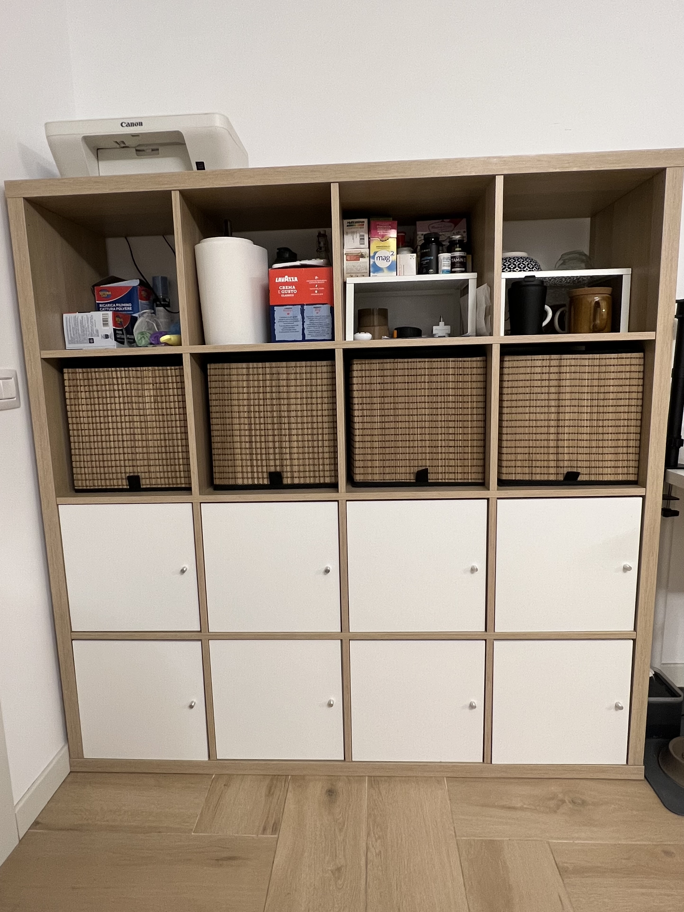
    

2. **Record Scanning Videos:** For this tutorial, we used *five* separate scanning recordings to cover the living room environment. If you have an even bigger or more complex environment, it might be necessary to use more scanning recordings, which is fine. On the other hand, it might be possible to use just one scanning recording if you can capture sufficient data, or where you have a smaller environment. Remember, each scanning recording must be **under 3 minutes in duration**. 
    
Check out these videos which show how we made the scans (also be sure to follow our [best practices](/enrichments/reference-image-mapper/#scanning-best-practices) for optimal scanning):

::: tip
To ensure accurate scanning of large plain surfaces like tables and kitchen countertops, enrich them with features. Consider using a printed tablecloth or placing items to enhance the mapping process.
:::

  

    

      <iframe style="position: absolute; width: 100%; height: 100%; border: none;" src="https://www.youtube.com/embed/jeL8gs053lg?si=6wlx4fjxlfiqrbRq"></iframe>
    

  

  

    

      <iframe style="position: absolute; width: 100%; height: 100%; border: none;" src="https://www.youtube.com/embed/zksTzVkGifk?si=3bxl0eKOgRbfoes-"></iframe>
    

  

  

    

      <iframe style="position: absolute; width: 100%; height: 100%; border: none;" src="https://www.youtube.com/embed/Bg_SiFByceY?si=d2koC7-V7bbrYL3h"></iframe>
    

  

  

    

      <iframe style="position: absolute; width: 100%; height: 100%; border: none;" src="https://www.youtube.com/embed/0r8oAn2AZMQ?si=SbSVHedGTJ4Zshfw"></iframe>
    

  

  

    

      <iframe style="position: absolute; width: 50%; height: 50%; left: 50%; transform: translateX(-50%); border: none;" src="https://www.youtube.com/embed/fmy9F8Q9eW0?si=F7q399iZHGW2kArv"></iframe>
    

  

3. **Eye Tracking Recordings:** Make an eye tracking recording while the participant(s) freely explore and visually interact with various elements within the environment. (You can of course make these prior to the reference images and scanning recordings).

4. **Add Custom Events:** During the eye tracking recording, users may focus on specific furniture or parts of the room multiple times. By adding custom [events](/neon/basic-concepts/events) annotations corresponding to these areas or objects, you can create [sections](/enrichments/#enrichment-sections) for the enrichments to be performed. This approach allows you to run each enrichment only on the portion of the recording where a certain object is present. For this tutorial, we used the following event annotations to run five Reference Image Mapper enrichments:
    - Desk: `desk.begin` and `desk.end`
    - TV area 1: `tv1.begin` and `tv1.end`
    - TV area 2: `tv2.begin` and `tv2.end`
    - Table: `table.begin` and `table.end`
    - Kitchen: `kitchen.begin` and `kitchen.end`
    - Cupboard: `cupboard.begin` and `cupboard.end`

5. **Create and run the enrichments:** You will need to create a separate enrichment for each reference image. A reasonable naming scheme *could* correspond to each area of the environment, like ‘cupboard’, ‘desk’ etc. In the temporal selection of each enrichment, be sure to use the appropriate events labels. E.g. for ‘cupboard’, you would use `cupboard.begin` and `cupboard.end`. Now, run the enrichments to map the subject's gaze from the recording onto the multiple reference images you captured.

## Final results

Once the enrichments are completed, heatmaps are automatically generated illustrating the areas which attracted more gaze. Additionally, you'll have the option to download gaze and fixation data mapped within the bounds of the pictures, enabling you to conduct further in-depth analyses.

    

        
    

    

        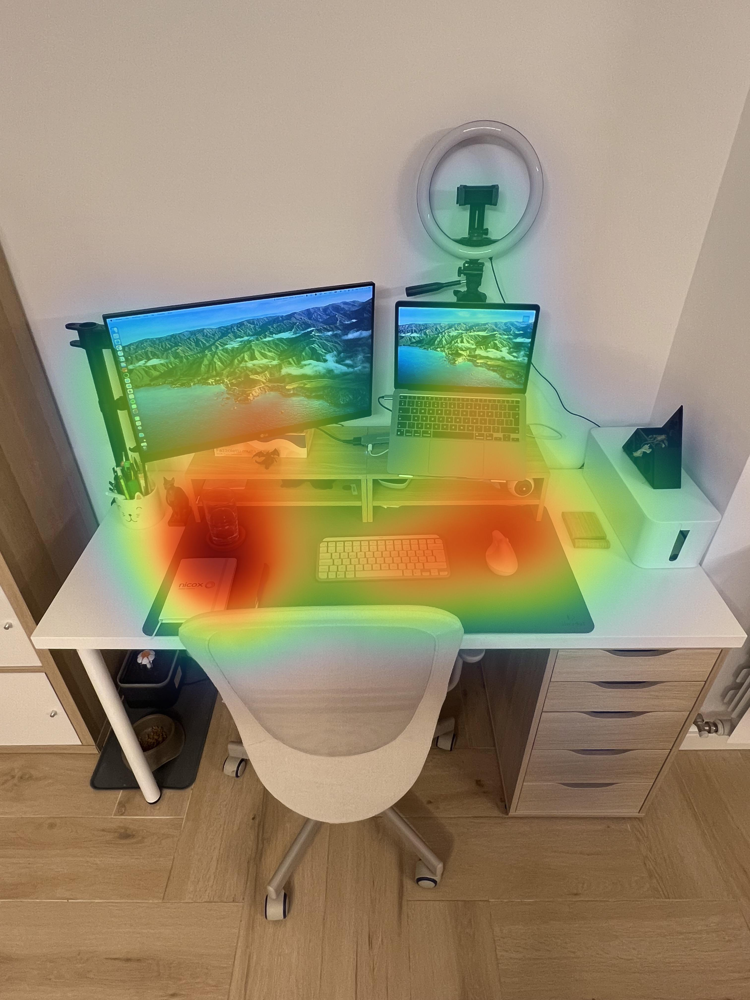
    

  

    

        
    

    

        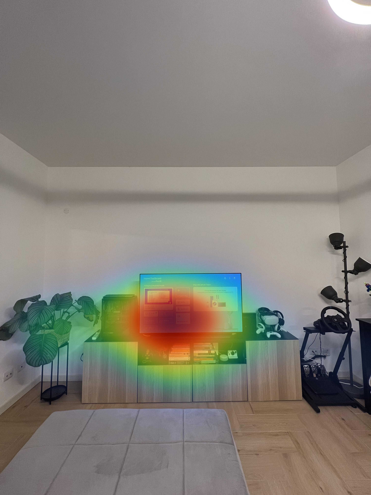
    

  

    

        
    

    

        
    

  

    

        
    

    

        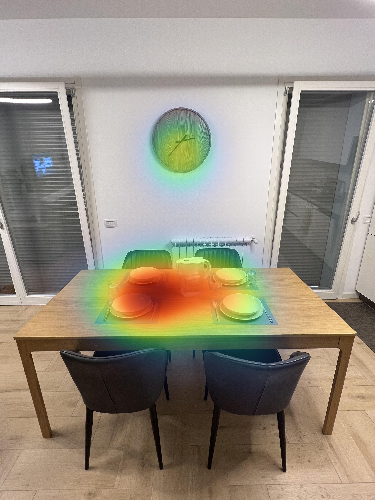
    

  

    

        
    

    

        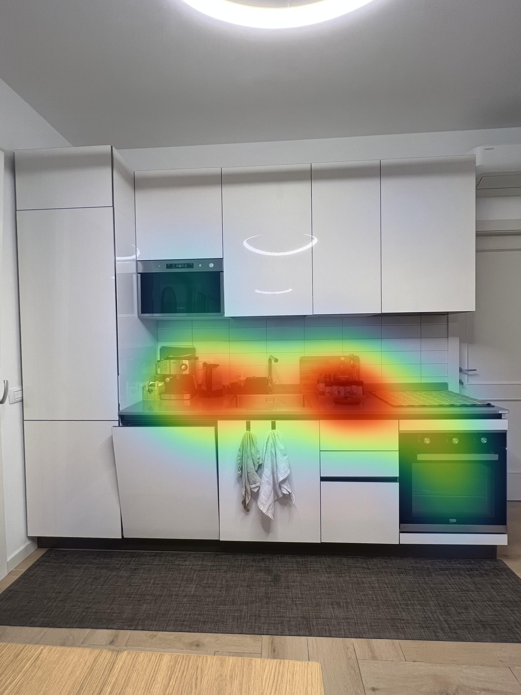
    

  

    

        
    

    

        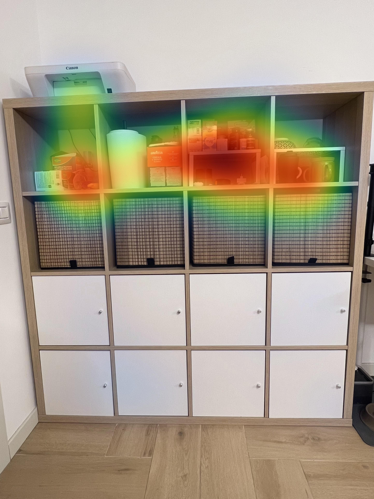
    

  

