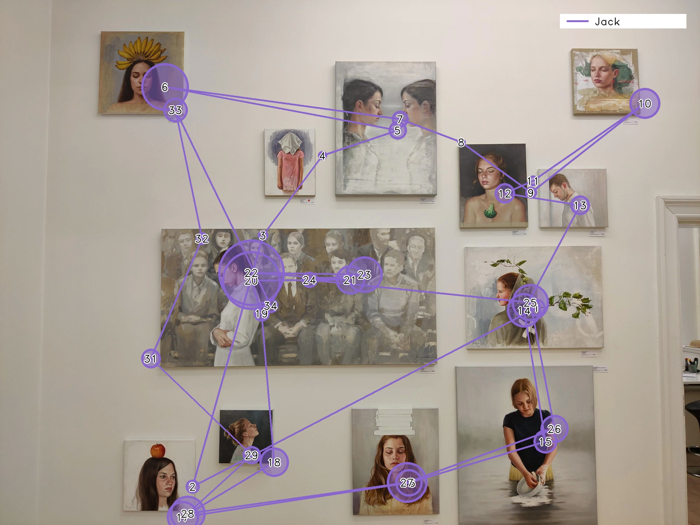
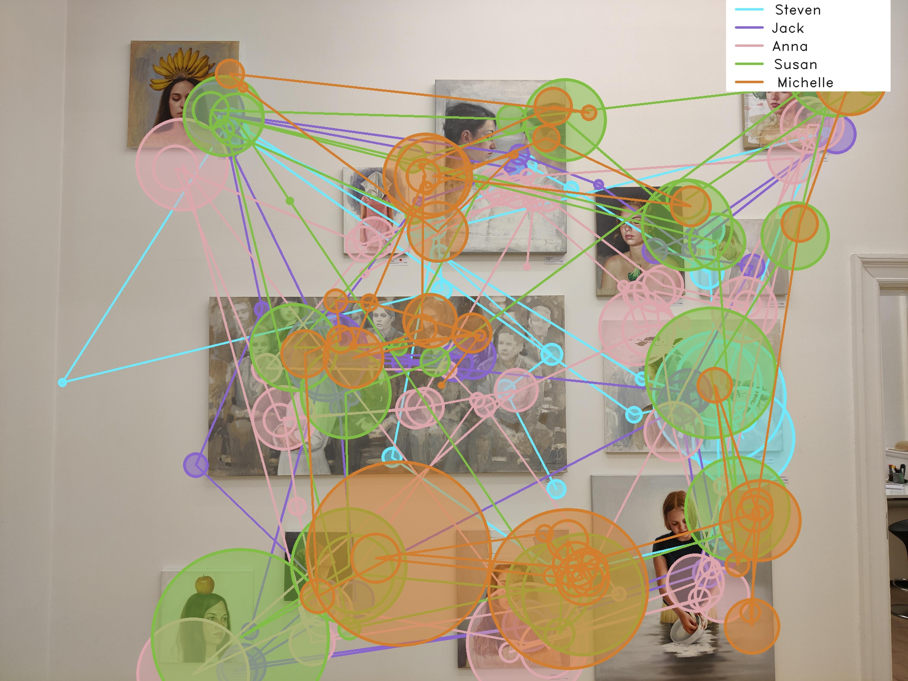

# Generate static and dynamic scanpaths with Reference Image Mapper

<TagLinks />

    <iframe width="2000" height="1500" src="https://www.youtube.com/embed/7V3X4XmbRAM" title="YouTube video player" frameborder="0" allow="accelerometer; autoplay; clipboard-write; encrypted-media; gyroscope; picture-in-picture" allowfullscreen></iframe>

 
 

::: tip
Picture this: Build and customise scanpath visualisations with your Reference Image Mapper exports!
:::

## Unlocking visual exploration with scanpaths
A scanpath is a graphical representation of an individual's gaze. It shows the sequence of fixations (pauses in gaze), and rapid eye movements made between fixations (saccades). Scanpaths offer a glimpse into how the observer has focused their attention on different aspects of the scene, which is a valuable tool for understanding a person's visual attention and perception. 

In this guide, we will show you how to generate both static and dynamic scanpath visualisations using your Reference Image Mapper exported data, like in the video above.

::: tip
Before continuing, ensure you are familiar with the [Reference Image Mapper](/enrichments/reference-image-mapper) 
enrichment. Check out [this explainer video](https://www.youtube.com/watch?v=ygqzQEzUIS4&t=56s) for reference.
:::

## Building the visualisations in an offline context
The [Reference Image Mapper](/enrichments/reference-image-mapper) available in Pupil Cloud is a tool that maps gaze onto 2D images and can subsequently generate heatmaps. However, it currently does not support the production of scanpath visualizations. Since scanpaths provide a useful characterization of *where*, *when*, and *how long* attention was focused on various elements, we developed a script that enables you to generate both static and dynamic scanpaths using your Reference Image Mapper data exported from Pupil Cloud.

## Steps
1. Run a [Reference Image Mapper](https://docs.pupil-labs.com/enrichments/reference-image-mapper/) enrichment and download the results
2. Download [this](https://gist.github.com/elepl94/9f669c4d81e455cf2095957831219664) gist and follow the instructions in the [readme](https://gist.github.com/elepl94/9f669c4d81e455cf2095957831219664#file-readme-md)

## Final results
After the script has completed its execution, you'll find the resulting scanpath visualizations stored in a newly created sub-folder named "scanpath." For each participant, you will obtain a reference image with the scanpath superimposed on it, along with a video that illustrates gaze behavior on the reference image, featuring a dynamic scanpath overlay. Furthermore, an aggregated visualization, combining all participants' scanpaths, will be at your disposal, providing the opportunity for more comprehensive and in-depth analyses.

    

        

            
        

    

    

        

            

                <iframe width="100%" height="100%" src="https://www.youtube.com/embed/X43aTIRjwgQ?si=aTzAkRrYNqdOEf0T" frameborder="0" allow="accelerometer; autoplay; clipboard-write; encrypted-media; gyroscope; picture-in-picture" allowfullscreen></iframe>
            

        

    

    

