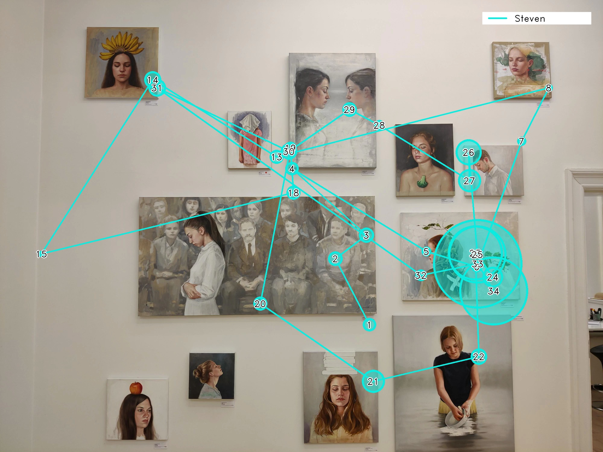

# Generate static and dynamic scanpaths with Reference Image Mapper

<TagLinks />

<div class="iframe-container2">
    <iframe width="2000" height="1500" src="https://www.youtube.com/embed/7V3X4XmbRAM" title="YouTube video player" frameborder="0" allow="accelerometer; autoplay; clipboard-write; encrypted-media; gyroscope; picture-in-picture" allowfullscreen></iframe>
</div> 
<br>

The [Reference Image Mapper](/enrichments/reference-image-mapper/) is a powerful tool that maps gaze onto 2D 
images of real-world environments and generates heatmaps. Now, we offer a new way to visualize your Reference Image Mapper 
data. We have created a ready-to-use script that generates static and dynamic scanpaths, providing deeper insights into 
patterns of visual behavior.

::: tip
Before continuing, ensure you are familiar with the [Reference Image Mapper](/enrichments/reference-image-mapper) 
enrichment. Check out [this explainer video](https://www.youtube.com/watch?v=ygqzQEzUIS4&t=56s) for reference.
:::

## What is a scanpath?
A scanpath is a graphical representation of an individual's gaze movements. It shows the sequence of fixations, or pauses 
in gaze, and the rapid eye movements made between fixations, known as saccades. The scanpath offers a glimpse into what 
the observer is focusing on and the duration and frequency of their attention to different aspects of the scene. This 
information is a valuable tool for understanding a person's visual attention and perception.

 

## What you'll need:
- A Reference Image Mapper export download
- Python 3.7 or higher
- [This](https://gist.github.com/elepl94/9f669c4d81e455cf2095957831219664) ready-to-go script

## Running the code
All you need to do is run the command `python3 RIM_scanpath.py` in your terminal. A prompt will then appear asking for 
the location of the Reference Image Mapper export folder. After this, just sit back and wait for the processing to finish. 
Upon completion, the resulting scanpath visualisations will be saved in a newly created sub-folder called "scanpath”.

If you wish to enhance the appearance of your scanpaths, keep reading for additional instructions!

## Personalization
### To each their own color
<p>
This function generates random colors for each participant based on their names.

```python
def color_generator(...):
    colors = {
        subj: (
            random.randint(0, 255),
            random.randint(0, 255),
            random.randint(0, 255),
        )
        for subj in names
    }

    return colors
```
</p>
<p>
However, if you prefer to assign specific colors to each participant, you can easily modify the function to suit your needs. An example could be:

``` python
def color_generator():
    colors = {}
    colors['Subject1'] = (0, 0, 255)
    colors['Subject2'] = (255, 0, 0)
    colors['Subject3'] = (0, 255, 0)
    
    return colors
```
</p>

### Make it font-tastic
If you have a preferred font or would like to change the size, simply edit the draw_on_frame() function. The fixation 
IDs are displayed in black text with a white border to make them stand out from the background. If you adjust the font 
size, it's also recommended to increase the values of `font_thick_w` and `font_thick_b` to maintain visual contrast.
``` python
def draw_on_frame(...):
# text aesthetics
    font = cv2.FONT_HERSHEY_DUPLEX
    font_size = 1
    font_thick_w = 3 
    font_thick_b = 1
...
```
### My name is legend
The script includes two functions for creating a legend to display the wearer names and corresponding colors:

1. `draw_name_legend()`: This function creates a legend box that displays only the name of the wearer on their individual scanpath video and image.
2. `draw_all_names_legend()`: This function creates a legend that displays all the wearer names on the final general scanpath image.

To customize the appearance of the legend, such as the position, dimensions, or colors of the rectangular white box or the colored line, 
you can modify the following parameters in both functions:

- `r_end_point` - x and y values of the ending coordinates of the rectangular legend box
- `r_start_point` - x and y values of the starting coordinates of the rectangular legend box
- `l_end_point` - x and y values of the ending coordinates of the colored line
- `l_start_point` - x and y values of the starting coordinates of the colored line
- In `cv2.rectangle`, edit `color` to set a new color for the legend box
- In `cv2.line`, edit `thickness` to set a new width for the colored line

<style scoped>

    img {
    border-radius: 10px;
    max-width: 100%;
    height: auto;
    box-sizing: border-box;
}

.iframe-container2{
  position: relative;
  width: 100%;
  padding-bottom: 75%;
  margin-bottom: 10px;
  height: 0;
  margin-left:0;
  margin-right:0;
}

.iframe-container2 iframe{
  position: absolute;
  top:0;
  left: 0;
  width: 100%;
  height: 100%;
}

</style>
