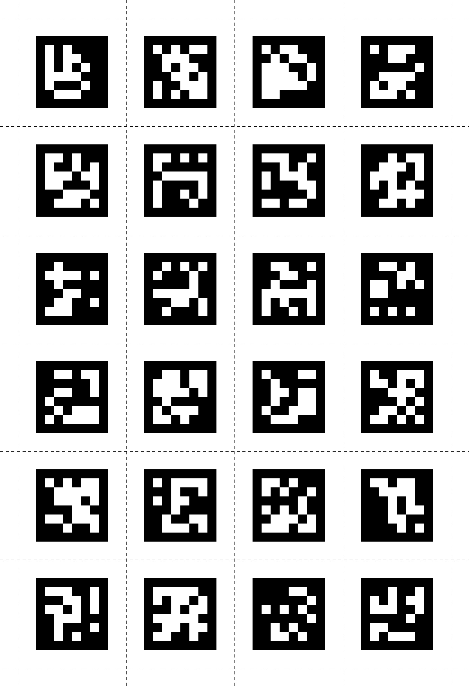

# Enrichments
Enrichments are algorithms running on cloud resources that allow you to perform various forms of analysis on your recordings. They allow you to calculate high-level features and aggregate and visualize data.

## Enrichment Sections
All enrichments are defined based on a start and end event. Those events are used to specify which sections of a recording an enrichment should be calculated on. From any recording that contains the start and end events, the according section between those events will be extracted for enrichment computation.

If a recording contains multiple pairs of the start and end events, multiple sections will be generated. If an enrichment should be calculated on entire recordings the `recording.begin` and `recording.end` events can be used, which automatically exist for all recordings.


## Marker Mapper
<div class="pb-4" style="display:flex;justify-content:center;filter:drop-shadow(2px 4px 10px #000000);">
  <v-img
    :src="require('../../media/cloud/imgs/marker_mapper_header.png')"
    max-width=80%
  >
  </v-img>
</div>
The Marker Mapper enrichment enables you to map gaze to an area of interest or "surface". A surface is based on markers placed in the physical environment. A heatmap of gaze data mapped onto the surface can be generated within the enrichment in Pupil Cloud. Mapped gaze can further be downloaded as CSV files.

### Setup
For robust detection, you should place enough markers on your surface such that at least 3 of them are visible whenever the surface is visible.

You may also place markers inside the surface or outside the surface in close proximity to it.

<div style="display:flex;" class="pb-4">
    <div style="flex-grow:1;display:flex;flex-direction:column;align-items:center;" class="pa-2">
        
        <p>Page 1</p>
    </div>
    <div style="flex-grow:1;display:flex;flex-direction:column;align-items:center;" class="pa-2">
        
        <p>Page 2</p>
    </div>
</div>


If you need more markers or higher resolution please see [here](https://github.com/pupil-labs/pupil-helpers/blob/master/markers_stickersheet/tag36h11_full.pdf?raw=True "PDF file with high-resolution markers.").

::: warning
<v-icon large color="warning">error_outline</v-icon>
Note that the markers require a white border around them for robust detection. In our experience, this should be at least equal to the width of the smallest white square/rectangle shown in the Marker. Please ensure you include a sufficient border when displaying or printing them!
:::

### Surface Coordinates
The Marker Mapper maps gaze points to a 2d surface and returns them in surface coordinates. The top left corner of the surface is defined as `(0, 0)` and the bottom right corner as `(1, 1)`. The orientation of the surface can be set in the enrichment settings.

The mapper may return values outside of the surface, which yields values smaller than 0 or larger than 1 and indicates that the corresponding gaze was not on the surface at that time.

### Export Format

#### sections.csv 
This file contains an overview of the sections that were generated from this enrichment.


| Field | Description | 
| -------- | -------- | 
| **section id** | Unique identifier of the section.     |
| **recording id** | Unique identifier of the recording this section belongs to.     |
| **recording name** | Name of the recording this section belongs to.     |
| **wearer id** | Unique identifier of the wearer used in the corresponding recording.     |
| **section start time [ns]** | Timestamp corresponding to the start event of the section. Given as UTC timestamp in nanoseconds.     |
| **section end time [ns]** | Timestamp corresponding to the end event of the section. Given as UTC timestamp in nanoseconds.     |
| **start event name** | Name of the start event of the section.     |
| **end event name** | Name of the end event of the section.     |


#### gaze.csv
This file contains all the mapped gaze data from all sections. The coordinate system is explained [here](#surface-coordinates "Explanation of the coordinate system of the Marker Mapper's surfaces").

| Field | Description | 
| -------- | -------- | 
| **section id** | Unique identifier of the corresponding section.     |
| **recording id** | Unique identifier of the recording this sample belongs to.     |
| **timestamp [ns]** | UTC timestamp in nanoseconds of the sample. Equal to the timestamp of the original gaze sample before mapping.     |
| **gaze detected on surface** | Boolean indicating whether or not the gaze point was inside or outside of the surface.     |
| **gaze position on surface x [normalized]** | Float value representing the x-coordinate of the mapped gaze point in surface coordinates. If the surface was not localized this value is empty.     |
| **gaze position on surface y [normalized]** | Same as gaze position on surface x [normalized] but for y-coordinate.     |


#### aoi_positions.csv
This file contains the surface locations in the scene images for all sections.


| Field | Description | 
| -------- | -------- | 
| **section id** | Unique identifier of the corresponding section.     |
| **timestamp [ns]** | UTC timestamp in nanoseconds of the sample. Equal to the timestamp of the scene camera frame the marker detection was executed on.     |
| **detected markers** | A list of the markers detected in the corresponding scene camera frame. Markers are represented by their ID and the list is separated by `;`. Added in version 2 of this enrichment.    |
| **tl x/y [px]** | x or y coordinate respectively of the **t**op **l**eft corner. Empty in case the surface could not be localized. Added in version 2 of this enrichment.   |
| **tr x/y [px]** | x or y coordinate respectively of the **t**op **r**ight corner. Empty in case the surface could not be localized. Added in version 2 of this enrichment.   |
| **br x/y [px]** | x or y coordinate respectively of the **b**ottom **r**ight corner. Empty in case the surface could not be localized. Added in version 2 of this enrichment.   |
| **bl x/y [px]** | x or y coordinate respectively of the **b**ottom **l**eft corner. Empty in case the surface could not be localized. Added in version 2 of this enrichment.   |


## Reference Image Mapper
<div class="pb-4" style="display:flex;justify-content:center;filter:drop-shadow(2px 4px 10px #000000);">
  <v-img
    :src="require('../../media/cloud/imgs/reference_image_mapper_header.png')"
    max-width=80%
  >
  </v-img>
</div>

The Reference Image Mapper enrichment enables you to map gaze to a reference image of an object of interest. A heatmap of gaze data mapped onto the reference image can be generated within the enrichment in Pupil Cloud. Mapped gaze can further be downloaded as CSV files (see below).

This enrichment is still a **beta feature**. Let us know if you have any [feedback](mailto:info+cloud@pupil-labs.com)!


### Setup
In addition to the reference image itself, calculating this enrichment also requires specifying a **scanning video**. In this video you must record your object(s) for 1-2 minutes fulfilling the following criteria:
- Make the recording while holding the Pupil Invisible glasses in your hand rather than wearing it on your head.
- Record the object of interest from all possible angles and from all distances a subject may look at it.
- Move the glasses slowly while recording to avoid motion blur.


A good scanning recording and reference image are shown below:

**Example Scanning Recording**

<Youtube src="-S5dOBqC0Uw"/>

**Example Reference Image**

<div class="pb-4" style="display:flex;justify-content:center;">
<v-img 
  :src="require('../../media/cloud/imgs/reference_image_sample.jpg')"
  max-width=80%
>
</v-img>
</div>


### Limitations
Please note that this enrichment only works for reference images showing objects that
- are static in their environment, i.e. they do not move while recording.
- are (mostly) static in their appearance, i.e. the object itself does not change while recording.

**Positive Examples**
- Image affixed to a wall/surface. This could be a painting, map, advertisement, poster, menu, etc.
- An exhibit in a museum. This could also be 3 dimensional, as long as it is static.
- Control Interface. Aircraft flight deck, automobile dashboard, machine controls. A vehicle (car, boat, airplane, excavator, etc) is usually moving in its environment. However, the interior is relatively static. We have found that this _should_ be enough to fulfill criteria for the reference image mapper.

**Negative Examples**
- Mobile phone or tablet screens. Not suitable due to dynamic movement within the environment and dynamic content displayed on screen.
- Computer monitors and TV screens. The contents displayed on the monitors/screens usually change dramatically. If the content remains static across recordings (e.g. single image) then the reference image mapper would work.

We always recommend making a quick test recording to check if your use-case is compatible.

### Mapped Gaze Coordinates
The Reference Image Mapper maps gaze points to a reference image. As such, the gaze coordinates are given in pixels referring to that image. The pixel at (0,0) is in the top left corner.


### Export Format
#### sections.csv
This file contains an overview of the sections that were generated from this enrichment.


| Field | Description | 
| -------- | -------- | 
| **section id** | Unique identifier of the section.     |
| **recording id** | Unique identifier of the recording this section belongs to.     |
| **recording name** | Name of the recording this section belongs to.     |
| **wearer id** | Unique identifier of the wearer used in the corresponding recording.     |
| **section start time [ns]** | Timestamp corresponding to the start event of the section. Given as UTC timestamp in nanoseconds.     |
| **section end time [ns]** | Timestamp corresponding to the end event of the section. Given as UTC timestamp in nanoseconds.     |
| **start event name** | Name of the start event of the section.     |
| **end event name** | Name of the end event of the section.     |


#### gaze.csv
This file contains all the mapped gaze data from all sections.


| Field | Description | 
| -------- | -------- | 
| **section id** | Unique identifier of the corresponding section.     |
| **recording id** | Unique identifier of the recording this sample belongs to.     |
| **timestamp [ns]** | UTC timestamp in nanoseconds of the sample. Equal to the timestamp of the original gaze sample before mapping.     |
| **gaze detected in reference image** | Boolean indicating whether or not the gaze point was detected inside or outside of the reference image.     |
| **gaze position in reference image x [px]** | Float value representing the x-coordinate of the mapped gaze point in pixel coordinates. If the reference image was not detected in the scene at the given time this value is empty.     |
| **gaze position in reference image y [px]** | Same as "gaze position in reference image x [px]" but for the y-coordinate.     |

#### Reference Image
The reference image used for defining the enrichment. The file is named `reference_image.jpeg|png`

## Face Mapper

<div class="pb-4" style="display:flex;justify-content:center;filter:drop-shadow(2px 4px 10px #000000);">
  <v-img
    :src="require('../../media/cloud/imgs/face_mapper_header.jpeg')"
    max-width=80%
  >
  </v-img>
</div>

The Face Mapper enrichment robustly detects faces in the scene video. Detections consist of the bounding box of the face. This provides you with insight into _when_ and _where_ faces are visible to a subject.

This enrichment automatically maps gaze data onto faces so that you can determine when a subject has been looking at them.

Additionally, this enrichment also calculates the location of the most important facial landmarks in the image for each face: left eye, right eye, nose, left mouth corner and right mout corner.

### Export Format
#### sections.csv
This file contains an overview of the sections that are generated by this enrichment.

| Field | Description | 
| -------- | -------- | 
| **section id** | Unique identifier of the section.     |
| **recording id** | Unique identifier of the recording this section belongs to.     |
| **recording name** | Name of the recording this section belongs to.     |
| **wearer id** | Unique identifier of the wearer used in the corresponding recording.     |
| **section start time [ns]** | Timestamp corresponding to the start event of the section. Given as UTC timestamp in nanoseconds.     |
| **section end time [ns]** | Timestamp corresponding to the end event of the section. Given as UTC timestamp in nanoseconds.     |
| **start event name** | Name of the start event of the section.     |
| **end event name** | Name of the end event of the section.     |

#### face_positions.csv
This file contains all the individual face detections.

| Field | Description | 
| -------- | -------- | 
| **section id** | Unique identifier of the corresponding section.     |
| **recording id** | Unique identifier of the recording this sample belongs to.     |
| **timestamp [ns]** | UTC timestamp in nanoseconds of the corresponding world camera frame timestamp. If multiple faces have been detected in the same scene video frame, each face is reported in a separate row with the same timestamp.     |
| **p1 x [px]** | x-coordinate of the starting point of the bounding box rectangle.     |
| **p1 y [px]** | y-coordinate of the starting point of the bounding box rectangle.     |
| **p2 x [px]** | x-coordinate of the ending point of the bounding box rectangle.     |
| **p2 y [px]** | y-coordinate of the ending point of the bounding box rectangle.     |
| **eye left x [px]** | X coordinate of the left eye in image coordinates in pixels.	|	
| **eye left y [px]** | Y coordinate of the left eye in image coordinates in pixels.	|
|	**eye right x [px]** | X coordinate of the right eye in image coordinates in pixels.	|
| **eye right y [px]** | Y coordinate of the right eye in image coordinates in pixels.	|
| **nose x [px]** | X coordinate of the nose in image coordinates in pixels. |
|	**nose y [px]** | Y coordinate of the nose in image coordinates in pixels. | 
|	**mouth left x [px]** | X coordinate of the left mouth corner in image coordinates in pixels. |
|	**mouth left y [px]** | Y coordinate of the left mouth corner in image coordinates in pixels. |
|	**mouth right x [px]** | X coordinate of the right mouth corner in image coordinates in pixels. |
|	**mouth right y [px]** | Y coordinate of the right mouth corner in image coordinates in pixels. |

#### gaze_on_face.csv
This file indicates which gaze samples are on faces (within the bounding box of detected faces).

| Field | Description | 
| -------- | -------- | 
| **section id** | Unique identifier of the corresponding section.     |
| **recording id** | Unique identifier of the recording this sample belongs to.     |
| **timestamp [ns]** | UTC timestamp in nanoseconds of the sample. Equal to the timestamp of the corresponding gaze sample.     |
| **gaze on face** | Boolean indicating whether the gaze point is on a face.     |

## Gaze Overlay
<div class="pb-4" style="display:flex;justify-content:center;filter:drop-shadow(2px 4px 10px #000000);">
  <v-img
    :src="require('../../media/cloud/imgs/gaze_overlay_header1.png')"
    max-width=80%
  >
  </v-img>
</div>

The Gaze Overlay enrichment allows you to download world videos with a gaze overlay rendering. You can easily filter out the sections of your recordings you are interested in and the visualization of the gaze circle can be customized (currently: size and color). 

### Export Format
#### sections.csv
This file contains an overview of the sections that were generated from this enrichment.


| Field | Description | 
| -------- | -------- | 
| **section id** | Unique identifier of the section.     |
| **recording id** | Unique identifier of the recording this section belongs to.     |
| **recording name** | Name of the recording this section belongs to.     |
| **wearer id** | Unique identifier of the wearer used in the corresponding recording.     |
| **section start time [ns]** | Timestamp corresponding to the start event of the section. Given as UTC timestamp in nanoseconds.     |
| **section end time [ns]** | Timestamp corresponding to the end event of the section. Given as UTC timestamp in nanoseconds.     |
| **start event name** | Name of the start event of the section.     |
| **end event name** | Name of the end event of the section.     |


#### Video Files
The export will have one folder per original recording using the following naming scheme:
```<recording name>-<start of recording ID>```

Each folder contains gaze overlay videos of the sections belonging to the corresponding recordings. The video files are named
```<beginning of section ID>_<start time>-<end time>.mp4```
where the times are in seconds relative to the recording start.


## Raw Data Exporter
Using the Raw Data Exporter you can get access to all your recording data in convenient CSV and MP4 format directly from Pupil Cloud. Easily export entire projects and extend your analysis with your own custom tools (R, Python, etc.) or third-party analysis platforms. In addition to the raw recording data, it also includes event annotations you have added post-hoc.

Currently, the events used for defining this enrichment are fixed to `recording.begin` and `recording.end`. It is not possible to limit the export range using other events similar to other enrichments.

### Export Format
#### sections.csv
This file contains an overview of the sections that were generated from this enrichment.


| Field | Description | 
| -------- | -------- | 
| **section id** | Unique identifier of the section.     |
| **recording id** | Unique identifier of the recording this section belongs to.     |
| **recording name** | Name of the recording this section belongs to.     |
| **wearer id** | Unique identifier of the wearer used in the corresponding recording.     |
| **section start time [ns]** | Timestamp corresponding to the start event of the section. Given as UTC timestamp in nanoseconds.     |
| **section end time [ns]** | Timestamp corresponding to the end event of the section. Given as UTC timestamp in nanoseconds.     |
| **start event name** | Name of the start event of the section.     |
| **end event name** | Name of the end event of the section.     |


#### Recording Data
The export contains one folder per recording following this naming scheme:
```<recording name>-<start of recording ID>```
The files included in every folder are described in the following.

#### info.json
This file contains meta-information on the recording.
| Field | Description | 
| -------- | -------- | 
| **android_device_id** | Unique identifier of the Android device used as Invisible Companion.     |
| **android_device_model** | Model name of the Companion device.     |
| **android_device_name** | Device name of the Companion device.     |
| **app_version** | Version of the Companion app used to make the recording. |
| **calib_version** | Version of the offset correction used by the Companion app. |
| **data_format_version** | Version of the data format used by the Companion app.     |
| **duration** | Duration of the recording in nanoseconds|
| **gaze_offset** | Gaze offset applied to this recording using the offset correction. Values are in pixels.|
| **glasses_serial_number** | Serial number of the Pupil Invisible glasses used for the recording. |
| **pipeline_version** | Version of the gaze estimation pipeline used by the Companion app. |
| **recording_id** | Unique identifier of the recording. |
| **scene_camera_serial_number** | Serial number of the scene camera used for the recording. |
| **start_time** | Timestamp of when the recording was started. Given as UTC timestamp in nanoseconds. |
| **template_data** | Data regarding the selected template for the recording as well as the response values. |
| **wearer_id** | Unique identifier of the wearer selected for this recording. |
| **wearer_name** | Name of the wearer selected for this recording. |

**Scene Video**
Scene video is contained in a file following the following naming scheme:
```<beginning of section ID>_<section start time>-<section end time>.mp4```


#### world_timestamps.csv
This file contains the timestamps of every world video frame.

| Field | Description | 
| -------- | -------- | 
| **section id** | Unique identifier of the corresponding section.     |
| **recording id** | Unique identifier of the recording this sample belongs to.     |
| **timestamp [ns]** | UTC timestamp in nanoseconds of the corresponding world frame. |


#### events.csv
This file contains project event annotations and real-time [recording events](/developer/invisible/#recording-events "Documentation on recordings events in real-time using recording events").

| Field | Description | 
| -------- | -------- | 
| **recording id** | Unique identifier of the recording this event belongs to.     |
| **timestamp [ns]** | UTC timestamp of the event. |
| **name** | Name of the event.     |
| **type** | Type of the event. Possible values: project, recording     |


#### gaze.csv
This file contains gaze data in world camera coordinates. For a definition of the coordinate system see [here](/developer/invisible/#gaze-coordinate-system "Explanation of Pupil Invisible's gaze coordinate system").


| Field | Description | 
| -------- | -------- | 
| **section id** | Unique identifier of the corresponding section.     |
| **recording id** | Unique identifier of the recording this sample belongs to.     |
| **timestamp [ns]** | UTC timestamp in nanoseconds of the sample. Equal to the timestamp of the original gaze sample before mapping.     |
| **gaze x [px]** | Float value representing the x-coordinate of the mapped gaze point in world camera pixel coordinates.
| **gaze y [px]** | Same as "gaze x [px]" but for the y-coordinate.     |
| **worn** | This value indicates whether the Pupil Invisible Glasses have been worn by a subject at this point in time. `1.0` indicates that it has been worn, while `0.0` indicates that is has not been. Added in version 2 of this enrichment.    |


#### imu.csv
This file contains the acceleration and gyro data capture by the IMU. Gyro values correspond to angular speed around the respective axis in degrees per second. Acceleration values correspond to the acceleration along the respective axis in G. For a definition of the coordinate system see [here](/developer/invisible/#imu-coordinate-system "Explanation of Pupil Invisible's IMU coordinate system").

Additionally, it contains drift-free estimations of the roll and pitch of the Pupil Invisible Glasses based on [Madgwick's algorithm](https://www.x-io.co.uk/res/doc/madgwick_internal_report.pdf). Numerical integration of angular rate is subject to position errors that grow with time. Accurate estimates of orientation therefore require drift correction. Madgwick's algorithm removes orientation drift in the pitch and roll axes using accelerometer feedback to monitor position relative to gravity.


| Field | Description | 
| -------- | -------- | 
| **section id** | Unique identifier of the corresponding section.     |
| **recording id** | Unique identifier of the recording this sample belongs to.     |
| **timestamp [ns]** | UTC timestamp in nanoseconds of the sample.    |
| **gyro x [deg/s]**<br />**gyro y [deg/s]**<br />**gyro z [deg/s]** | Rotation speed around x, y or z-axis respectively in degrees/s.    |
| **acceleration x [G]**<br />**acceleration y [G]**<br />**acceleration z [G]** | Translational acceleration along the x, y or z-axis respectively in G. Note `1 G = 9.80665 m/s^2`.|
| **roll** | Drift-free estimation of the roll (head tilt from side to side) in degrees. The output range is -180 to +180 degrees. Added in version 2 of this enrichment.    |
| **pitch** | Drift-free estimation of the pitch (head tilt from front to back) in degrees. The output range is -180 to +180 degrees. Added in version 2 of this enrichment.         |
