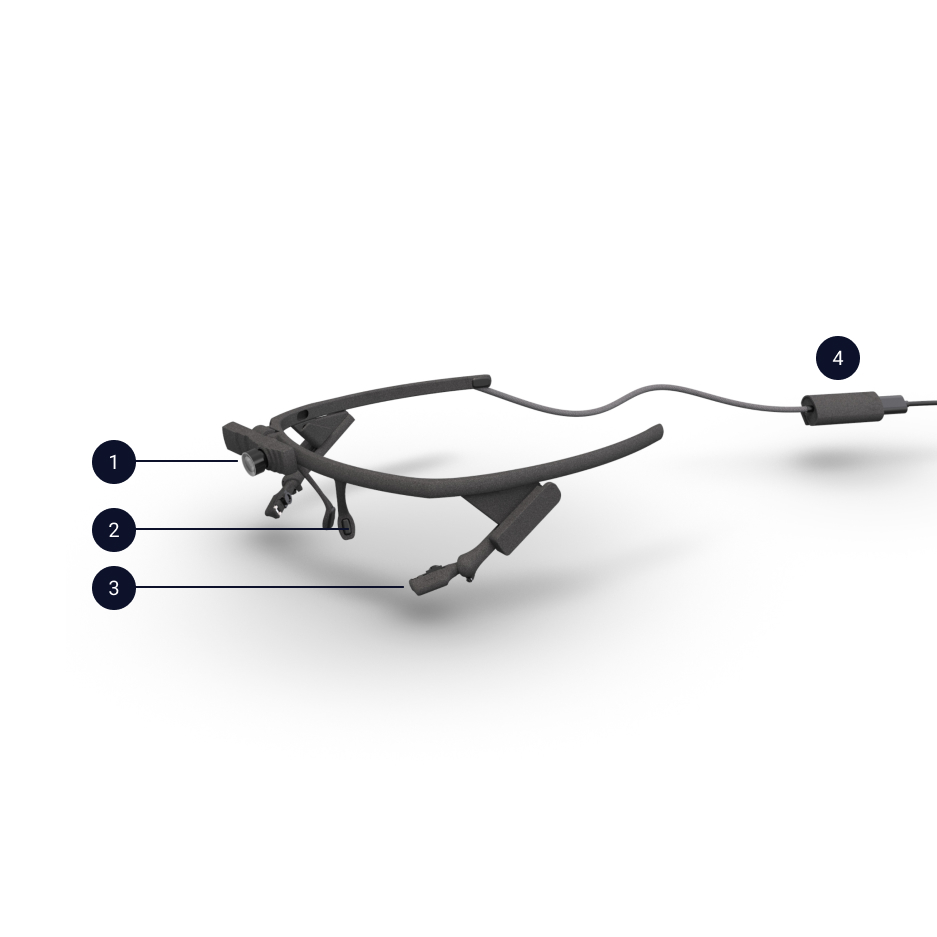

# Hardware
You wear Pupil Core headset like a pair of glasses. The headset is designed to be lightweight and adjustable in order to accommodate a wide range of users. There are a number of configurations, so your headset might not look exactly like the picture below. 

  

**Terminology**
1. World camera
2. Nose support
3. Eye camera(s)
4. USB-C connector clip

## What's in the box

- Pupil Core headset
- Eye camera arm extenders
- Additional world camera lenses (depending on configuration)
- USB-C to USB-A cable
- Silicone nose pads

## Additional Parts

#### World Camera
The high speed 2d world camera comes with two lenses.
60 degree FOV lens (shown on the left) and a wide angle 100 degree FOV lens (shown on the right).

The world camera lens are interchangeable, so you can swap between the two lenses provided for normal or wide angle FOV.

<video width="100%" controls class="mb-5">
  <source src="../../media/core/videos/worldcam-lens.mp4" type="video/mp4">
</video>

::: warning
<v-icon large color="warning">error_outline</v-icon>
If you change lenses you need to recalibrate the camera to update intrinsics. Otherwise 3d calibration and accuracy test will not work properly!
:::

#### Arm Extender
If you need to adjust the eye cameras beyond the built in adjustment range,
you can use the orange arm extenders that are shipped with your Pupil headset.

<video width="100%" controls class="mb-5">
  <source src="../../media/core/videos/arm-extend.mp4" type="video/mp4">
</video>

1. Unplug your eye camera.
1. Slide the existing eye camera arm off the headset.
1. Slide the arm extender onto the triangular mount rail on the headset frame.
1. Slide the camera onto the extended mount rail.
1. Plug the camera back in.

The eye camera arm extender works for all existing 120 and 200hz systems.

::: tip
<v-icon large color="info">info_outline</v-icon>
Starting on 2018-02-01 the arm extender is shipped with all Pupil headset orders. If you have an older headset, you can get the extender from our [Shapeways store](http://shpws.me/PL6w).
:::

#### Nose Pads
All Pupil headsets come with 2 sets of nose pads. You can swap the nose pads to customize the fit.

<video width="100%" controls class="mb-5">
  <source src="../../media/core/videos/nosepad.mp4" type="video/mp4">
</video>

::: tip
<v-icon large color="info">info_outline</v-icon>
Depending on your configuration, some additional parts may be included with your Pupil headset.
:::

## Headset Adjustments

#### Slide Eye Camera
The eye camera arm slides in and out of the headset frame. You can slide the eye camera arm along the track.

<video width="100%" controls class="mb-5">
  <source src="../../media/core/videos/eyecam-slide.mp4" type="video/mp4">
</video>

#### Rotate World Camera
You can rotate the world camera up and down to align with your FOV.

<video width="100%" controls class="mb-5">
  <source src="../../media/core/videos/worldcam-rotate.mp4" type="video/mp4">
</video>

#### Rotate Eye Camera
The eye camera arm is connected to the eye camera via the ball joint. You can rotate about its ball joint.

<video width="100%" controls class="mb-5">
  <source src="../../media/core/videos/eyecam-rotate.mp4" type="video/mp4">
</video>

#### Ball Joint Set Screw
You can adjust the set screw to control the movement of the eye camera about the ball joint.
We recommend setting the set screw so that you can still move the eye camera by hand but not so loose that the eye camera moves when moving the head.
You can also tighten the set screw to fix the eye camera in place.

<video width="100%" controls class="mb-5">
  <source src="../../media/core/videos/eyecam-screw.mp4" type="video/mp4">
</video>

::: tip
<v-icon large color="info">info_outline</v-icon>
Before you calibrate, make sure to properly adjust the headset to get optimal eye detection and world camera FOV.
:::

## Focus Camera

#### Focus World Camera
Set the focus for the distance at which you will be calibrating by rotating the camera lens.

<video width="100%" controls class="mb-5">
  <source src="../../media/core/videos/worldcam-focus.mp4" type="video/mp4">
</video>

#### No Focus 200Hz Eye Camera
200hz eye cameras do not need to be focused, and can not be focused. The lens of the 200hz eye camera is arrested using glue. Twisting the lens will risk breaking the mount.

  

#### Focus 120hz Eye Camera
If you have a 120hz eye camera, make sure the eye camera is in focus. Twist the lens focus ring of the eye camera with your fingers or lens adjuster tool to bring the eye camera into focus.

<video width="100%" controls class="mb-5">
  <source src="../../media/core/videos/eye-adjust.mp4" type="video/mp4">
</video>