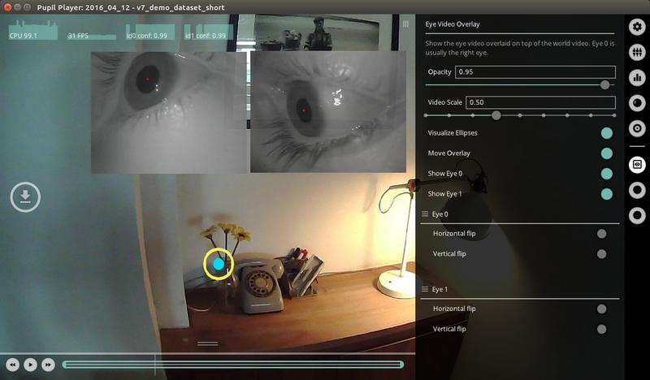
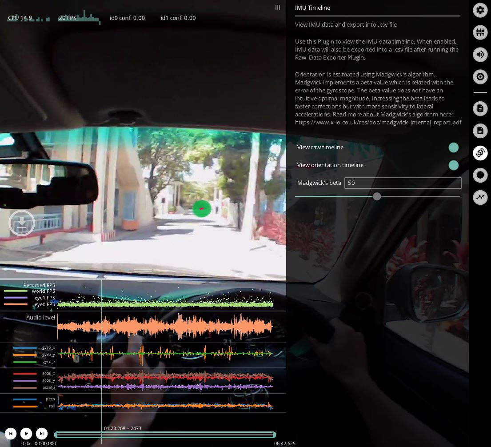

# Pupil Player
Pupil Player is the second tool you will use after Pupil Capture. It is a media and data visualizer at its core. You will use it to look at Pupil Capture recordings. Visualize your data and export it.

  

## Load a recording
Drag the recording folder (the triple digit one) directly onto the app icon **or** launch the application and drag + drop the recording folder into the Pupil Player window.

  

Don't have a recording yet? [Download a sample recording](https://drive.google.com/file/d/1vzjZkjoi8kESw8lBnsa_k_8hXPf3fMMC/view?usp=sharing "Download sample recording to use in Pupil Player").

## Player Window
The Player window is the main control center for `Pupil Player`. It displays video and data recorded by [Pupil Capture](/core/software/pupil-capture) or [Pupil Invisible](/invisible/).

  

1. **Graphs**: This area contains performance graphs. The graphs display `CPU`, `FPS`, and pupil algorithm detection confidence.
1. **Hot keys**: This area contains clickable buttons for plugins.
1. **Timeline Events**: Plugins can add temporal events to this expandable panel.
1. **Timeline**: Control the playback of the video with the play/pause button (or spacebar on your keyboard). Drag the playhead (vertical line) to the desired point in time.
    - **Trimming**: Drag either end of the timeline to set a trim beginning and ending trim marks. The trim section marks directly inform the section of video/data to export.
    - **Frame Stepping**: You can use the arrow keys on your keyboard or the `<<` `>>` buttons to advance one frame at a time while the playback is paused.
    - **Playback Speed**: To change the playback speed, use the arrow keys on your keyboard or the `<<` `>>` buttons during playback. There are 5 available playback speeds: `0.25x`, `0.5x`, `1x` (default), `2x`, `4x`.

1. **Menu**: This area contains settings and contextual information for each plugin.
1. **Sidebar**: This area contains clickable buttons for each plugin. System plugins are loaded in the top and user added plugins are added below the horizontal separator.

### Keyboard Shortcuts

| Keyboard Shortcut   | Description                                            |
|:--------------------|:-------------------------------------------------------|
| `<space>`           | Play and pause video                                   |
| `<arrow left>`      | Step to previous frame\* / Decrease playback speed\*\* |
| `<arrow right>`     | Step to next frame\* / Increase playback speed\*\*     |
| `e`                 | Start export                                           |
| `a`                 | Surface tracker: Add new surface                       |
| `x`                 | Add annotation (default keyboard shortcut)             |
| `f`                 | Fixation: Show next                                    |
| `F`                 | Fixation: Show previous                                |

\* While paused
\*\* During playback

## Workflow

Pupil Player is similar to a video player. You can playback recordings and can load plugins to build visualizations.

Here is an example workflow:

- Start Pupil Player
- Open a Plugin - From the `Plugin Manager` GUI menu load the `Vis Circle` plugin.
- Playback - press the play button or `space` bar on your keyboard to view the video playback with visualization overlay, or drag the playhead in the seek bar to scrub through the dataset.
- Set trim marks - you can drag the green rounded rectangle at the beginning and end of the seekbar to set the trim marks. This will set the start and end frame for the exporter and for other plugins.
- Export Video & Raw Data - From the `Plugin Manager` view, load the `World Video Exporter` plugin and the `Raw Data Exporter` plugin. Press `e` on your keyboard or the `e` button in the left hand side of the window to start the export.
- Check out exported data in the `exports` directory within your recording directory

::: tip
<v-icon large color="info">info_outline</v-icon>
Pupil Player will <strong>never</strong> remove or overwrite any of your raw data gathered during capture. All exports are isolated within a sub-directory named <code>exports</code>. Exports will never be overwritten.
:::

## Plugins
Pupil Player uses the same Plugin framework found in Pupil Capture to add functionality.

Visualizations, marker tracking, and the exporter are all implemented using this structure. Very little work (often no work) needs to be done to make a Capture Plugin work for the Pupil Player and vice versa.

There are two general types of plugins:

- **Unique**: You can only launch one instance of this plugin.
- **Not unique**: You can launch multiple instances of this type of plugin. For example, you can load one `Vis Circle` plugin to render the gaze position with a translucent green circle, and another `Vis Circle` plugin to render the gaze circle with a green stroke of 3 pixel thickness. You can think of these types of plugins as _additive_.

In the following sections we provide a summary of plugins currently available and in Pupil Player.

### Visualization Plugins
We will call plugins with the `Vis` prefix **visualization** plugins. These plugins are simple plugins, are mostly additive (or *not unique*), and directly operate on the gaze positions to produce visualizations. Other plugins like `Surface Tracker` also produces visualizations, but will be discussed elsewhere due to the extent of its features.

#### Vis Circle
Visualize the gaze positions with a circle for each gaze position. This plugin is **not unique**, therefore you can add multiple instances of the plugin to build your visualization.

  

You can set the following parameters:

  + `radius` - the radius of the circle around the gaze point.
  + `stroke width` - the thickness or width of the stoke in pixels.
  + `fill` - toggle on for a circle with solid fill. Toggle off for a circle with only stroke.
  + `color` - define the `red`, `green`, `blue` values for color. `Alpha` defines the opacity of the stroke and fill.

Here we show an example of how you could use **2** instances of the `Vis Circle` Plugin. The first instance renders the gaze position as a filled yellow circle. The second instance renders the same gaze position as an orange stroke circle.

#### Vis Cross
Visualize the gaze positions with a cross for each gaze position. This plugin is **not unique**, therefore you can add multiple instances of the plugin to build your visualization. You can set the following parameters:

  

  + `inner offset length` - the distance in pixels to offset the interior cross endpoints from the gaze position. A value of `0` will make the crosshairs intersect the gaze position.
  + `outer length` - The length of the cross lines in pixels from the gaze position. Note - equal values of `inner offset length` and `outer length` will result in a cross with no length, and therefore not rendered.
  + `stroke width` - the thickness or width of the stoke in pixels.
  + `color` - define the `red`, `green`, `blue` values for color.

Here we show an example of how you could use **2** instances of the `Vis Cross` Plugin. The first instance renders the gaze position as a red cross with that extends to the boundaries of the screen. The second instance renders the gaze position as a green cross, with a heavier stroke weight.

#### Vis Polyline
Visualize the gaze positions with a polyline for each gaze position.

  

This plugin is **not unique**, therefore you can add multiple instances of the plugin to build your visualization. You can set the following parameters:

  + `line thickness` - the thickness or width of the polyline stroke in pixels.
  + `color` - define the `red`, `green`, `blue` values for color.

An example showing `Vis Polyline` used with `Vis Circle`. The polyline enables one to visualize the sequence of the gaze positions over a single world frame.

#### Vis Light Points
Visualize the gaze positions as a point of light for each gaze position. The `falloff` of the light from the gaze position is specified by the user.

  

This plugin is **not unique**, therefore you can add multiple instances of the plugin to build your visualization. You can set the following parameters:

  + `falloff` - The distance (in pixels) at which the light begins to fall off (fade to black). A very low number will result in a very dark visualization with tiny white light points. A very large number will result in a visualization of the world view with little or no emphasis on the gaze positions.

Here is an example demonstrating `Vis Light Points` with a falloff of 73.

#### Vis Eye Video Overlay
Here is an example of the `Eye Video Overlay` with binocular eye videos.

  

This plugin can be used to overlay the eye video on top of the world video. Note that the eye video is not recorded by default in Pupil Capture so if you want to use this plugin, make sure to check `record eye video` in Pupil Capture.

This plugin is **unique**, therefore you can only load one instance of this plugin. You can set the following parameters:

  + `opacity` - the opacity of the overlay eye video image. `1.0` is opaque and `0.0` is transparent.
  + `video scale` - use the slider to increase or decrease the size of the eye videos.
  + `move overlay` - toggle `on` and then click and drag eye video to move around in the player window. Toggle `off` when done moving the video frames.
  + `show` - show or hide eye video overlays.
  + `horiz. and vert. flip` - flip eye videos vertically or horizontally

### Analysis Plugins
These plugins are simple unique plugins, that operate on the gaze data for analysis and visualizations.

#### Surface Tracker
This plugin is a post-hoc version of the [Surface Tracking](/core/software/pupil-capture/#surface-tracking) plugin for Pupil Capture.
You can use this plugin to detect markers in the recording, define surfaces, edit surfaces, and create and export visualizations of gaze data within the defined surfaces.

  

Here is an example workflow for using the `Surface Tracker` plugin to generate heatmap visualizations and export surface data reports:

  + Load the `Surface Tracker` plugin - if you already have surfaces defined, the load may take a few seconds because the plugin will look through the entire video and cache the detected surfaces.
  + Add surface - if you do not have any defined surfaces, you can click on the `Add surface` button when the markers you want to user are visible or just click the circular `A` button in the left hand side of the screen.
  + Surface name and size - In the `Surface Tracker` menu GUI, define the surface name and real world size.
  *Note* - defining size is important as it will affect how heatmaps are rendered.
  + Set trim marks - optional, but if you want to export data for a specific range, then you should set the trim marks.
  + Recalculate gaze distributions - click the `(Re)calculate gaze distributions` button after specifying surface sizes.
  You should now see heatmaps in the Player window (if gaze positions were within your defined surfaces).
  + Export gaze and surface data - click `e` and all surface metrics reports will be exported and saved for your trim section within your `export` folder.

All files generated by the `Surface Tracker` will be located in the subfolder `surfaces`.
The different reported metrics are:

  + `surface_visibility.csv` - Overview of how many world camera frames each surface was contained in.
  + `surface_gaze_distribution.csv` - Overview of how many gaze samples have been collected on each individual surface and outside of surfaces.
  + `surface_events.csv` - List of image-enter and image-exit events for all surfaces.

Further the following metrics are reported for every individual surface.
Each surface has a name, which can be manually set as described above.
This name is augmented by an automatically generated numerical identifier.

  + `heatmap_<surface_name>.png` - Heatmap of gaze positions on the surface aggregated over the entire export.
  + `gaze_positions_on_surface_<surface_name>.csv` - A list of gaze datums on the surface.
  The values include the gaze point in two different coordinates systems.
  `x_norm` and `y_norm` are coordinates between 0 and 1, where `(0,0)` is the bottom left corner of the surface and `(1,1)` is the top right corner.
  `x_scaled` and `y_scaled` contain the same coordinates but scaled with the size defined for the surface.
  + `surf_positions_<surface_name>` - List of surface positions in 3D.
  The position is given as the 3D pose of the surface in relation to the current position of the scene camera.
  `img_to_surf_trans` is a matrix transforming coordinates from the camera coordinate system to the surface coordinate system.
  `surf_to_img_trans` is the inverse of `img_to_surf_trans`.

Additionally, the `Surface Tracker` exports the detected markers to the `marker_detections.csv` file. The `world_index` column represents the scene video frame index, `marker_uid` is the label used for identifying a single marker, and `corner_<0|1|2|3>_<x|y>` is the corner coordinate in pixel space.

#### Fixation Detector
The post-hoc fixation detector calculates fixations for the whole recording. The menu gives feedback about the progress of the detection, how many fixations were found, and shows detailed information about the current fixation. Press `f` or click the `f` hot key button on the left hand side of the window to seek forward to the next fixation.

  

Toggle `Show fixations` to show a visualization of fixations. The blue number is the number of the fixation (0 being the first fixation). You can export fixation reports for your current trim section by pressing `e` on your keyboard or the `e` hot key button on the left hand side of the window.

You can find more information in our [dedicated fixation detection section](/core/terminology/#fixations "Pupil Core terminology - fixations").

#### Head Pose Tracking
This plugin uses fiducial markers ([apriltag](https://april.eecs.umich.edu/software/apriltag.html)) to build a 3d model of the environment and track the headset's pose within it. Note, only markers of the default `tag36h11` family are currently supported by the head pose tracker plugin.

::: tip
The markers used must be unique. You may not use multiple instances of the same marker ID within your environment.
:::

<Youtube src="9x9h98tywFI"/>

See the [surface tracking section](/core/software/pupil-capture/#surface-tracking) for images of the markers to download.

Head pose tracking works best in a well lit environment with an even distribution of light, so that the tracking markers are clearly visible. Try to avoid situations where the world-camera faces into bright light, such as sunlight entering through a window in an otherwise dim room

By default, the location of the first visible marker will be used as the origin of the 3d model's coordinate system. In the plugin's menu, you can change the marker that is being used as the origin. The unit of the coordinate system is defined as the physical length of the printed markers.

Results are exported in the following files:
- `head_pose_tacker_model.csv`: A list of all markers used to generate the 3d model and the 3d locations of the marker vertices.
- `head_pose_tacker_poses.csv`: The world camera's pose within the 3d model coordinate system for each recorded world frame. A camera pose is described as a 6-components vector. The first three components are the rotation vector in Rodrigues format and the last three components are the translation vector.

#### IMU Timeline
This plugin visualizes accelerometer and gyroscope data from Pupil Invisible recordings. It also fuses the 
data using [Madgwick's algorithm](https://github.com/xioTechnologies/Fusion) to yield drift-free orientation estimates in the pitch and roll axes.

  

Why fuse the data? Numerical integration of angular rate is subject to position errors that grow with time. Accurate 
estimates of orientation therefore require drift correction. Madgwick's algorithm removes orientation drift in the pitch
and roll axes using accelerometer feedback to monitor position relative to gravity.

In the Plugin's menu, toggle `View raw timeline` to view the accelerometer and gyroscope readings and `View orientation
timeline` for pitch and roll. You can also change `Madgwick's beta`. This value is associated with gyroscope mean error.
Increasing the beta will lead to faster drift corrections but with more sensitivity to lateral accelerations. Read more
about [Madgwick's algorithm here](https://www.x-io.co.uk/res/doc/madgwick_internal_report.pdf).

Results are exported in `imu_timeline.csv` with the following columns:
| Key                 | Description                                                            |
|:--------------------|:-----------------------------------------------------------------------|
| `imu_timestamp`     | Timestamp of the IMU reading                                           |
| `world_index `      | Associated_frame: closest world video frame                            |
| `gyro_x`            | Angular velocity about the x-axis in deg/s                             |
| `gyro_y`            | Angular velocity about the y-axis in deg/s                             |
| `gyro_z`            | Angular velocity about the z-axis in deg/s                             |
| `accel_x`           | Linear acceleration along the x-axis in G (9.80665 m/s2)    |
| `accel_y`           | Linear acceleration along the y-axis in G (9.80665 m/s2)    |
| `accel_z`           | Linear acceleration along the z-axis in G (9.80665 m/s2)    |
| `pitch`             | Orientation about the x-axis (head tilt from front to back) in degrees |
| `roll`              | Orientation about the z-axis (head tilt from side to side) in degrees  |

:::tip
<v-icon large color="info">info_outline</v-icon>
Read more about [Pupil Invisible's coordinate systems here](/developer/invisible/#coordinate-systems).
:::

This Plugin does not estimate orientation about the yaw axis (head rotation from left to right). This is 
because the IMU has no magnetometer to monitor heading. The Plugin therefore implements a version of Madgwick's
algorithm that only estimates Pitch and Roll.

Note that this Plugin [will not be loaded](/core/software/pupil-player/#product-specific-plugins) with Pupil Core recordings.

### Pupil Data And Post-hoc Detection
By default, Player starts with the `Pupil Data From Recording` plugin that tries to load pupil positions that were detected and stored during a Pupil Capture recording.
Alternatively, one can run the pupil detection post-hoc.

**Post-hoc Pupil Detection and Gaze Mapping**

<Youtube src="_Jnxi1OMMTc"/>

**Post-hoc Calibration For Another Recording**

<Youtube src="eEl3sswsTms?cc_load_policy=1"/>

**Post-hoc Gaze Mapping Validation**

<Youtube src="aPLnqu26tWI?cc_load_policy=1"/>

#### Post-hoc Pupil Detection
The `Post-hoc Pupil Detection` plugin can be used with any dataset where eye videos were recorded.
The plugin tries to load the eye videos, and runs the pupil detection algorithm in separate processes.

This plugin is available starting with Pupil Player `v0.9.13`.

The `Redetect` button restarts the detection procedure.
You can use the `Post-hoc Pupil Detection` plugin to debug, improve, and gain insight into the pupil detection process.

### Gaze Data And Post-hoc Calibration
By default, Player starts with the `Gaze Data From Recording` plugin that tries to load gaze positions that were detected and stored during a Pupil Capture recording.
Alternatively, one can run the gaze mapping process post-hoc.

#### Post-hoc Calibration
The `Post-hoc Gaze Calibration` plugin enables you to calibrate, map, and validate gaze post-hoc and is available starting with Pupil Player `v0.9.13`.
It can be used on any Pupil dataset.

The workflow is separated into three steps, each with its own submenu: Reference Locations, Calibrations, and Gaze Mappers.

Reference locations are points within the recorded world video that are known to have been fixated on by the participant/subject.
They can either be automatically detected or manually annotated:

1. `Detect Circle Markers in Recording`: This button starts the automatic detection of [circular calibration markers](/core/software/pupil-capture/#calibration-marker "Pupil circular calibration marker documentation") within the world video. The progress is visualized in the plugin's timeline.
2. `Manual Edit Mode`: When this option is enabled, you can add new locations as well as correct and delete existing ones. There can only be one location per world frame.

As in Capture, one can have more than one calibration per recording.
A calibration on its own does not result in gaze data.
Rather, it contains the required parameters to map pupil to gaze data.
Each has the following properties:

- `Name`: Used to correctly select a calibration for each gaze mapper (see below).
- `Mapping Method`: `2d` uses polynomial regression, or `3d` uses bundle adjustment calibration.
- `Reference Range`: Time range that indicates which reference locations to use.

Calibrations are stored as `plcal` files in the recording's `calibration` subfolder.
You can copy and apply them to recordings that do not include reference locations.
See the instructional video below for details.

In order to apply a calibration to pupil data, one needs a gaze mapper.
Each gaze mapper has the following properties:

- `Calibration`: One of the previously created or imported calibrations (see screencast)
- `Mapping Range`: Time range in which pupil data will be mapped to gaze data.
- `Manual Correction`: Apply a fixed offset to your gaze mapping.
- `Validation`: You can validate the accuracy and precision of the mapped gaze by comparing it to reference locations in the selected `Validation Range`. It uses the same methodology as the [`Accuracy Visualizer`](/core/software/pupil-capture/#notes-on-calibration-accuracy "Notes on calibration accuracy").

::: warning
<v-icon large color="warning">error_outline</v-icon>
Overlapping mapping ranges result in multiple gaze points per gaze datum.
This can be temporarly disabled by turning off the according gaze mapper's `Activate Gaze` option.
:::

::: tip
<v-icon large color="info">info_outline</v-icon>
You can compare `2d` and `3d` mapping results by creating two calibrations and gaze mappers with the same calibration and mapping ranges.
:::

### Developing your own Plugin
To develop your own plugin see the [developer guide](/developer/core/overview "Pupil Core developer documentation").

### Product-specific plugins
Some plugins in Pupil Player _only_ load if they are able to be used with the product that created the recordings.

Here is a list of what plugins are available based on the product that generated the recording:

| Pupil Player Plugin | Pupil Core | Pupil Invisible | Pupil Mobile |
| :-: | :--: | :-: | :-: |
| Blink detection | :heavy_check_mark:  |  :heavy_minus_sign: | :heavy_check_mark: |
| Fixation detection | :heavy_check_mark: | :heavy_minus_sign: | :heavy_check_mark: |
| Post-hoc pupil detection | :heavy_check_mark:| :heavy_minus_sign: | :heavy_check_mark: |
| Post-hoc gaze calibration | :heavy_check_mark: | :heavy_minus_sign: | :heavy_check_mark: |
| Pupil from recording | :heavy_check_mark: | :heavy_minus_sign: | :heavy_minus_sign: |
| Gaze from recording | :heavy_check_mark: | :heavy_check_mark: | :heavy_minus_sign: |
| IMU timeline | :heavy_minus_sign: | :heavy_check_mark: | :heavy_minus_sign: |

#### Changelog
> Changed in version 3.3:
> - Removed the `“Pupil from recording”` option, as there is no pupillometry data to load from Pupil Invisible recordings. Pupil Player will no longer generate an empty `pupil_positions.csv` file after export.
>
> Added in version 3.2:
> -  Added product-specific plugins.

## Export
You can export data and videos by pressing `e` on your keyboard or the `e` hot key button in the Pupil Player window.

All open plugins that have export capability will export when you press `e`.
Exports are separated from your raw data and contained in the `exports` sub-directory.
The exports directory lives within your recording directory.

Active video exporters will run in the background and you can see the progress bar of the export in the GUI. While exporting, you can continue working with Pupil Player and even launch new exports. Each video export creates at least one `mp4` and its respective file timestamp file. See the [Data Format](/developer/core/recording-format/ "Pupil Core recording format") section for details.

### Export Directory
Every export creates a new folder within the `exports` sub-directory of your recording. All data from the export is saved to this folder.

### Export Handling
You can select the frame range to export by setting trim marks in the seek bar or directly in the `General Settings` menu.

Longer running exports, e.g. video exports, go through three phases: Queued, Running, and Completed.
Export tasks can be cancelled while being queued or running.
Completed tasks are kept in the list for reference.

### World Video Exporter
The `World Video Exporter` is loaded by default.

  

The export saves the world video as shown in Player, including all currently active visualizations (see  [Visualization Plugins](#visualization-plugins "Pupil Player visualization plugins documentation")). 

Gereral overview for exported video files:

The World and Eye video exporter save the scene video file, together with [numpy](https://numpy.org/devdocs/reference/generated/numpy.lib.format.html) and csv files containing timestamps corresponding to each frame. 
The timestamps follow the [Pupil Time](/core/terminology/#timestamps) convention. The csv timestamp files include an additional `pts` column. `pts` is an abbreviation for _presentation timestamps_ and refers to the media file's internal time representation. It can be used to seek or identify specific frames within the media file.

Media time (seconds after start) can be calculated as follows: `pts / time_base = seconds since start`. 

We export the pts for the purpose of frame identification within the media stream, e.g. if one wants to extract a specific range of frames based on the external Core timestamps. We do not export the time_base because we do not need the pts for actual time representation. The normal timestamps are sufficient for that.

### Eye Video Exporter
The `Eye Video Exporter` needs to be loaded explicitly through the Plugin Manager.
It includes the option to render the 2d pupil detection result into the exported video.

### iMotions Exporter
The iMotions Exporter creates data that can be used with [https://imotions.com/](https://imotions.com/ "iMotions website").

Specifically, it undistorts the world video images using the camera intrinsics. Gaze data is also undistorted and exported to the `gaze.tlv` file.

### Raw Data Exporter
The `Raw Data Exporter` exports pupil and gaze data to `.csv` files and is active by default.

  

#### pupil_positions.csv
* `pupil_timestamp` - timestamp of the source image frame
* `world_index` - associated_frame: closest world video frame
* `eye_id` - 0 or 1 for left/right eye
* `confidence` - is an assessment by the pupil detector on how sure we can be on this measurement. A value of `0` indicates no confidence. `1` indicates perfect confidence. In our experience useful data carries a confidence value greater than ~0.6. A `confidence` of exactly `0` means that we don't know anything. So you should ignore the position data.
* `norm_pos_x` - x position in the eye image frame in normalized coordinates
* `norm_pos_y` - y position in the eye image frame in normalized coordinates
* `diameter` - diameter of the pupil in image pixels as observed in the eye image frame (is not corrected for perspective)
* `method` - string that indicates what detector was used to detect the pupil

Data made available by 2d pupil detection:

* `ellipse_center_x` - x center of the pupil in image pixels
* `ellipse_center_y` - y center of the pupil in image pixels
* `ellipse_axis_a` - first axis of the pupil ellipse in pixels
* `ellipse_axis_b` - second axis of the pupil ellipse in pixels
* `ellipse_angle` - angle of the ellipse in degrees

Data made available by 3d pupil detection:

* `diameter_3d` - diameter of the pupil scaled to mm based on anthropomorphic avg eye ball diameter and corrected for perspective.
* `model_confidence` - confidence of the current eye model (0-1)
* `model_id` - id of the current eye model. When a slippage is detected the model is replaced and the id changes.
* `sphere_center_x` - x pos of the eyeball sphere is eye pinhole camera 3d space units are scaled to mm.
* `sphere_center_y` - y pos of the eye ball sphere
* `sphere_center_z` - z pos of the eye ball sphere
* `sphere_radius` - radius of the eyeball. This is always 12mm (the anthropomorphic avg.) We need to make this assumption because of the `single camera scale ambiguity`.
* `circle_3d_center_x` - x center of the pupil as 3d circle in eye pinhole camera 3d space units are mm.
* `circle_3d_center_y` - y center of the pupil as 3d circle
* `circle_3d_center_z` - z center of the pupil as 3d circle
* `circle_3d_normal_x` - x normal of the pupil as 3d circle. Indicates the direction that the pupil points at in 3d space.
* `circle_3d_normal_y` - y normal of the pupil as 3d circle
* `circle_3d_normal_z` - z normal of the pupil as 3d circle
* `circle_3d_radius` - radius of the pupil as 3d circle. Same as `diameter_3d`
* `theta` - circle_3d_normal described in spherical coordinates
* `phi` - circle_3d_normal described in spherical coordinates
* `projected_sphere_center_x` - x center of the 3d sphere projected back onto the eye image frame. Units are in image pixels.
* `projected_sphere_center_y` - y center of the 3d sphere projected back onto the eye image frame
* `projected_sphere_axis_a` - first axis of the 3d sphere projection.
* `projected_sphere_axis_b` - second axis of the 3d sphere projection.
* `projected_sphere_angle` - angle of the 3d sphere projection. Units are degrees.

#### gaze_positions.csv
* `gaze_timestamp` - timestamp of the source image frame
* `world_index` - associated_frame: closest world video frame
* `confidence` - computed confidence between 0 (not confident) -1 (confident)
* `norm_pos_x` - x position in the world image frame in normalized coordinates
* `norm_pos_y` - y position in the world image frame in normalized coordinates

The fields below are _not_ available for Pupil Invisible recordings:

* `base_data` - "timestamp-id timestamp-id ..." of pupil data that this gaze position is computed from data made available by the 3d vector gaze mappers
* `gaze_point_3d_x` - x position of the 3d gaze point (the point the subject looks at) in the world camera coordinate system
* `gaze_point_3d_y` - y position of the 3d gaze point
* `gaze_point_3d_z` - z position of the 3d gaze point
* `eye_center0_3d_x` - x center of eye-ball 0 in the world camera coordinate system (of camera 0 for binocular systems or any eye camera for monocular system)
* `eye_center0_3d_y` - y center of eye-ball 0
* `eye_center0_3d_z` - z center of eye-ball 0
* `gaze_normal0_x` - x normal of the visual axis for eye 0 in the world camera coordinate system (of eye 0 for binocular systems or any eye for monocular system). The visual axis goes through the eye ball center and the object thats looked at.
* `gaze_normal0_y` - y normal of the visual axis for eye 0
* `gaze_normal0_z` - z normal of the visual axis for eye 0
* `eye_center1_3d_x` - x center of eye-ball 1 in the world camera coordinate system (not available for monocular setups.)
* `eye_center1_3d_y` - y center of eye-ball 1
* `eye_center1_3d_z` - z center of eye-ball 1
* `gaze_normal1_x` - x normal of the visual axis for eye 1 in the world camera coordinate system (not available for monocular setups.). The visual axis goes through the eye ball center and the object thats looked at.
* `gaze_normal1_y` - y normal of the visual axis for eye 1
* `gaze_normal1_z` - z normal of the visual axis for eye 1

### Annotation Export

The `Annotation Player` plugin loads any annotations generated during the recording, as
well as allows you to add annotations after the effect in Pupil Player. On export, the
plugin writes the annotation data to `annotations.csv`. It includes at least the
following keys:

- `index`: World frame index during which the annotation started or happened
- `timestamp`: Start time or timestamp of the annotation in Pupil time
- `label`: Annotation label
- `duration`: Duration of the annotation

::: tip
<v-icon large color="info">info_outline</v-icon>
Any custom field encountered in the annotations will be exported as an additional column.
Their values will be converted to strings using Python's string representation. Therefore,
it is recommended to use primitive types (strings, integers, floats) as value types for
custom fields.
:::

### Fixation Export

Fixations are exported to `fixations.csv`, containing the following fields:

* `start_timestamp` - Timestamp of the first related gaze datum
* `duration` - Exact fixation duration, in milliseconds
* `start_frame_index` - Index of the first related world frame
* `end_frame_index` - Index of the last related world frame
* `norm_pos_x` - Normalized x position of the fixation’s centroid
* `norm_pos_y` - Normalized y position of the fixation’s centroid
* `dispersion` - Dispersion, in degrees
* `confidence` - Average pupil confidence
* `method` - `2d gaze` or `3d gaze`
* `gaze_point_3d_x` - x position of mean 3d gaze point, only available if `gaze 3d` method was used
* `gaze_point_3d_y` - y position of mean 3d gaze point, only available if `gaze 3d` method was used
* `gaze_point_3d_z` - z position of mean 3d gaze point, only available if `gaze 3d` method was used
* `base_data` - Gaze data that the fixation is based on
