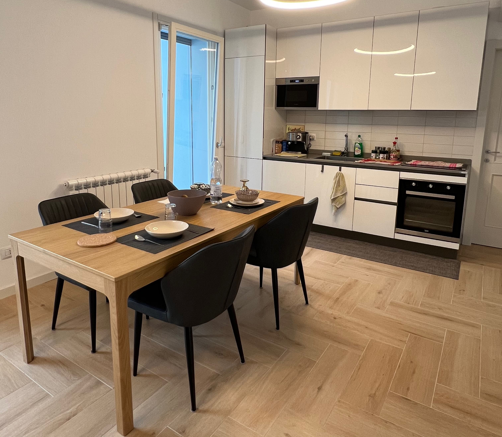

# Map and visualize gaze onto multiple reference images taken from the same environment
<TagLinks />

    <iframe width="560" height="315" src="https://www.youtube.com/embed/wi4MAzuJIzU" title="YouTube video player" frameborder="0" allow="accelerometer; autoplay; clipboard-write; encrypted-media; gyroscope; picture-in-picture" allowfullscreen></iframe>

 

In the [Reference Image Mapper](/invisible/explainers/enrichments/reference-image-mapper/) guide, we learnt how to properly set up a Reference Image Mapper enrichment, with a <i>single</i> reference image. However, there are some cases in which it would be useful to map gaze onto <i>multiple</i> reference images taken from the same environment - for example, moving in a room while interacting with certain parts of it. 

## What you'll need

::: tip
Before continuing, ensure you are familiar with the [Reference Image Mapper](/invisible/explainers/enrichments/#reference-image-mapper) enrichment. Check out [this explainer video](https://www.youtube.com/watch?v=ygqzQEzUIS4&t=56s) for reference.
::: 

1. Multiple reference images (one for each area you will explore)
2. Multiple scanning recordings (2 or more, depending on environment dimensions/complexity)

## Reference Images

First, we will take pictures of the areas and/or furniture of the room we are interested in.

|||
|---|---|
|||
|||

## Scanning recordings
Based on the environment dimensions/complexity, you might need to take more than one scanning recording. Split your environment into more than one part and then record separate scanning videos.

::: danger
<b>Scanning Recording Duration</b>  
Please record a scanning video that is less than 3 minutes long!  The Reference Image Mapper enrichment does <b>not</b> accept longer recordings.
:::

In this guide, we want to map gaze onto different parts of a living room, for this reason, we recorded <b>two</b> scanning videos. The first one focuses on half of the room (kitchen, table, cupboard, desk) whereas the second one focuses on the tv and sofa area.

Please follow our best practices to ensure optimal scanning:
- Make the recording while holding the Pupil Invisible glasses in your hand
- Record the area of interest from all possible angles and distances a subject may view them
- Move the glasses slowly during recording, to avoid motion blur
- Make sure you have good contrast and the scene lighting is similar to that during mapping

::: tip 
To ensure good scanning of big plain surfaces - like tables and kitchen countertops - enrich them with features. Use a printed tablecloth and/or place items to produce a successful mapping!
:::

    <iframe width="560" height="315" src="https://www.youtube.com/embed/FQ2SdFcnqXw" title="YouTube video player" frameborder="0" allow="accelerometer; autoplay; clipboard-write; encrypted-media; gyroscope; picture-in-picture" allowfullscreen></iframe>

    <iframe width="560" height="315" src="https://www.youtube.com/embed/aEOZZrUrEpE" title="YouTube video player" frameborder="0" allow="accelerometer; autoplay; clipboard-write; encrypted-media; gyroscope; picture-in-picture" allowfullscreen></iframe>

## Run the enrichments
Here we recorded just one video where the wearer was asked to walk and freely explore the living room. Now it is time to map the subject's gaze from this video into the five pictures above.
 

    <iframe width="560" height="315" src="https://www.youtube.com/embed/XTIkB8Wct6M" title="YouTube video player" frameborder="0" allow="accelerometer; autoplay; clipboard-write; encrypted-media; gyroscope; picture-in-picture" allowfullscreen></iframe>

During the recording, the user looked at the same furniture and parts of the room multiple times. To save up time and computational resources, we suggest you split the recording into shorter [Sections](/invisible/explainers/enrichments/#enrichment-sections) - based on which part of the room the user is exploring - to run separate enrichment on them.

For this recording, we used the following [event annotations](/invisible/explainers/basic-concepts/#events) to run five Reference Image Mapper enrichments:
- Cupboard: `cupboard.begin` and `cupboard.end`
- Desk: `desk.begin` and `desk.end`
- Kitchen: `kitchen.begin` and `kitchen.end`
- TV: `tv.begin` and `tv.end`
- Table: `table.begin` and `table.end`

## Final results
And that's all, folks! Relax and grab a cup of coffee while waiting for the enrichments to be done (it may take several minutes, depending on how long are the recordings). Once everything is finished, from the Project Editor view you can visualize how the gaze is simultaneously mapped both on the recording and the reference images (as shown in the video at the very beginning of this guide).

From the Enrichment view, you can visualize heatmaps of each reference image, as follows: 

|||
|---|---|
|||
|||
|||
|||

