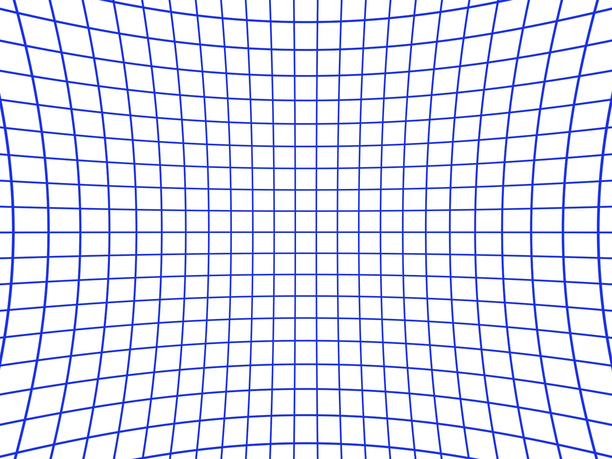
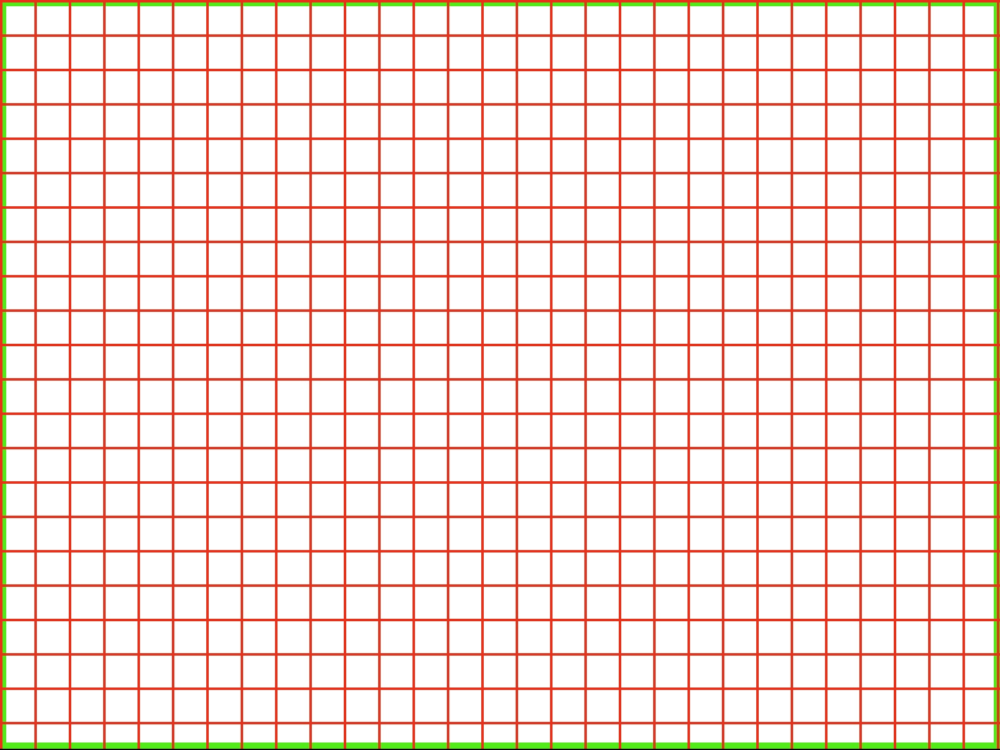

# Correcting for the lens distortion on Neon's scene camera
A circumstance that often arises in wearable eye tracking setups is the presence of distortions on the scene camera. The type of lenses used, with their wide-angle characteristics, allow for a broad field of view, enabling the capture of more information within a single frame. However, this advantage comes at the cost of introducing distortions to the image. <!-- rectilinear distortions -->

While we account for them in Pupil Cloud, and we even give you the possibility to download the undistorted video using the [Gaze Overlay enrichment](/enrichments/gaze-overlay), this is not the case when using the [Realtime API](/neon/real-time-api) or raw data, where you may want to correct it by yourself.

## When is it beneficial to correct for lens distortion?

<div class="mb-4" style="display:flex;justify-content:center;">
  <v-img class="rounded" :src="require('../../../media/neon/undist/sidebyside_neon_with_gaze.jpg')"
  width="100%" 
  alt="Side by side comparison of a distorted and undistorted image with gaze positions overlaid."
  title="Side by side comparison of a distorted and undistorted image with gaze positions overlaid." />
</div>

The lens distortion in Neon's scene camera is not very strong, but correcting for it can have benefits for some applications. The undistorted image may be a more realistic or appealing representation of the observer's visual perspective (e.g. parallel lines will also be parallel in the undistorted image). Some computer vision algorithms also perform better on undistorted images.

Below you can find an example of an <span style="color:red">**original frame**</span> (in <span style="color:red">red</span>) and <span style="color:blue">**undistorted frame**</span> (in <span style="color:blue">blue</span>):

<div style="width: 60%; margin: 0 auto;">
<script
  defer
  src="https://unpkg.com/img-comparison-slider@7/dist/index.js"
></script>
<link
  rel="stylesheet"
  href="https://unpkg.com/img-comparison-slider@7/dist/styles.css"
/>

  
  
</img-comparison-slider>
<br>
<br>
</div>

:::tip
**TLDR**; Correcting for lens distortions is crutial for spatial analysis and comparability across studies.
:::

## How to correct for the lens distortions?
In this tutorial, we will cover how to read the provided intrinsic and extrinsic camera parameters and correct for the lens distortions in Neon's scene camera. We will also show you how to undistort the gaze data, so that you can map the gaze position onto the undistorted scene camera video.

We will be using Python and OpenCV to perform the undistortion but the same principles apply to other programming languages and libraries.

## Requirements
To follow this guide, you will need to have the following libraries installed on your python environment:

- OpenCV for image processing and undistortion
- Numpy for numerical data manipulation

```bash
pip install opencv-python numpy
```

### Reading from the Cloud download JSON file

We measure the intrinsics and extrinsics parameters from the cameras for you, such that you do not need to do it by yourself. If you are using the [Cloud download](/export-formats/recording-data/neon/#scene-camera-json) format, you can find the intrinsic parameters in the **scene_camera.json** file which you can read using the following function:

```python
def read_from_json(path):
    with open(path, "r") as f:
        data = json.load(f)
    return data
```
Where **path** points to the **scene_camera.json** file. Then, we will store the scene camera matrix, distortion coefficients in variables for later use.

```python
calibration = read_from_json(path)
K = np.array(calibration["camera_matrix"])
D = np.array(calibration["distortion_coefficients"])[0]
```

### Reading from the raw file
<details><summary>Click to see how to read it from the raw format</summary><br>
<!-- This is collapsed   -->
If you are using the RAW data, this data is also stored there. The calibration parameters are stored in a binary file, and you can read it using the following function:


```python
def read_instrinsics_neon(path):
    return np.fromfile(
        path,
        np.dtype(
            [
                ("version", "u1"),
                ("serial", "6a"),
                ("scene_camera_matrix", "(3,3)d"),
                ("scene_distortion_coefficients", "8d"),
                ("scene_extrinsics_affine_matrix", "(4,4)d"),
                ("right_camera_matrix", "(3,3)d"),
                ("right_distortion_coefficients", "8d"),
                ("right_extrinsics_affine_matrix", "(4,4)d"),
                ("left_camera_matrix", "(3,3)d"),
                ("left_distortion_coefficients", "8d"),
                ("left_extrinsics_affine_matrix", "(4,4)d"),
                ("crc", "u4"),
            ]
        ),
    )
```

Where **path** points to the calibration file, which is located in the same folder as the raw data with the name **calibration.bin**. Then, we will store the scene camera matrix, distortion coefficients in variables for later use.

``` python
calibration = read_instrinsics_neon(path)
K = calibration["scene_camera_matrix"][0]
D = calibration["scene_distortion_coefficients"][0]
```

</details>
<!-- empty line   -->

## Understanding the variables

### Scene camera matrix (K)
A 3x3 matrix representing the intrinsic parameters of the camera. The camera matrix contains information about the focal length, principal point, and skew of the camera, defined as follows:

```
K = [[fx, 0, cx],
     [0, fy, cy],
     [0,  0,  1]]
```

where:

- **fx** and **fy** are the focal lengths expressed in pixels. They measure the distance between the camera sensor and the pinhole opening of the camera. As such, they determine the field of view of the camera.
- **cx** and **cy** are the coordinates of the principal point, which represents the optical center of the camera. It indicates the position of the image center in the image plane, usually close to the center of the image.

<div>
<a href="https://docs.opencv.org/4.x/dc/dbb/tutorial_py_calibration.html" target="_blank">Read more about OpenCV convention here.</a>
</div>

### Distortion coefficients (D)

```
D = [k1, k2, p1, p2, k3, k4, k5, k6]
```

where:

- **k1** to **k6** are radial distortion coefficients. They model the radial distortion caused by the curvature of the lens, making straight lines appear curved near the edges of the image.
- **p1** and **p2** are tangential distortion coefficients. They model the tangential distortion caused by the misalignment between the camera sensor and the lens, resulting in image distortions that are not radial.

<div>
<a href="https://docs.opencv.org/4.x/dc/dbb/tutorial_py_calibration.html" target="_blank">Read more about OpenCV convention here.</a>
</div>

## Undistorting the video and gaze data per frame
Assuming we have our frame (in OpenCV) and gaze data, we can undistort it using the following code:

```python
undist_frame = cv2.undistort(orig_frame, K, D)
```

Where *orig_frame* is the original frame, *K* is the scene camera matrix, and *D* is the distortion coefficients. The function returns the undistorted frame.


<div class="mb-4" style="display:flex;justify-content:center;">
  <v-img class="rounded" :src="require('../../../media/neon/undist/sidebyside_neon.jpg')"
  max-width="100%" 
  alt="Image showing the original frame overlaid with the undistorted frame."
  title="Image showing the original frame overlaid with the undistorted frame." />
</div>

Finally, this is how we undistort the gaze point:

```python
xy_undist = cv2.undistortPoints(xy.reshape(-1, 1, 2).astype(np.float32), 
    K, D, P=K)
xy_undist = xy_undist.reshape(-1, 2)
```
On the examplme below, we show the original gaze points overlaid ove the undistorted frame (in red) and the undistorted point positions (in yellow):

<div class="mb-4" style="display:flex;justify-content:center;">
  <v-img class="rounded" :src="require('../../../media/neon/undist/undist_neon_with_gaze.jpg')"
  max-width="70%" 
  alt="Image showing the original frame overlaid with the undistorted frame."
  title="Image showing the original frame overlaid with the undistorted frame." />
</div>